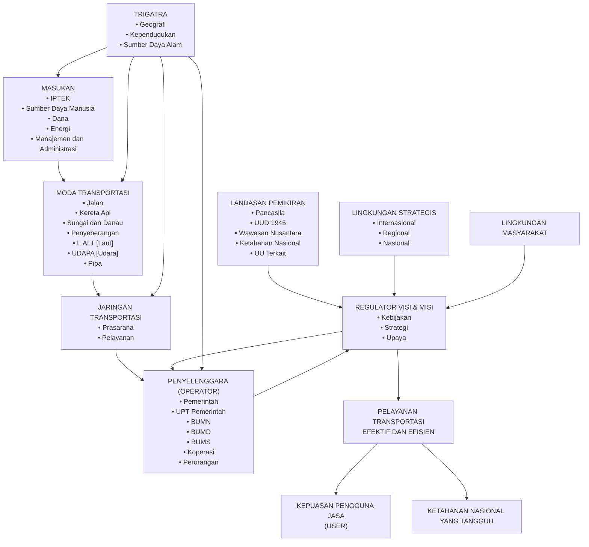

# TRANSKRIPSI PERATURAN MENTERI PERHUBUNGAN NOMOR KM.49 TAHUN 2005
## TENTANG SISTEM TRANSPORTASI NASIONAL (SISTRANAS)
### Halaman 1 sampai 15 (Verbatim)

---

#### HALAMAN 1 (Halaman 262)

MENTERI PERHUBUNGAN
REPUBLIK INDONESIA

PERATURAN MENTERI PERHUBUNGAN
NOMOR : KM.49 TAHUN 2005

TENTANG

SISTEM TRANSPORTASI NASIONAL
( SISTRANAS )

DENGAN RAHMAT TUHAN YANG MAHA ESA

MENTERI PERHUBUNGAN,

Menimbang : a. bahwa transportasi sebagai urat nadi kehidupan ekonomi, sosial budaya, pertahanan keamanan, dan politik mempunyai peranan penting serta strategis untuk memantapkan perwujudan wawasan nusantara, memperkokoh ketahanan, dan mempererat hubungan antar bangsa dalam usaha mencapai tujuan yang sama berdasarkan Pancasila dan Undang-Undang Dasar 1945, dan dengan adanya perubahan paradigma sistem pemerintahan dengan ditetapkannya Undang-Undang Nomor 32 Tahun 2004 tentang Pemerintahan Daerah serta tuntutan arus globalisasi akan mengubah tatanan pengaturan di bidang transportasi yang bersifat sentralistik ke desentralistik dan dari sifat dominasi pemerintah kepada mekanisme pasar, dipandang perlu menyempurnakan Keputusan Menteri Perhubungan Nomor KM 15 Tahun 1997 tentang Sistem Transportasi Nasional;
            b. bahwa dalam rangka memantapkan perencanaan dan mewujudkan jaringan transportasi nasional yang efektif dan efisien, perlu dilakukan pendekatan kesisteman dalam satu kesatuan Sistem Transportasi Nasional ;
            c. bahwa sehubungan dengan hal tersebut huruf a dan huruf b, perlu menetapkan Sistem Transportasi Nasional dengan Peraturan Menteri Perhubungan;

Mengingat  : 1. Undang-Undang Nomor 13 Tahun 1992 tentang Perkeretaapian (Lembaran Negara Tahun 1992 Nomor 47, Tambahan Lembaran Negara Nomor 3479);
            2. Undang-Undang Nomor 14 Tahun 1992 tentang Lalu Lintas Dan Angkutan Jalan (Lembaran Negara Tahun 1992 Nomor 49, Tambahan Lembaran Negara Nomor 3480);

---

#### HALAMAN 2 (Halaman 263)

3. Undang-Undang Nomor 15 Tahun 1992 tentang Penerbangan (Lembaran Negara Tahun 1992 Nomor 53, Tambahan Lembaran Negara Nomor 3481);
4. Undang-Undang Nomor 21 Tahun 1992 tentang Pelayaran (Lembaran Negara Tahun 1992 Nomor 98, Tambahan Lembaran Negara Nomor 3493);
5. Undang-Undang Nomor 32 Tahun 2004 tentang Pemerintahan Daerah (Lembaran Negara Tahun 2004 Nomor 125, Tambahan Lembaran Negara Nomor 4437);
6. Peraturan Presiden Nomor 9 Tahun 2005 tentang Kedudukan, Tugas, Fungsi, Susunan Organisasi dan Tata Kerja Kementerian Negara Republik Indonesia;

MEMUTUSKAN:

Menetapkan : PERATURAN MENTERI PERHUBUNGAN TENTANG SISTEM TRANSPORTASI NASIONAL (SISTRANAS).

##### Pasal 1

Sistem Transportasi Nasional (Sistranas) sebagaimana ditetapkan dalam lampiran Peraturan Menteri Perhubungan ini merupakan tatanan transportasi yang terorganisasi secara kesisteman untuk dijadikan sebagai pedoman dan landasan dalam perencanaan, pembangunan, penyelenggaraan transportasi guna mampu mewujudkan penyediaan jasa transportasi yang efektif dan efisien.

##### Pasal 2

Sistranas sebagaimana dimaksud dalam Pasal 1 disusun secara terpadu dan diwujudkan dalam :
a. Tataran Transportasi Nasional (Tatranas);
b. Tataran Transportasi Wilayah (Tatrawil);
c. Tataran Transportasi Lokal (Tatralok);

##### Pasal 3

Tatranas, Tatrawil dan Tatralok sebagaimana dimaksud dalam Pasal 2 huruf (a), (b) dan (c) ditetapkan sebagai berikut:
a. Tatranas ditetapkan oleh Pemerintah Pusat;
b. Tatrawil ditetapkan oleh Pemerintah Propinsi;
c. Tatralok ditetapkan oleh Pemerintah Kabupaten/Kota.

---

#### HALAMAN 3 (Halaman 264)

##### Pasal 4

Pengembangan Sistranas dilakukan secara berkesinambungan, konsisten dan terpadu baik intra maupun antar moda, dengan sektor pembangunan lainnya serta memperhatikan eksistensi Pemerintah Daerah Provinsi, Kabupaten dan Kota, sesuai dengan kebutuhan dan perkembangan jaman, ilmu pengetahuan dan teknologi.

##### Pasal 5

Dokumen Sistranas yang merupakan Lampiran sebagaimana dimaksud dalam Pasal 1, merupakan satu kesatuan dengan Peraturan Menteri ini.

##### Pasal 6

Dengan ditetapkan keputusan ini, Keputusan Menteri Perhubungan Nomor 15 Tahun 1997 tentang Sistranas dinyatakan tidak berlaku lagi.

##### Pasal 7

Peraturan Menteri ini mulai berlaku pada tanggal ditetapkan.

Ditetapkan di : JAKARTA
Pada tanggal  : 12 Agustus 2005
______________________________
MENTERI PERHUBUNGAN

ttd

M. HATTA RAJASA

SALINAN Peraturan ini disampaikan kepada :
1.  Ketua Badan Pemeriksa Keuangan;
2.  Menteri Koordinator Bidang Perekonomian;
3.  Sekretaris Negara;
4.  Menteri Keuangan;
5.  Menteri Hukum dan HAM;
6.  Menteri Pertahanan;
7.  Menteri Dalam Negeri;
8.  Menteri Pekerjaan Umum;
9.  Menteri Negara Lingkungan Hidup;
10. Menteri Negara BUMN;
11. Para Gubernur seluruh Indonesia;
12. Sekjen, Irjen, Para Dirjen dan Para Kabadan di lingkungan Dephub;
13. Para Bupati dan Walikota seluruh Indonesia;
14. Para Kepala Dinas Perhubungan Propinsi seluruh Indonesia;
15. Para Kepala Dinas Perhubungan Kabupaten/Kota seluruh Indonesia.

Salinan sesuai dengan aslinya
Kepala Biro Hukum dan KSLN

(ttd)

KALALO NUGROHO
NIP. 120105102
(Cap Departemen Perhubungan)

---

#### HALAMAN 4 (Halaman 265)

Lampiran Peraturan Menteri Perhubungan
Nomor   : KM 49 TAHUN 2005
Tanggal  : 12 AGUSTUS 2005

### DAFTAR ISI

DAFTAR ISI ................................................................ i

BAB I    PENDAHULUAN ....................................................... 1
         A. Latar Belakang ................................................ 1
         B. Maksud dan Tujuan ............................................. 1
         C. Pengertian .................................................... 1
         D. Sistematika Penulisan ......................................... 2

BAB II   POLA DASAR SISTRANAS ............................................. 3
         A. Umum .......................................................... 3
         B. Konsepsi ...................................................... 3
            1. Definisi Sistranas ......................................... 3
            2. Landasan Sistranas ......................................... 3
            3. Asas Sistranas ............................................. 4
            4. Tujuan Sistranas ........................................... 4
            5. Sasaran Sistranas .......................................... 4
            6. Fungsi Sistranas ........................................... 6
            7. Pola Pikir Sistranas ....................................... 8
         C. Tatanan Transportasi .......................................... 11
            1. Struktur Ruang ............................................. 11
            2. Tataran Transportasi ....................................... 12
            3. Jaringan Transportasi ...................................... 13

BAB III  KONDISI TRANSPORTASI SAAT INI DAN MASA MENDATANG .................. 24
         A. Umum .......................................................... 24
         B. Kondisi Saat Ini .............................................. 24
            1. Kinerja Transportasi ....................................... 24
            2. Moda Transportasi .......................................... 28
         C. Kondisi yang Diharapkan Masa Mendatang ........................ 33
            1. Kinerja Transportasi ....................................... 33
            2. Moda Transportasi .......................................... 34
         D. Lingkungan Strategis, Peluang dan Kendala ..................... 39
            1. Lingkungan Strategis ....................................... 39

D:\SISTRANAS PERMEN FINAL\sistranas permen final27705\DAFTAR ISI-Sistranas_PerMen.doc i

---

#### HALAMAN 5 (Halaman 266)

            2. Peluang .................................................... 39
            3. Kendala .................................................... 40
         E. Identifikasi Masalah .......................................... 41
            1. Jaringan Prasarana dan Pelayanan ........................... 41
            2. Keselamatan dan Keamanan Transportasi ...................... 41
            3. Pengusahaan Transportasi ................................... 41
            4. Sumber Daya Manusia serta Iptek ............................ 42
            5. Lingkungan Hidup dan Energi ................................ 42
            6. Dana Pembangunan Transportasi .............................. 42
            7. Administrasi Negara di Sektor Transportasi .................. 42

BAB IV   KEBIJAKAN UMUM SISTRANAS ......................................... 43
         A. Umum .......................................................... 43
         B. Kebijakan Sistranas ........................................... 43
            1. Meningkatnya Pelayanan Transportasi Nasional ............... 43
               a. Peningkatan Kualitas Pelayanan .......................... 43
               b. Peningkatan Keterpaduan Pengembangan Tatranas,
                  Tatrawil dan Tatralok ................................... 44
               c. Peningkatan Peranan Sektor Transportasi Terhadap
                  Pengembangan dan Peningkatan Daya Saing Sektor Lain ..... 44
               d. Peningkatan dan Pengembangan Sektor Transportasi Sebagai
                  Urat Nadi Penyelenggaraan Sistem Logistik Nasional ...... 44
               e. Penyeimbangan Peranan BUMN, BUMD, Swasta dan
                  Koperasi ................................................ 44
               f. Perawatan Prasarana Transportasi ........................ 45
               g. Optimalisasi Penggunaan Fasilitas yang Ada .............. 45
               h. Keterpaduan Antarmoda ................................... 46
               i. Pengembangan Kapasitas Transportasi ..................... 46
               j. Peningkatan Pelayanan pada Daerah Tertinggal ............ 46
               k. Peningkatan Pelayanan untuk Kelompok Masyarakat
                  Tertentu ................................................ 47
               l. Peningkatan Pelayanan pada Keadaan Darurat .............. 47
            2. Meningkatnya Keselamatan dan Keamanan Transportasi .......... 47
               a. Peningkatan Keselamatan Transportasi .................... 47
               b. Peningkatan Keamanan Transportasi ...................... 48
            3. Meningkatnya Pembinaan Pengusahaan Transportasi ............ 49
               a. Peningkatan Efisiensi dan Daya Saing .................... 49
               b. Penyederhanaan Perijinan dan Deregulasi ................. 49
               c. Peningkatan Kompetisi Moda Transportasi ................. 49
               d. Peningkatan Standardisasi Pelayanan dan Teknologi ....... 49
               e. Peningkatan Penerimaan dan Pengurangan Subsidi .......... 50
               f. Peningkatan Aksesibilitas Perusahaan Nasional Transportasi
                  ke Luar Negeri .......................................... 50

D:\SISTRANAS PERMEN FINAL\sistranas permen final27705\DAFTAR ISI-Sistranas_PerMen.doc ii

---

#### HALAMAN 6 (Halaman 267)

               g. Peningkatan Produktivitas dan Efisiensi Perusahaan Jasa
                  Transportasi ............................................ 51
               h. Pembinaan Badan Usaha Milik Negara (BUMN) ............... 51
            4. Meningkatnya Kualitas Sumber Daya Manusia serta Ilmu
               Pengetahuan dan Teknologi .................................. 51
               a. Peningkatan Inovasi Melalui Penelitian dan Pengembangan ... 51
               b. Pengembangan Pendidikan dan Pelatihan Transportasi ...... 52
               c. Peningkatan Keperdulian Masyarakat Terhadap Peraturan
                  Perundangan Transportasi ................................ 52
            5. Meningkatnya Pemeliharaan dan Peningkatan Kualitas
               Lingkungan Hidup Serta Penghematan Penggunaan Energi ....... 52
               a. Peningkatan Proteksi Kualitas Lingkungan ................ 52
               b. Peningkatan Kesadaran Terhadap Ancaman Tumpahan
                  Minyak .................................................. 53
               c. Peningkatan Konservasi Energi ........................... 53
               d. Penghematan Penggunaan Ruang ............................ 53
            6. Meningkatnya Penyediaan Dana Pembangunan Transportasi ........ 53
               a. Peningkatan Penerimaan dari Pemakai Jasa Transportasi .... 53
               b. Peningkatan Anggaran Pembangunan Nasional dan Daerah .... 54
               c. Peningkatan Partisipasi Swasta dan Koperasi ............. 55
               d. Pemanfaatan Hibah/Bantuan Luar Negeri untuk Program-
                  program Tertentu ........................................ 55
            7. Meningkatnya Kualitas Administrasi Negara di Sektor
               Transportasi ............................................... 55
               a. Penerapan Manajemen Modern .............................. 55
               b. Pengembangan Data dan Perencanaan Transportasi .......... 55
               c. Peningkatan Struktur Organisasi ......................... 56
               d. Peningkatan Sumber Daya Manusia ......................... 56
               e. Peningkatan Sistem Pemotivasian ......................... 56
               f. Peningkatan Sistem Pengawasan ........................... 56

BAB V    ARAH PERWUJUDAN SISTRANAS ........................................ 58
         A. Umum .......................................................... 58
         B. Pola Dasar Tataran Transportasi ............................... 58
            1. Fungsi ..................................................... 58
            2. Keterpaduan Tananan ........................................ 58
            3. Proses Penyusunan dan Penetapan ............................ 59
            4. Pembinaan .................................................. 59
            5. Kebijakan .................................................. 60
            6. Simpul dan Ruang Lalu Lintas ............................... 60
            7. Sistematika Penulisan Dokumen .............................. 61
         C. Arah Perwujudan Jaringan ...................................... 62

D:\SISTRANAS PERMEN FINAL\sistranas permen final27705\DAFTAR ISI-Sistranas_PerMen.doc iii

---

#### HALAMAN 7 (Halaman 268)

            1. Transportasi Antarmoda/Multimoda ........................... 62
            2. Transportasi Jalan ......................................... 63
            3. Transportasi Kereta Api .................................... 64
            4. Transportasi Sungai dan Danau .............................. 65
            5. Transportasi Penyeberangan ................................. 66
            6. Transportasi Laut .......................................... 67
            7. Transportasi Udara ......................................... 68
            8. Transportasi Pipa .......................................... 69

BAB VI   PENUTUP .......................................................... 71

D:\SISTRANAS PERMEN FINAL\sistranas permen final27705\DAFTAR ISI-Sistranas_PerMen.doc iv

---

#### HALAMAN 8 (Halaman 269)

## BAB I
## PENDAHULUAN

### A. Latar Belakang
Keberhasilan pembangunan sangat dipengaruhi oleh peran transportasi sebagai urat nadi kehidupan politik, ekonomi, sosial budaya, dan pertahanan keamanan. Pembangunan sektor transportasi diarahkan pada terwujudnya sistem transportasi nasional yang handal, berkemampuan tinggi dan diselenggarakan secara efektif dan efisien dalam menunjang dan sekaligus menggerakkan dinamika pembangunan, mendukung mobilitas manusia, barang serta jasa, mendukung pola distribusi nasional serta mendukung pengembangan wilayah dan peningkatan hubungan internasional yang lebih memantapkan perkembangan kehidupan berbangsa dan bernegara dalam rangka perwujudan wawasan nusantara.

Perwujudan sistem transportasi nasional yang efektif dan efisien, menghadapi berbagai tantangan, peluang dan kendala sehubungan dengan adanya perubahan lingkungan yang dinamis seperti otonomi daerah, globalisasi ekonomi, perubahan perilaku permintaan jasa transportasi, kondisi politik, perkembangan ilmu pengetahuan dan teknologi, kepedulian pada kelestarian lingkungan hidup serta adanya keterbatasan sumber daya. Untuk mengantisipasi kondisi tersebut, sistem transportasi nasional perlu terus ditata dan disempurnakan dengan dukungan sumber daya manusia yang berkualitas, sehingga terwujud keandalan pelayanan dan keterpaduan antar dan intra moda transportasi, dalam rangka memenuhi kebutuhan pembangunan, tuntutan masyarakat serta perdagangan nasional dan internasional dengan memperhatikan kehandalan serta kelaikan sarana dan prasarana transportasi.

### B. Maksud dan Tujuan
Dokumen Sistem Transportasi Nasional (Sistranas) dimaksudkan sebagai pedoman pengaturan dan pembangunan transportasi, dengan tujuan agar dicapai penyelenggaraan transportasi nasional yang efektif dan efisien.

### C. Pengertian
1. Pelayanan transportasi adalah jasa yang dihasilkan oleh penyedia jasa transportasi untuk memenuhi kebutuhan pengguna jasa transportasi.
2. Jaringan pelayanan transportasi adalah susunan rute-rute pelayanan transportasi yang membentuk satu kesatuan hubungan.
3. Jaringan prasarana transportasi adalah serangkaian simpul yang dihubungkan oleh ruang lalu lintas sehingga membentuk satu kesatuan.
4. Ruang lalu lintas adalah suatu ruang gerak sarana transportasi yang dilengkapi dengan fasilitas untuk mendukung keselamatan dan kelancaran transportasi.
5. Simpul transportasi adalah suatu tempat yang berfungsi untuk kegiatan menaikkan dan menurunkan penumpang, membongkar dan memuat

D:\SISTRANAS PERMEN FINAL\Sistranas_PerMen_Edit\BAB I-Sistranas_PerMen.doc 1

---

#### HALAMAN 9 (Halaman 270)

barang, mengatur perjalanan serta tempat perpindahan intramoda dan antarmoda.
6. Transportasi antarmoda adalah transportasi penumpang dan/atau barang yang menggunakan lebih dari satu moda transportasi dalam satu perjalanan yang berkesinambungan.
7. Transportasi multimoda adalah transportasi barang dengan menggunakan paling sedikit 2 (dua) moda transportasi yang berbeda, atas dasar satu kontrak yang menggunakan Dokumen Transportasi Multimoda dari suatu tempat barang diterima oleh operator transportasi multimoda ke suatu tempat yang ditentukan untuk penerimaan barang tersebut.

### D. Sistematika Penulisan
Penulisan dokumen Sistranas disusun dalam 6 bab dengan tata urut sebagai berikut:
BAB I    PENDAHULUAN
BAB II   POLA DASAR SISTRANAS
BAB III  KONDISI TRANSPORTASI SAAT INI DAN MASA MENDATANG
BAB IV   KEBIJAKAN UMUM SISTRANAS
BAB V    ARAH PERWUJUDAN SISTRANAS
BAB VI   PENUTUP

D:\SISTRANAS PERMEN FINAL\Sistranas_PerMen_Edit\BAB I-Sistranas_PerMen.doc 2

---

#### HALAMAN 10 (Halaman 271)

## BAB II
## POLA DASAR SISTRANAS

### A. Umum
Sistranas disusun dengan landasan Pancasila, Undang-Undang Dasar 1945, Wawasan Nusantara, Ketahanan Nasional, undang-undang di bidang transportasi dan peraturan perundangan terkait lainnya. Perumusan Sistranas tersebut juga memanfaatkan peluang dan memperhatikan kendala lingkup internasional, regional dan nasional, baik dari sisi regulator, operator, pengguna jasa, maupun dari sisi masyarakat, dengan sasaran terwujudnya penyelenggaraan transportasi yang efektif dan efisier..

### B. Konsepsi
#### 1. Definisi Sistranas
Sistranas adalah tatanan transportasi yang terorganisasi secara kesisteman terdiri dari transportasi jalan, transportasi kereta api, transportasi sungai dan danau, transportasi penyeberangan, transportasi laut, transportasi udara, serta transportasi pipa, yang masing-masing terdiri dari sarana dan prasarana, kecuali pipa, yang saling berinteraksi dengan dukungan perangkat lunak dan perangkat pikir membentuk suatu sistem pelayanan jasa transportasi yang efektif dan efisien, berfungsi melayani perpindahan orang dan/atau barang, yang terus berkembang secara dinamis.
#### 2. Landasan Sistranas
Sistranas diselenggarakan berdasarkan landasan idiil Pancasila, landasan konstitusional UUD 1945, landasan visional Wawasan Nusantara, landasan konsepsional Ketahanan Nasional, landasan operasional peraturan perundangan di bidang transportasi serta peraturan perundangan lain yang terkait.
##### a. Pancasila
Dalam menunjang pemerataan pembangunan nasional, utamanya seperti yang tersirat dalam sila kelima Pancasila yaitu Keadilan sosial bagi seluruh rakyat Indonesia, maka pembangunan diarahkan untuk peningkatan taraf hidup masyarakat yang berkeadilan, antara lain melalui pemerataan pelayanan jasa transportasi.
##### b. Undang-Undang Dasar 1945
Pada hakekatnya tujuan nasional yang tercantum di dalam UUD 1945 adalah untuk mencapai cita-cita nasional yaitu negara Indonesia yang merdeka, berdaulat, adil dan makmur, antara lain melalui penataan sistem transportasi.
##### c. Wawasan Nusantara
Merupakan cara pandang dan sikap bangsa Indonesia mengenai diri dan lingkungannya, dengan mengutamakan persatuan bangsa dalam kebhinekaan dan kesatuan wilayah dalam kehidupan bermasyarakat, berbangsa, dan bernegara, yang perlu didukung sistem transportasi sebagai urat nadi kehidupan politik, ekonomi, sosial budaya, pertahanan dan keamanan.

D:\SISTRANAS PERMEN FINAL\Sistranas_PerMen_Edit\BAB II-Sistranas_PerMen.doc 3

---

#### HALAMAN 11 (Halaman 272)

##### d. Ketahanan Nasional
Konsepsi ketahanan nasional Indonesia merupakan pedoman untuk meningkatkan keuletan dan ketangguhan bangsa yang mengandung kemampuan mengembangkan kekuatan nasional, dengan pendekatan kesejahteraan dan keamanan secara seimbang, serasi, dan selaras, dalam seluruh aspek kehidupan nasional, dimana peranan transportasi sangat penting.
##### e. Undang-Undang di Bidang Transportasi dan Peraturan Perundangan Terkait
Arah dan kebijakan pembangunan transportasi dilakukan secara terencana, rasional, optimal, bertanggung jawab, mempertimbangkan aspek kelestarian lingkungan hidup, serta keterpaduan antar sektor dan subsektor dengan memperhatikan peraturan perundangan yang berlaku.

#### 3. Asas Sistranas
Sistranas diselenggarakan berdasarkan asas keimanan dan ketaqwaan terhadap Tuhan Yang Maha Esa, asas manfaat, asas adil dan merata, asas usaha bersama, asas keseimbangan, asas kepentingan umum, asas kesadaran hukum, asas kemandirian, dan asas keterpaduan.

#### 4. Tujuan Sistranas
Tujuan Sistranas adalah terwujudnya transportasi yang efektif dan efisien dalam menunjang dan sekaligus menggerakkan dinamika pembangunan, meningkatkan mobilitas manusia, barang dan jasa, membantu terciptanya pola distribusi nasional yang mantap dan dinamis, serta mendukung pengembangan wilayah dan peningkatan hubungan internasional yang lebih memantapkan perkembangan kehidupan berbangsa dan bernegara dalam rangka perwujudan wawasan nusantara dan peningkatan hubungan internasional.

#### 5. Sasaran Sistranas
Sasaran Sistranas adalah terwujudnya penyelenggaraan transportasi yang efektif dan efisien. Efektif dalam arti selamat, aksesibilitas tinggi, terpadu, kapasitas mencukupi, teratur, lancar dan cepat, mudah dicapai, tepat waktu, nyaman, tarif terjangkau, tertib, aman, serta polusi rendah. Efisien dalam arti beban publik rendah and utilitas tinggi dalam satu kesatuan jaringan transportasi nasional.
**Selamat**, dalam arti terhindarnya pengoperasian transportasi dari kecelakaan akibat faktor internal transportasi. Keadaan tersebut dapat diukur antara lain berdasarkan perbandingan antara jumlah kejadian kecelakaan terhadap jumlah pergerakan kendaraan dan jumlah penumpang dan atau barang.
**Aksesibilitas tinggi**, dalam arti bahwa jaringan pelayanan transportasi dapat menjangkau seluas mungkin wilayah nasional dalam rangka perwujudan wawasan nusantara dan ketahanan nasional. Keadaan tersebut dapat diukur antara lain dengan perbandingan antara panjang dan kapasitas jaringan transportasi dengan luas wilayah yang dilayani.
**Terpadu**, dalam arti terwujudnya keterpaduan intramoda dan antarmoda dalam jaringan prasarana dan pelayanan, yang meliputi pembangunan, pembinaan dan penyelenggaraannya sehingga lebih efektif dan efisien.
**Kapasitas mencukupi**, dalam arti bahwa kapasitas sarana dan prasarana transportasi cukup tersedia untuk memenuhi permintaan pengguna jasa.

D:\SISTRANAS PERMEN FINAL\Sistranas_PerMen_Edit\BAB II-Sistranas_PerMen.doc 4

---

#### HALAMAN 12 (Halaman 273)

Kinerja kapasitas tersebut dapat diukur berdasarkan indikator sesuai dengan karakteristik masing-masing moda, antara lain perbandingan jumlah sarana transportasi dengan jumlah penduduk pengguna transportasi, antara sarana dan prasarana, antara penumpang-kilometer atau ton-kilometer dengan kapasitas yang tersedia.
**Teratur**, dalam arti pelayanan transportasi yang mempunyai jadwal waktu keberangkatan dan waktu kedatangan. Keadaan ini dapat diukur antara lain dengan jumlah sarana transportasi terjadwal terhadap seluruh sarana transportasi yang beroperasi.
**Lancar dan cepat**, dalam arti terwujudnya waktu tempuh yang singkat dengan tingkat keselamatan yang tinggi. Keadaan tersebut dapat diukur berdasarkan indikator antara lain kecepatan kendaraan per satuan waktu.
**Mudah dicapai**, dalam arti bahwa pelayanan menuju kendaraan dan dari kendaraan ke tempat tujuan mudah dicapai oleh pengguna jasa melalui informasi yang jelas; kemudahan mendapatkan tiket, dan kemudahan alih kendaraan. Keadaan tersebut dapat diukur antara lain melalui indikator waktu dan biaya yang dipergunakan dari tempat asal perjalanan ke sarana transportasi atau sebaliknya.
**Tepat waktu**, dalam arti bahwa pelayanan transportasi dilakukan dengan jadwal yang tepat, baik saat keberangkatan maupun kedatangan, sehingga masyarakat dapat merencanakan perjalanan dengan pasti. Keadaan tersebut dapat diukur antara lain dengan jumlah pemberangkatan dan kedatangan yang tepat waktu terhadap jumlah sarana transportasi berangkat dan datang.
**Nyaman**, dalam arti terwujudnya ketenangan dan kenikmatan bagi penumpang selama berada dalam sarana transportasi. Keadaan tersebut dapat diukur dari ketersediaan dan kualitas fasilitas terhadap standarnya.
**Tarif terjangkau**, dalam arti terwujudnya penyediaan jasa transportasi yang sesuai dengan daya beli masyarakat menurut kelasnya, dengan tetap memperhatikan berkembangnya kemampuan penyedia jasa transportasi. Keadaan tersebut dapat diukur berdasarkan indikator perbandingan antara pengeluaran rata-rata masyarakat untuk pemenuhan kebutuhan transportasi terhadap pendapatan.
**Tertib**, dalam arti pengoperasian sarana transportasi sesuai dengan peraturan perundang-undangan yang berlaku dan norma atau nilai-nilai yang berlaku di masyarakat. Keadaan tersebut dapat diukur berdasarkan indikator antara lain perbandingan jumlah pelanggaran dengan jumlah perjalanan.
**Aman**, dalam arti terhindarnya pengoperasian transportasi dari akibat faktor eksternal transportasi baik berupa gangguan alam, gangguan manusia, maupun gangguan lainnya. Keadaan tersebut dapat diukur antara lain berdasarkan perbandingan antara jumlah terjadinya gangguan dengan jumlah perjalanan.
**Polusi rendah**, dalam arti polusi yang ditimbulkan sarana transportasi baik polusi gas buang, air, suara, maupun polusi getaran serendah mungkin. Keadaan ini dapat diukur antara lain dengan perbandingan antara tingkat polusi yang terjadi terhadap ambang batas polusi yang telah ditetapkan.
**Efisien**, dalam arti mampu memberikan manfaat yang maksimal dengan pengorbanan tertentu yang harus ditanggung oleh pemerintah, operator, masyarakat dan lingkungan, atau memberikan manfaat tertentu dengan

D:\SISTRANAS PERMEN FINAL\Sistranas_PerMen_Edit\BAB II-Sistranas_PerMen.doc 5

---

#### HALAMAN 13 (Halaman 274)

pengorbanan minimum. Keadaan ini dapat diukur antara lain berdasarkan perbandingan manfaat dengan besarnya biaya yang dikeluarkan. Sedangkan utilisasi merupakan tingkat penggunaan kapasitas sistem transportasi yang dapat dinyatakan dengan indikator seperti faktor muat penumpang, faktor muat barang dan tingkat penggunaan sarana dan prasarana.

#### 6. Fungsi Sistranas
Sesuai dengan perannya sebagai urat nadi kehidupan politik, ekonomi, sosial budaya, dan pertahanan-keamanan, Sistranas mempunyai fungsi ganda, yaitu sebagai unsur penunjang dan pendorong.
Sebagai unsur penunjang, Sistranas berfungsi menyediakan jasa transportasi yang efektif dan efisien untuk memenuhi kebutuhan sektor lain, sekaligus juga berfungsi ikut menggerakkan dinamika pembangunan nasional serta sebagai industri jasa yang dapat memberikan nilai tambah.
Sebagai unsur pendorong, Sistranas berfungsi menyediakan jasa transportasi yang efektif untuk menghubungkan daerah terisolasi dengan daerah berkembang yang berada di luar wilayahnya, sehingga terjadi pertumbuhan perekonomian yang sinergis.

#### 7. Pola Pikir Sistranas
Pola pikir konsepsi Sistranas dalam rangka mencapai tujuannya sebagaimana disajikan pada Gambar 1, meliputi masukan, moda transportasi, jaringan transportasi, penyelenggara transportasi, landasan pemikiran, trigatra, lingkungan strategis, lingkungan masyarakat, visi dan misi, kebijakan, pelayanan, kepuasan pengguna jasa, dan ketahanan nasional, dapat dijelaskan sebagai berikut.
##### a. Masukan
Masukan yang berpengaruh baik terhadap proses maupun keluaran dari kegiatan transportasi antara lain meliputi ilmu pengetahuan dan teknologi, sumber daya manusia, dana, sumber daya energi, dan manajemen/administrasi negara.
Penguasaan teknologi akan mampu memaksimalkan kemampuan transportasi dalam memenuhi kebutuhan mobilitas manusia dan barang serta tuntutan peningkatan kualitas pelayanan. Penerapan teknologi maju akan menciptakan efisiensi dan semakin memperkuat daya saing nasional dalam perdagangan internasional. Penerapan teknologi tersebut tetap memperhatikan wawasan lingkungan, hemat energi, dan pengutamaan produksi dalam negeri.
Sumber daya manusia, yang terdiri dari aparat pemerintah, awak sarana, dan penyedia jasa transportasi, merupakan salah satu modal dasar pembangunan transportasi yang perlu dikembangkan. Peningkatan keterampilan dan kualifikasi sumber daya manusia melalui peningkatan pendidikan dan pelatihan serta disiplin akan lebih menjamin keselamatan dan keamanan serta mutu pelayanan transportasi.
Pembangunan transportasi secara berkelanjutan perlu didukung dengan tersedianya dana yang cukup, melalui sumber pendanaan yang dikaji secara cermat, seperti pendapatan usaha, pajak, dan sebagainya.
Kegiatan transportasi membutuhkan energi yang cukup dominan dalam penyelenggaraannya. Diversifikasi sumber daya energi perlu dilakukan untuk kesinambungan operasional transportasi melalui penggunaan teknologi sarana dan prasarana transportasi yang hemat energi sekaligus dapat mengurangi pencemaran lingkungan.

D:\SISTRANAS PERMEN FINAL\Sistranas_PerMen_Edit\BAB II-Sistranas_PerMen.doc 6

---

#### HALAMAN 14 (Halaman 275)

Sistranas harus dikelola melalui manajemen dan administrasi yang baik, sesuai dengan kriteria good governance.
##### b. Moda Transportasi
Jaringan transportasi dapat dibentuk oleh moda transportasi jalan, kereta api, sungai dan danau, penyeberangan, laut, udara, dan pipa. Masing-masing moda memiliki karakteristik teknis yang berbeda, pemanfaatannya disesuaikan dengan kondisi geografis daerah layanan.
Moda transportasi jalan mempunyai karakteristik utama yakni fleksibel, dan mampu memberikan pelayanan dari pintu ke pintu. Moda transportasi kereta api memiliki keunggulan yaitu daya angkut tinggi, polusi rendah, keselamatan tinggi, dan hemat bahan bakar. Moda transportasi sungai dan danau mempunyai karakteristik kecepatan rendah dan murah dengan tingkat polusi rendah. Moda transportasi penyeberangan mempunyai karakteristik mampu mengangkut penumpang dan kendaraan dalam jumlah besar serta kecepatan relatif rendah dengan tingkat polusi rendah.
Moda transportasi laut mempunyai karakteristik mampu mengangkut penumpang dan barang dalam jumlah besar, kecepatan rendah dan jarak jauh dengan tingkat polusi rendah.
Moda transportasi udara mempunyai karakteristik kecepatan tinggi dan dapat melakukan penetrasi sampai ke seluruh wilayah yang tidak bisa dijangkau oleh moda transportasi lain.
Moda transportasi pipa tidak digunakan untuk transportasi umum, sifat pelayanannya terbatas hanya untuk angkutan komoditas curah cair dan gas, dengan sifat pergerakan hanya satu arah.

D:\SISTRANAS PERMEN FINAL\Sistranas_PerMen_Edit\BAB II-Sistranas_PerMen.doc 7

---

#### HALAMAN 15 (Halaman 276)

### GAMBAR 1 : POLA PIKIR KONSEPSI SISTRANAS

*(Catatan Transkripsi: Berdasarkan diagram asli pada dokumen, terdapat kesalahan ketik cetak/scan seperti kata "L.ALT" untuk "LAUT" dan "UDAPA" untuk "UDARA" pada daftar Moda Transportasi)*

D:\SISTRANAS PERMEN FINAL\Sistranas_PerMen_Edit\BAB II-Sistranas_PerMen.doc 8

c. Jaringan Transportasi
Jaringan transportasi terdiri dari jaringan prasarana dan jaringan pelayanan. Jaringan prasarana terdiri dari simpul dan ruang lalu lintas.
Keterpaduan jaringan prasarana moda-moda transportasi mendukung penyelenggaraan transportasi antarmoda/multimoda dalam penyediaan pelayanan angkutan yang berkesinambungan. Simpul transportasi merupakan media alih muat yang mempunyai peran yang sangat penting dalam mewujudkan keterpaduan dan kesinambungan pelayanan angkutan. Jaringan pelayanan transportasi antarmoda/multimoda meliputi pelayanan angkutan penumpang dan/atau barang.
Jaringan prasarana transportasi jalan terdiri dari simpul, yang berwujud terminal penumpang dan terminal barang, dan ruang lalu lintas yang berupa ruas jalan yang ditentukan hirarkinya menurut peranannya. Jaringan pelayanan angkutan umum meliputi pelayanan angkutan orang dan atau barang.
Jaringan prasarana transportasi kereta api terdiri dari simpul yang berwujud stasiun, dan ruang lalu lintas yang berupa jalur kereta api. Jaringan pelayanan transportasi kereta api meliputi jaringan pelayanan angkutan orang dan atau barang.
Jaringan prasarana transportasi sungai dan danau terdiri dari simpul yang berwujud pelabuhan sungai dan danau, dan ruang lalu lintas yang berwujud alur pelayaran. Jaringan pelayanan transportasi sungai dan danau meliputi jaringan pelayanan angkutan orang dan atau barang.
Jaringan prasarana transportasi penyeberangan terdiri dari simpul yang berwujud pelabuhan penyeberangan, dan ruang lalu lintas yang berwujud alur penyeberangan. Jaringan pelayanan transportasi penyeberangan disebut lintas penyeberangan.
Jaringan prasarana transportasi laut terdiri dari simpul yang berwujud pelabuhan laut, dan ruang lalu lintas yang berwujud alur pelayaran. Jaringan pelayanan transportasi laut dibedakan menurut hirarki dan sifat pelayanannya.
Jaringan prasarana transportasi udara terdiri dari bandar udara sebagai simpul, dan ruang lalu-lintas udara. Jaringan pelayanan transportasi udara terdiri dari rute penerbangan dalam negeri dan rute penerbangan luar negeri.
Jaringan transportasi pipa terdiri dari jaringan utama, jaringan pengumpan, dan jaringan distribusi. Jaringan transportasi pipa dibangun oleh industri tertentu sebagai alat transportasi yang penggunaannya khusus untuk kepentingan industri tersebut. Jaringan transportasi pipa tidak dapat dipisahkan antara jaringan prasarana dan jaringan pelayanannya.
d. Penyelenggara Transportasi
Penyelenggara transportasi adalah Pemerintah, Unit Pelaksana Teknis (UPT) yang dibentuk pemerintah, Badan Usaha Milik Negara (BUMN), Badan Usaha Milik Daerah (BUMD), Badan Usaha Milik Swasta (BUMS), koperasi, dan perorangan.
e. Landasan Pemikiran
Landasan pemikiran yang terdiri dari Pancasila, UUD 1945, Wawasan Nusantara, Ketahanan Nasional, dan UU terkait, merupakan komponen

---
D:\SISTRANAS PERMEN FINAL\sistranas permen final27705\BAB II-Sistranas_PerMen.doc
9
---

penting yang menjadi landasan dan acuan dalam perumusan kebijakan, strategi dan upaya penyelenggaraan transportasi nasional.
f. Trigatra
Penyediaan dan pengembangan transportasi pada hakekatnya harus dilakukan dengan memperhatikan keterkaitannya dengan Trigatra, yakni gatra geografi, sumber daya alam, dan kependudukan.
Penyelenggaraan transportasi dilaksanakan dengan memperhatikan kondisi geografi Indonesia yang terdiri dari daratan dan perairan dengan pulau-pulau yang ada di dalamnya. Transportasi harus dapat menjangkau seluruh pelosok tanah air dan terjangkau oleh masyarakat banyak.
Sumber daya alam, dalam bentuk sumber bahan makanan, sumber energi, bahan mineral, flora, serta fauna, memerlukan sarana dan prasarana transportasi agar dapat dieksplorasi, dieksploitasi, diproduksi dan didistribusikan ataupun diperdagangkan agar manfaatnya secara optimal dapat dinikmati oleh rakyat.
Jumlah, persebaran penduduk, tingkat pertumbuhan, struktur, tingkat kesejahteraan, dan kualitas sumber daya manusia, merupakan masalah dan sekaligus potensi yang harus dipecahkan dan dilayani oleh sistem transportasi nasional khususnya melalui peningkatan mobilitas penduduk.
g. Lingkungan Strategis
Perumusan kebijakan, strategi dan upaya pembangunan Sistranas juga dipengaruhi lingkungan strategis baik lingkup internasional, regional maupun nasional yang manifestasinya berupa peluang dan kendala.
h. Lingkungan Masyarakat
Masyarakat mempunyai peranan penting dalam menjaga keamanan sarana dan prasarana transportasi, agar tidak dirusak ataupun diganggu dengan alasan apapun. Kerusakan fasilitas publik akan berdampak luas terhadap pengguna jasa.
i. Visi dan Misi
Visi Sistranas merupakan keadaan transportasi yang diinginkan di masa mendatang.
Misi merupakan upaya untuk mewujudkan visi Sistranas dan acuan dalam merumuskan kebijakan Sistranas.
j. Kebijakan
Kebijakan, strategi, dan upaya dalam perwujudan Sistranas harus dalam satu lintas proses yang mengalir dalam rangka pemanfaatan masukan menuju tercapainya keluaran berupa pelayanan, dengan mempertimbangkan peluang dan kendala yang ada. Dengan demikian kebijakan, strategi dan upaya, harus memperhatikan semua elemen yang membentuk Sistranas dalam rangka menghasilkan pelayanan yang kuantitas dan kualitasnya sesuai dengan kebutuhan pengguna jasa.
k. Pelayanan
Inti dari Sistranas adalah pemanfaatan semua sumber daya secara optimal dan terorganisasi dalam rangka penyelenggaraan kegiatan transportasi untuk semua lapisan masyarakat pada semua wilayah. Hal

---
D:\SISTRANAS PERMEN FINAL\sistranas permen final27705\BAB II-Sistranas_PerMen.doc
10
---

ini berarti bahwa muara dari pelaksanaan kegiatan transportasi adalah terwujudnya pelayanan yang efektif dan efisien.
l. Kepuasan Pengguna Jasa
Pelayanan transportasi yang efektif dan efisien akan menghasilkan kepuasan bagi pengguna jasa (user) yang pada gilirannya dapat meningkatkan kesejahteraan.
m. Ketahanan Nasional yang Tangguh
Dengan meningkatnya kesejahteraan masyarakat, sebagai akibat dari pelayanan transportasi yang efektif dan efisien, akan dapat mewujudkan ketahanan nasional yang tangguh.

C. Tatanan Transportasi

1. Struktur Ruang
Struktur ruang wilayah nasional antara lain meliputi sistem pusat permukiman nasional dan jaringan transportasi nasional. Sistem pusat permukiman nasional adalah tatanan pusat-pusat pelayanan ekonomi, pusat-pusat pelayanan pemerintahan dan atau pusat-pusat pelayanan jasa, yang terorganisasi secara kesisteman, terdiri dari Pusat Kegiatan Nasional (PKN), Pusat Kegiatan Wilayah (PKW), dan Pusat Kegiatan Lokal (PKL) untuk melayani kawasan permukiman, kawasan perkotaan dan wilayah sekitarnya.
Sistem pusat permukiman nasional meliputi pusat permukiman perkotaan dan pusat permukiman perdesaan.
Pusat permukiman perkotaan terdiri atas pusat kegiatan nasional, pusat kegiatan wilayah, dan pusat kegiatan lokal.
Pusat kegiatan nasional adalah kawasan perkotaan yang memenuhi salah satu atau semua kriteria sebagai berikut:
a. berfungsi atau berpotensi sebagai simpul utama kegiatan ekspor-impor atau pintu gerbang ke kawasan internasional;
b. berfungsi atau berpotensi sebagai pusat kegiatan industri dan jasa-jasa berskala nasional atau yang melayani beberapa provinsi;
c. berpotensi atau berfungsi sebagai simpul utama transportasi skala nasional atau melayani beberapa provinsi;
d. berpotensi atau berfungsi sebagai pusat utama pelayanan lintas batas antar negara di kawasan perbatasan.
Pusat kegiatan wilayah adalah kawasan perkotaan yang memenuhi salah satu atau semua kriteria sebagai berikut:
a. berfungsi atau berpotensi sebagai pusat kegiatan industri dan jasa-jasa yang melayani beberapa kabupaten;
b. berpotensi atau berfungsi sebagai simpul transportasi yang melayani beberapa kabupaten;
c. berpotensi atau berfungsi sebagai simpul kedua kegiatan ekspor-impor mendukung PKN.
Pusat kegiatan lokal adalah kawasan perkotaan yang memenuhi salah satu atau semua kriteria sebagai berikut:

---
D:\SISTRANAS PERMEN FINAL\sistranas permen final27705\BAB II-Sistranas_PerMen.doc
11
---

a. berfungsi atau berpotensi sebagai pusat kegiatan industri dan jasa-jasa yang melayani satu kabupaten atau beberapa kecamatan;
b. berpotensi atau berfungsi sebagai simpul transportasi yang melayani satu kabupaten atau beberapa kecamatan.
Pusat permukiman perdesaan merupakan desa yang mempunyai potensi cepat berkembang dan dapat meningkatkan perkembangan desa sekitarnya, serta dapat melayani perkembangan berbagai usaha dan atau kegiatan dan permukiman masyarakat di desa tersebut dan desa-desa sekitarnya.
Sistem pusat permukiman nasional merupakan salah satu faktor utama yang dipertimbangkan dalam pengembangan Sistranas. Sistranas saling berinteraksi dengan pengembangan wilayah, termasuk pertumbuhan ekonomi, sosial-budaya, politik, dan pertahanan-keamanan nasional.

2. Tataran Transportasi
Sistranas diwujudkan dalam tiga tataran, yaitu Tataran Transportasi Nasional (Tatranas), Tataran Transportasi Wilayah (Tatrawil), dan Tataran Transportasi Lokal (Tatralok).
a. Tatranas
Tatranas adalah tatanan transportasi yang terorganisasi secara kesisteman, terdiri dari transportasi jalan, transportasi kereta api, transportasi sungai dan danau, transportasi penyeberangan, transportasi laut, transportasi udara, dan transportasi pipa, yang masing-masing terdiri dari sarana dan prasarana, yang saling berinteraksi dengan dukungan perangkat lunak dan perangkat pikir membentuk suatu sistem pelayanan jasa transportasi yang efektif dan efisien, berfungsi melayani perpindahan orang dan atau barang antar simpul atau ko:a nasional, dan dari simpul atau kota nasional ke luar negeri atau sebaliknya.
b. Tatrawil
Tatrawil adalah tatanan transportasi yang terorganisasi secara kesisteman terdiri dari transportasi jalan, transportasi kereta api, transportasi sungai dan danau, transportasi penyeberangan, transportasi laut, transportasi udara, dan transportasi pipa yang masing-masing terdiri dari sarana dan prasarana yang saling berinteraksi dengan dukungan perangkat lunak dan perangkat pikir membentuk suatu sistem pelayanan transportasi yang efektif dan efisien, berfungsi melayani perpindahan orang dan atau barang antar simpul atau kota wilayah, dan dari simpul atau kota wilayah ke simpul atau kota nasional atau sebaliknya.
c. Tatralok
Tatralok adalah tatanan transportasi yang terorganisasi secara kesisteman terdiri dari transportasi jalan, transportasi kereta api, transportasi sungai dan danau, transportasi penyeberangan, transportasi laut, transportasi udara, dan transportasi pipa yang masing-masing terdiri dari sarana dan prasarana yang saling berinteraksi dengan dukungan perangkat lunak dan perangkat pikir membentuk suatu sistem pelayanan transportasi yang efektif dan efisien, berfungsi melayani perpindahan orang dan atau barang antar simpul atau kota lokal, dan dari simpul atau kota lokal ke simpul atau kota wilayah, dan simpul atau

---
D:\SISTRANAS PERMEN FINAL\sistranas permen final27705\BAB II-Sistranas_PerMen.doc
12
---

kota nasional terdekat atau sebaliknya, serta dalam kawasan perkotaan dan perdesaan.
Kota Nasional adalah kota-kota pusat pemerintahan, kota-kota pintu gerbang nasional, kota-kota pusat kegiatan ekonomi nasional, dan kota-kota yang memiliki dampak strategis terhadap kegiatan nasional, yang memenuhi kriteria PKN.
Simpul transportasi nasional adalah simpul yang melayani pergerakan yang bersifat nasional, atau antar provinsi dan atau antar negara.
Kota Wilayah adalah kota-kota yang memiliki keterkaitan dengan beberapa kabupaten dalam satu provinsi, kota gerbang wilayah, kota-kota pusat kegiatan ekonomi wilayah dan kota-kota yang memiliki dampak strategis terhadap pengembangan wilayah provinsi, yang memenuhi kriteria PKW.
Simpul transportasi wilayah adalah simpul yang melayani pergerakan yang bersifat wilayah atau antar kabupaten/kota dan regional.
Kota Lokal adalah kota-kota yang memiliki keterkaitan dengan beberapa kecamatan dalam satu kabupaten, kota gerbang lokal, kota-kota pusat kegiatan ekonomi lokal dan kota-kota yang memiliki dampak strategis terhadap pengembangan kabupaten/kota, yang memenuhi kriteria PKL.
Simpul transportasi lokal adalah simpul yang melayani pergerakan yang bersifat lokal atau dalam kabupaten/kota serta kecamatan/perdesaan.
3. Jaringan Transportasi
a. Transportasi Antarmoda
1) Jaringan Pelayanan
Jaringan pelayanan transportasi antarmoda adalah pelayanan transportasi antarmoda perkotaan, transportasi antarmoda antar kota, dan transportasi antarmoda luar negeri.
2) Jaringan Prasarana
Keterpaduan jaringan prasarana transportasi antarmoda diwujudkan dalam bentuk interkoneksi antar fasilitas dalam terminal transportasi antarmoda, yaitu simpul transportasi yang berfungsi sebagai titik temu antar moda transportasi yang terlibat, yang memfasilitasi kegiatan alih muat, yang dari aspek tatanan fasilitas, fungsional, dan operasional, mampu memberikan pelayanan antar moda secara berkesinambungan.
b. Transportasi Jalan
1) Jaringan Pelayanan
Pelayanan angkutan orang dengan kendaraan umum dikelompokkan menurut wilayah pelayanan, operasi pelayanan, dan perannya.
Menurut wilayah pelayanannya, angkutan penumpang dengan kendaraan umum, terdiri dari Angkutan Lintas Batas Negara, Angkutan Antar Kota Antar Provinsi, Angkutan Kota, Angkutan Perdesaan, Angkutan Perbatasan, Angkutan Khusus, Angkutan Taksi, Angkutan Sewa, Angkutan Pariwisata dan Angkutan Lingkungan.
Menurut sifat operasi pelayanannya, angkutan penumpang dengan kendaraan umum di atas dapat dilaksanakan dalam trayek dan tidak dalam trayek.

---
D:\SISTRANAS PERMEN FINAL\sistranas permen final27705\BAB II-Sistranas_PerMen.doc
13
---

Angkutan orang dengan kendaraan umum dalam trayek yaitu
a) Angkutan lintas batas negara, angkutan dari satu kota ke kota lain yang melewati lintas batas negara dengan menggunakan mobil bus umum yang terkait dalam trayek;
b) Angkutan Antar Kota Antar Provinsi (AKAP), angkutan dari satu kota ke kota lain yang melalui antar daerah Kabupaten/Kota yang melalui lebih dari satu daerah Provinsi dengan menggunakan mobil bus umum yang terikat dalam trayek;
c) Angkutan Antar kota Dalam provinsi (AKDP), angkutan dari satu kota ke kota lain yang melalui antar daerah Kabupaten/Kota dalam satu daerah provinsi dengan menggunakan mobil bus umum yang terikat dalam trayek;
d) Angkutan Kota, angkutan dari satu tempat ke tempat lain dalam satu daerah Kota atau wilayah ibu kota Kabupaten atau dalam Daerah Khusus Ibu kota Jakarta dengan menggunakan mobil bus umum atau mobil penumpang umum yang terikat dalam trayek;
e) Angkutan Perdesaan, angkutan dari satu tempat ke tempat lain dalam satu daerah Kabupaten yang tidak termasuk dalam trayek kota yang berada pada wilayah ibu Kota Kabupaten dengan mempergunakan mobil bus umum atau mobil penumpang umum yang terikat dalam trayek;
f) Angkutan Perbatasan, angkutan kota atau angkutan perdesaan yang memasuki wilayah kecamatan yang berbatasan langsung pada Kabupaten atau Kota lainnya baik yang melalui satu provinsi maupun lebih dari satu Provinsi;
g) Angkutan Khusus, angkutan yang mempunyai asal dan/atau tujuan tetap, yang melayani antar jemput penumpang umum, antar jemput karyawan, permukiman, dan simpul yang berbeda.

Sedangkan untuk angkutan orang dengan kendaraan umum tidak dalam trayek yaitu :
a) Angkutan Taksi, angkutan dengan menggunakan mobil penumpang umum yang diberi tanda khusus dan dilengkapi dengan argometer yang melayani angkutandari pintu ke pintu dalam wilayah operasi terbatas;
b) Angkutan Sewa, angkutan dengan menggunakan mobil penumpang umum yang melayani angkutan dari pintu ke pintu dengan atau tanpa pengemudi, dalam wilayah operasi yang tidak terbatas;
c) Angkutan Pariwisata, angkutan dengan menggunakan bis umum yang dilengkapi dengan tanda-tanda khusus untuk keperluan pariwisata atau keperluan lain di luar pelayanan angkutan dalam trayek, seperti untuk keperluan keluarga dan sosial lainnya;
d) Angkutan Lingkungan, angkutan dengan menggunakan mobil penumpang yang dioperasikan dalam wilayah operasi terbatas pada kawasan tertentu.
Pelayanan angkutan barang dengan kendaraan umum tidak dibatasi wilayah pelayanannya. Demi keselamatan, keamanan, ketertiban, dan kelancaran lalu lintas dan angkutan jalan dapat ditetapkan jaringan lintas untuk mobil barang tertentu, baik kendaraan umum maupun

---
D:\SISTRANAS PERMEN FINAL\sistranas permen final27705\BAB II-Sistranas_PerMen.doc
14
---

kendaraan bukan umum. Dengan ditetapkan jaringan lintas untuk mobil barang yang bersangkutan, maka mobil barang dimaksud hanya diijinkan melalui lintasannya, misalnya mobil barang pengangkut peti kemas, mobil barang pengangkut bahan berbahaya dan beracun, dan mobil barang pengangkut alat berat.
2) Jaringan Prasarana
Jaringan prasarana transportasi jalan terdiri dari simpul yang berwujud terminal penumpang dan terminal barang, dan ruang lalu lintas. Terminal penumpang menurut wilayah pelayanannya dikelompokkan menjadi:
a) terminal penumpang tipe A, berfungsi melayani kendaraan umum untuk angkutan lintas batas negara, angkutan antar kota antar provinsi, antar kota dalam provinsi, angkutan kota, dan angkutan perdesaan;
b) terminal penumpang tipe B, berfungsi melayani kendaraan umum untuk angkutan antar kota dalam provinsi, angkutan kota, dan angkutan perdesaan;
c) terminal penumpang tipe C, berfungsi melayani kendaraan umum untuk angkutan perdesaan.
Selanjutnya masing-masing tipe tersebut dapat dibagi dalam beberapa kelas sesuai dengan kapasitas terminal dan volume kendaraan umum yang dilayani.
Terminal barang dapat pula dikelompokkan menurut fungsi pelayanan penyebaran/distribusi menjadi :
a) Terminal Utama, berfungsi melayani penyebaran antar pusat kegiatan nasional, dari pusat kegiatan wilayah ke pusat kegiatan nasional, serta perpindahan antar moda;
b) Terminal Penu.npang, berfungsi melayani penyebaran antar pusat kegiatan wilayah, dari pusat kegiatan lokal ke pusat kegiatan wilayah;
c) Terminal Lokal, berfungsi melayani penyebaran antar pusat kegiatan lokal.
Jaringan jalan terdiri atas jaringan jalan primer dan jaringan jalan sekunder. Jaringan jalan primer, merupakan jaringan jalan dengan peranan pelayanan distribusi barang dan jasa untuk pengembangan semua wilayah di tingkat nasional, dengan menghubungkan semua simpul jasa distribusi yang berwujud pusat-pusat kegiatan. Sedangkan Jaringan jalan sekunder, merupakan jaringan jalan dengan peranan pelayanan distribusi barang dan jasa untuk masyarakat di dalam kawasan perkotaan.
Berdasarkan sifat dan pergerakan lalu lintas dan angkutan jalan, jalan umum dibedakan atas fungsi jalan arteri, kolektor, lokal dan lingkungan. Jalan arteri, merupakan jalan umum yang berfungsi melayani angkutan utama dengan ciri perjalanan jarak jauh, kecepatan rata-rata tinggi, dan jumlah jalan masuk dibatasi secara berdaya guna. Jalan kolektor, merupakan jalan umum yang berfungsi melayani angkutan pengumpul atau pembagi dengan ciri perjalanan jarak sedang, kecepatan rata-rata sedang, dan jumlah jalan masuk dibatasi. Jalan lokal, merupakan jalan umum yang berfungsi melayani

---
D:\SISTRANAS PERMEN FINAL\sistranas permen final27705\BAB II-Sistranas_PerMen.doc
15
---

angkutan setempat dengan ciri perjalanan jarak dekat, kecepatan rata-rata rendah, dan jumlah jalan masuk tidak dibatasi. Jalan lingkungan, merupakan jalan umum yang berfungsi melayani angkutan lingkungan dengan ciri perjalanan jarak dekat, dan kecepatan rata-rata rendah.
Pembagian setiap ruas jalan pada jaringan jalan primer terdiri dari :
a) jalan arteri primer, menghubungkan secara berdaya guna antar pusat kegiatan nasional, atau antara pusat kegiatan nasional dengan pusat kegiatan wilayah;
b) jalan kolektor primer, menghubungkan secara berdaya guna antar pusat kegiatan wilayah, atau menghubungkan antara pusat kegiatan wilayah dengan pusat kegiatan lokal;
c) jalan lokal primer, menghubungkan secara berdaya guna pusat kegiatan nasional dengan pusat kegiatan lingkungan atau pusat kegiatan wilayah dengan pusat kegiatan lingkungan atau pusat kegiatan lokal dengan pusat kegiatan lokal, pusat kegiatan lokal dengan pusat kegiatan lingkungan, dan antarpusat kegiatan lingkungan.
d) jalan lingkungan primer, menghubungkan antarpusat kegiatan di dalam kawasan perdesaan dan jalan di dalam lingkungan kawasan perdesaan.
Jalan umum menurut statusnya dikelompokkan ke dalam jalan nasional, jalan provinsi, jalan kabupaten, jalan kota, dan jalan desa.
Jalan nasional merupakan jalan arteri dan jalan kolektor dalam sistem jaringan jalan primer yang menghubungkan antar ibukota provinsi, dan jalan strategis nasional, serta jalan tol.
Jalan provinsi merupakan jalan kolektor dalam sistem jaringan jalan primer yang menghubungkan ibukota provinsi dengan ibukola kabupaten/kota, atau antar ibukota kabupaten/kota, dan jalan strategis provinsi.
Jalan kabupaten merupakan jalan lokal dalam sistem jaringan jalan primer yang tidak termasuk jalan nasional and jalan provinsi, yang menghubungkan ibukota kabupaten dengan ibukota kecamatan, atau antar ibukota kecamatan, ibukota kabupaten dengan PKL, antar PKL, serta jalan umum dalam sistem jaringan jalan sekunder dalam wilayah kabupaten, dan jalan strategis kabupaten.
Jalan kota adalah jalan umum dalam sistem jaringan jalan sekunder yang menghubungkan antar pusat pelayanan dalam kota, menghubungkan pusat pelayanan dengan persil, menghubungkan antar persil, serta menghubungkan antar pusat permukiman yang berada di dalam kota.
Jalan desa merupakan jalan umum yang menghubungkan kawasan dan atau antar permukiman di dalam desa, serta jalan lingkungan.
Jalan dibagi dalam beberapa kelas didasarkan pada kebutuhan transportasi, pemilihan moda transportasi yang sesuai karakteristik masing-masing moda, perkembangan teknologi kendaraan bermotor, muatan sumbu terberat kendaraan bermotor, serta konstruksi jalan Pembagian kelas jalan dimaksud, meliputi jalan kelas I, kelas II, kelas III A, kelas III B, dan kelas III C.

---
D:\SISTRANAS PERMEN FINAL\sistranas permen final27705\BAB II-Sistranas_PerMen.doc
16
---

Dilihat dari aspek pengusahaannya, jalan umum dikelompokkan menjadi jalan tol yang kepada pemakainya dikenakan pungutan dan merupakan alternatif dari jalan umum yang ada, dan jalan bukan tol.
c. Transportasi Kereta Api
1) Jaringan Pelayanan
Jaringan pelayanan transportasi kereta api dibedakan menjadi jaringan pelayanan transportasi kereta api antar kota dan perkotaan. Jaringan pelayanan angkutan antar kota terdiri atas:
a) lintas utama berfungsi melayani angkutan jarak jauh atau sedang yang menghubungkan antar stasiun, dan berfungsi sebagai pengumpul yang ditetapkan untuk melayani lintas utama;
b) lintas cabang berfungsi melayani angkutan jarak sedang atau dekat yang menghubungkan antara stasiun yang berfungsi sebagai pengumpan dengan stasiun yang berfungsi sebagai pengumpul atau antar stasiun yang berfungsi sebagai pengumpan yang ditetapkan untuk melayani lintas cabang.
Menurut sifat barang yang diangkut, pengangkutan barang dengan kereta api dikelompokkan menjadi:
a) angkutan barang dengan cara umum: pelayanan angkutan untuk berbagai jenis barang yang dilayani dengan menggunakan gerbong atau kereta bagasi dengan syarat-syarat umum angkutan barang;
b) angkutan barang dengan cara khusus: pelayanan angkutan hanya untuk sejenis komoditi tertentu dengan menggunakan gerbong atau kereta bagasi dengan syarat-syarat khusus, seperti angkutan pupuk, minyak, batu bara, hewan dan lain sebagainya.
2) Jaringan Prasarana
Jaringan prasarana transportasi kereta api terdiri dari simpul yang berwujud stasiun, dan ruang lalu lintas. Stasiun mempunyai fungsi yang sama dengan simpul moda transportasi lainnya yaitu sebagai tempat untuk menaikkan dan menurunkan penumpang, memuat dan membongkar barang, mengatur perjalanan kereta api, serta perpindahan intramoda dan atau antarmoda. Stasiun dapat dikelompokkan menurut:
a) Fungsinya, dapat dibedakan menjadi stasiun penumpang dan stasiun barang. Stasiun penumpang pada umumnya dapat juga berfungsi untuk melayani angkutan barang namun bersifat terbatas, sedangkan stasiun barang hanya khusus melayani angkutan barang. Stasiun tersebut dapat dibagi menjadi stasiun pengumpul dan pengumpan serta dalam beberapa kelas sesuai dengan lokasi kebutuhan operasional, dan pengusahaannya.
b) Pengelolaannya, dikelompokkan menjadi stasiun umum dan stasiun khusus. Stasiun umum adalah stasiun yang digunakan untuk melayani kepentingan umum baik untuk angkutan penumpang maupun barang, sedangkan stasiun khusus adalah stasiun yang dimiliki/dikuasai badan usaha tertentu yang hanya digunakan untuk menunjang kegiatan yang bersangkutan.
Ruang lalu lintas pada transportasi kereta api berupa jalur kereta api yang diperuntukkan bagi gerak lokomotif, kereta dan gerbong. Jalur

---
D:\SISTRANAS PERMEN FINAL\sistranas permen final27705\BAB II-Sistranas_PerMen.doc
17
---

kereta api dimaksud dapat dikelompokkan menurut kepemilikan dan penyelenggaraannya. Menurut kepemilikan dan penyelenggaraannya, jalur kereta api dikelompokkan menjadi jalur kereta api umum dan jalur kereta api khusus. Jalur kereta api umum adalah jalur kereta api yang digunakan untuk melayani kepentingan umum baik untuk angkutan penumpang maupun barang, sedangkan jalur kereta api khusus adalah jalur kereta api yang digunakan secara khusus oleh badan usaha tertentu untuk kepentingan sendiri.
d. Transportasi Sungai dan Danau
1) Jaringan Pelayanan
Pelayanan transportasi sungai dan danau untuk angkutan penumpang dan barang dilakukan dalam trayek tetap teratur, dan trayek tidak tetap dan tidak teratur.
2) Jaringan Prasarana
Jaringan prasarana transportasi sungai dan danau terdiri dari simpul yang berwujud pelabuhan sungai dan danau, dan ruang lalu lintas yang berwujud alur pelayaran.
Pelabuhan sungai dan danau menurut peran dan fungsinya terdiri dari pelabuhan sungai dan danau yang melayani angkutan antar provinsi, pelabuhan sungai dan danau yang melayani angkutan antar kabupaten/kota dalam provinsi, serta pelabuhan sungai dan danau yang melayani angkutan dalam kabupaten/kota.
e. Transportasi Penyeberangan
1) Jaringan Pelayanan
Jaringan pelayanan penyeberangan, yang disebut lintas penyeberangan, menurut fungsinya terdiri dari: lintas penyeberangan antar negara, yaitu yang menghubungkan simpul pada jaringan jalan dan/atau jaringan jalur kereta api antar negara; lintas penyeberangan antar provinsi, yaitu yang menghubungkan simpul pada jaringan jalan dan atau jaringan jalur kereta api antar provinsi; lintas penyeberangan antar kabupaten/kota, yaitu yang menghubungkan simpul pada jaringan jalan dan/atau jaringan jalur kereta api antar kabupaten/kota; lintas penyeberangan dalam kabupaten/kota, yaitu yang menghubungkan simpul pada jaringan jalan dan/atau jaringan jalur kereta api dalam kabupaten/kota.
2) Jaringan Prasarana
Jaringan prasarana transportasi penyeberangan terdiri dari simpul yang berwujud pelabuhan penyeberangan dan ruang lalu lintas yang berwujud alur penyeberangan. Hirarki pelabuhan penyeberangan berdasarkan peran dan fungsinya dikelompokkan menjadi:
a) pelabuhan penyeberangan lintas provinsi dan antar negara, yaitu pelabuhan penyeberangan yang melayani lintas provinsi dan antar negara;
b) pelabuhan penyeberangan lintas kabupaten/kota, yaitu pelabuhan penyeberangan yang melayani lintas kabupaten/kota,

---
D:\SISTRANAS PERMEN FINAL\sistranas permen final27705\BAB II-Sistranas_PerMen.doc
18
---

c) pelabuhan penyeberangan lintas dalam kabupaten, yaitu pelabuhan penyeberangan yang melayani lintas dalam kabupaten/kota.
f. Transportasi Laut
1) Jaringan Pelayanan
Jaringan pelayanan transportasi laut berupa trayek dibedakan menurut kegiatan dan sifat pelayanannya.
Berdasarkan kegiatannya, jaringan transportasi laut terdiri dari jaringan trayek transportasi laut dalam negeri dan jaringan trayek transportasi laut luar negeri.
Selanjutnya jaringan trayek transportasi laut dalam negeri terdiri dari:
a) jaringan trayek transportasi laut utama yang menghubungkan antar pelabuhan yang berfungsi sebagai pusat akumulasi dan distribusi;
b) jaringan trayek transportasi laut pengumpan yaitu yang menghubungkan pelabuhan yang berfungsi sebagai pusat akumulasi dan distribusi dengan pelabuhan yang bukan berfungsi sebagai pusat akumulasi dan distribusi. Disamping itu, trayek ini juga menghubungkan pelabuhan-pelabuhan yang bukan berfungsi sebagai pusat akumulasi dan distribusi;
Berdasarkan fungsi pelayanan transportasi laut sebagai ship follows the trade dan ship promote the trade, jaringan trayek transportasi laut dibagi menjadi pelayanan komersial dan non komersial (perintis).
Jaringan trayek transportasi laut tersebut di atas ditetapkan dengan memperhatikan pengembangan pusat industri, perdagangan dan pariwisata, pengembangan daerah, keterpaduan intra dan antarmoda transportasi.
Berdasarkan sifat pelayanannya jaringan pelayanan transportasi laut terdiri atas:
a) jaringan pelayanan transportasi laut tetap dan teratur yaitu jaringan pelayanan dengan trayek dan jadwal yang telah ditetapkan;
b) jaringan pelayanan transportasi laut tidak tetap dan tidak teratur yaitu jaringan pelayanan dengan trayek dan jadwal yang tidak ditetapkan.
2) Jaringan Prasarana
Jaringan prasarana transportasi laut terdiri dari simpul yang berwujud pelabuhan laut dan ruang lalu lintas yang berwujud alur pelayaran. Pelabuhan laut dibedakan berdasarkan peran, fungsi dan klasifikasi serta jenis. Berdasarkan jenisnya pelabuhan dibedakan atas:
a) pelabuhan umum yang digunakan untuk melayani kepentingan umum perdagangan luar negeri dan dalam negeri sesuai ketetapan pemerintah dan mempunyai fasilitas karantina, imigrasi, bea cukai, penjagaan dan penyelamatan;
b) pelabuhan khusus yang digunakan untuk melayani kepentingan sendiri guna menunjang kegiatan tertentu.
Hirarki berdasarkan peran dan fungsi pelabuhan laut terdiri dari :

---
D:\SISTRANAS PERMEN FINAL\sistranas permen final27705\BAB II-Sistranas_PerMen.doc
19
---

a) pelabuhan internasional hub (utama primer) adalah pelabuhan utama yang memiliki peran and fungsi melayani kegiatan dan alih muat penumpang dan barang internasional dalam volume besar karena kedekatan dengan pasar dan jalur pelayaran internasional serta berdekatan dengan jalur laut kepulauan Indonesia;
b) pelabuhan internasional (utama sekunder) adalah pelabuhan utama yang memiliki peran dan fungsi melayani kegiatan dan alih muat penumpang dan barang nasional dalam volume yang relatif besar karena kedekatan dengan jalur pelayaran nasional dan internasional serta mempunyai jarak tertentu dengan pelabuhan internasional lainnya;
c) pelabuhan nasional (utama tersier) adalah pelabuhan utama memiliki peran dan fungsi melayani kegiatan dan alih muat penumpang dan barang nasional dan bisa menangani semi kontainer dengan volume bongkar sedang dengan memperhatikan kebijakan pemerintah dalam pemerataan pembangunan nasional dan meningkatkan pertumbuhan wilayah, mempunyai jarak tertentu dengan jalur/rute lintas pelayaran nasional dan antar pulau serta dekat dengan pusat pertumbuhan wilayah ibukota kabupaten/kota dan kawasan pertumbuhan nasional.
d) pelabuhan regional adalah pelabuhan pengumpan primer yang berfungsi khususnya untuk melayani kegiatan dan alih muat angkutan laut dalam jumlah kecil dan jangkauan pelayanan antar kabupaten/kota serta merupakan pengumpan kepada pelabuhan utama;
e) pelabuhan lokal adalah pelabuhan pengumpan sekunder yang berfungsi khususnya untuk melayani kegiatan angkutan laut dalam jumlah kecil dan jangkauan pelayanannya antar kecamatan dalam kabupaten/kota serta merupakan pengumpan kepada pelabuhan utama dan pelabuhan regional.
Berdasarkan peran dan fungsi pelabuhan khusus yang bersifat nasional, terdiri dari pelabuhan khusus nasional/internasional yang melayani kegiatan bongkar muat barang berbahaya dan beracun (B3) dengan lingkup pelayanan yang bersifat lintas provinsi dan internasional.
Berdasarkan jangkauan pelayanannya pelabuhan dapat ditetapkan sebagai pelabuhan yang terbuka dan tidak terbuka untuk perdagangan luar negeri.
Penyelenggaraan pelabuhan umum dapat dibedakan atas pelabuhan umum yang diselenggarakan oleh pemerintah pusat dan atau penyelenggaraannya dilimpahkan pada BUMN, dan pelabuhan umum yang diselenggarakan oleh pemerintah provinsi dan kabupaten/kota dan atau yang penyelenggaraannya dilimpahkan pada BUMD.
Ruang lalu lintas laut (seaways) adalah bagian dari ruang perairan yang ditetapkan untuk melayani kapal laut yang berlayar atau berolah gerak pada satu lokasi/pelabuhan atau dari suatu lokasi/pelabuhan menuju ke lokasi/pelabuhan lainnya melalui arah dan posisi tertentu.
Alur pelayaran adalah bagian dari ruang lalu lintas laut yang alami maupun buatan yang dari segi kedalaman, lebar dan hambatan pelayaran lainnya dianggap aman untuk dilayari. Alur pelayaran

---
D:\SISTRANAS PERMEN FINAL\sistranas permen final27705\BAB II-Sistranas_PerMen.doc
20
---

dicantumkan dalam peta laut dan buku petunjuk pelayaran serta diumumkan oleh instansi yang berwenang.
Berdasarkan fungsi ruang lalu lintas laut dikelompokkan atas:
a) ruang lalu lintas laut dimana pada lokasi tersebut instruksi secara positif diberikan dari pemandu (sea traffic controller) kepada nakhoda, contoh: alur masuk pelabuhan, daerah labuh/anchorage area, kolam pelabuhan, daerah bandar dan sebagainya;
b) ruang lalu lintas laut dimana pada lokasi tersebut hanya diberikan informasi tentang lalu lintas yang diperlukan meliputi antara lain informasi tentang cuaca, kedalaman, pasang surut, arus, gelombang dan lain-lain.
Alur pelayaran terdiri dari alur pelayaran internasional dan alur pelayaran dalam negeri serta alur laut kepulauan, untuk perlintasan yang sifatnya terus-menerus, langsung dan secepatnya bagi kapal asing yang melalui perairan Indonesia (innocent passages), seperti Selat Lombok-Selat Makassar, Selat Sunda-Selat Karimata, Laut Sawu-Laut Banda-Laut Maluku, Laut Timor-Laut Banda-Laut Maluku, yang ditetapkan dengan memperhatikan faktor-faktor pertahanan keamanan, keselamatan berlayar, rute yang biasanya digunakan untuk pelayaran internasional, tata ruang kelautan, konservasi sumber daya alam dan lingkungan, dan jaringan kabel/pipa dasar laut serta rekomendasi organisasi internasional yang berwenang.

g. Transportasi Udara
1) Jaringan Pelayanan
Jaringan pelayanan transportasi udara merupakan kumpulan rute penerbangan yang melayani kegiatan transportasi udara dengan jadwal dan frekuensi yang sudah tertentu.
Berdasarkan wilayah pelayanannya, rute penerbangan dibagi menjadi rute penerbangan dalam negeri dan rute penerbangan luar negeri. Jaringan penerbangan dalam negeri dan luar negeri merupakan suatu kesatuan dan terintegrasi dengan jaringan transportasi darat dan laut.
Berdasarkan hirarki pelayanannya, rute penerbangan terdiri atas rute penerbangan utama, pengumpan dan perintis.
a) rute utama yaitu rute yang menghubungkan antar bandar udara pusat penyebaran.
b) rute pengumpan yaitu rute yang menghubungkan antara bandar udara pusat penyebaran dengan bandar udara yang bukan pusat penyebaran, dan/atau antar bandar udara bukan pusat penyebaran;
c) rute perintis yaitu rute yang menghubungkan bandar udara bukan pusat penyebaran dengan bandar udara bukan pusat penyebaran yang terletak pada daerah terisolasi/tertinggal.
Berdasarkan fungsi pelayanan transportasi udara sebagai ship follow the trade dan ship promote the trade, jaringan pelayanan transportasi udara dibagi menjadi pelayanan komersial dan non komersial (perintis).

---
D:\SISTRANAS PE.OMEN FINAL\sistranas permen final27705\BAB II-Sistranas_PerMen.doc
21
---

Kegiatan transportasi udara terdiri atas: angkutan udara niaga yaitu angkutan udara untuk umum dengan menarik bayaran, dan angkutan udara bukan niaga yaitu kegiatan angkutan udara untuk memenuhi kebutuhan sendiri dan kegiatan pokoknya bukan di bidang angkutan udara. Sebagai tulang punggung transportasi udara adalah angkutan udara niaga berjadwal, sebagai penunjang adalah angkutan udara niaga tidak berjadwal, sedang pelengkap adalah angkutan udara bukan niaga.
Kegiatan angkutan udara niaga berjadwal melayani rute penerbangan dalam negeri dan atau penerbangan luar negeri secara tetap dan teratur, sedangkan kegiatan angkutan udara niaga tidak berjadwal tidak terikat pada rute penerbangan yang tetap dan teratur.
2) Jaringan Prasarana
Jaringan prasarana transportasi udara terdiri dari bandar udara, yang berfungsi sebagai simpul, dan ruang udara yang berfungsi sebagai ruang lalu lintas udara.
Bandar udara dibedakan berdasarkan fungsi, penggunaan, klasifikasi, status dan penyelenggaraannya serta kegiatannya.
Berdasarkan hirarki fungsinya bandar udara dikelompokkan menjadi bandar udara pusat penyebaran dan bandar udara bukan pusat penyebaran.
Berdasarkan penggunaannya, bandar udara dikelompokkan menjadi:
a) bandar udara yang terbuka untuk melayani angkutan udara ke/dari luar negeri;
b) bandar udara yang tidak terbuka untuk melayani angkutan udara ke/dari luar negeri.
Berdasarkan statusnya, bandar udara dikelompokkan menjadi :
a) bandar udara umum yang digunakan untuk melayani kepentingan umum;
b) bandar udara khusus yang digunakan untuk melayani kepentingan sendiri guna menunjang kegiatan tertentu.
Berdasarkan penyelenggaraannya bandar udara dibedakan atas:
a) bandar udara umum yang diselenggarakan oleh pemerintah, pemerintah provinsi, pemerintah kabupaten/kota atau badan usaha kebandarudaraan. Badan usaha kebandarudaraan dapat mengikutsertakan pemerintah provinsi, pemerintah kabupaten/kota dan badan hukum Indonesia melalui kerjasama, namun kerjasama dengan pemerintah provinsi dan atau kabupaten/kota harus kerjasama menyeluruh.
b) bandar udara khusus yang diselenggarakan oleh pemerintah, pemerintah provinsi, pemerintah kabupaten/kota dan badan hukum Indonesia.
Berdasarkan kegiatannya bandar udara terdiri dari: bandar udara yang melayani kegiatan :
a) pendaratan dan lepas landas pesawat udara untuk melayani kegiatan angkutan udara;
b) pendaratan dan lepas landas helikopter untuk melayani angkutan udara.

---
D:\SISTRANAS PERMEN FINAL\sistranas permen final27705\BAB II-Sistranas_PerMen.doc
22
---

Bandar udara untuk pendaratan dan lepas landas helikopter untuk melayani kepentingan angkutan udara disebut heliport, helipad, dan helideck.
Berdasarkan fungsinya ruang lalu-lintas udara dikelompokkan atas:
a) controlled airspace yaitu ruang udara yang ditetapkan batas batasnya, yang didalamnya diberikan instruksi secara positif dari pemandu (air traffic controller) kepada penerbang (contoh: control area, approach control area, aerodrome control area);
b) uncontrolled airspace yaitu ruang lalu lintas udara yang di dalamnya hanya diberikan informasi tentang lalu lintas yang diperlukan (essential traffic information).
Ruang lalu lintas udara disusun dengan menggunakan prinsip jarak terpendek untuk memperoleh biaya terendah dengan tetap memperhatikan aspek keselamatan penerbangan.

h. Transportasi Pipa
Jaringan transportasi pipa terdiri atas :
1) Jaringan transportasi pipa lokal untuk menunjang proses produksi dan distribusi di daerah industri;
2) Jaringan transportasi pipa regional yang berfungsi sebagai pendukung proses produksi dan distribusi di dalam provinsi;
3) Jaringan transportasi pipa nasional dan antar negara yang berfungsi sebagai pendukung proses produksi dan distribusi lintas provinsi dan lintas batas negara.
Didalam penggelaran jaringan pipa harus memperhatikan persyaratan keamanan, keselamatan dan kelestarian lingkungan.

---
D:\SISTRANAS PERMEN FINAL\sistranas permen final27705\BAB II-Sistranas_PerMen.doc
23
---

292

                            BAB III
             KONDISI TRANSPORTASI SAAT INI
                  DAN MASA MENDATANG

A. Umum

   Kondisi transportasi saat ini merupakan salah satu modal dasar dalam
   mewujudkan transportasi yang efektif dan efisien. Kondisi transportasi
   digambarkan melalui penilaian kinerja setiap moda antara lain kapasitas
   prasarana, tarif, kelancaran, tingkat ketertiban, keamanan, dan pelayanan
   transportasi.

   Kondisi transportasi yang akan datang ditinjau dari harapan masyarakat,
   operator, dan pemerintah dinyatakan dalam keterpaduan moda serta
   penyelenggaraan masing-masing moda transportasi yang efektif dan efisien.

   Dalam rangka mewujudkan kondisi transportasi yang diharapkan perlu
   memperhatikan perubahan lingkungan strategis, peluang dan kendala, serta
   permasalahan pada aspek jaringan, keselamatan, pengusahaan, sumber daya
   manusia dan Iptek, lingkungan hidup dan energi, dan pendanaan.

   Transportasi nasional yang efektif dan efisien diharapkan mampu mendukung
   terwujudnya ketahanan nasional yang tangguh dan Wawasan Nusantara.

B. Kondisi Saat Ini

   1. Kinerja Transportasi
      a. Keselamatan
         Tingkat keselamatan transportasi jalan relatif masih rendah, terlihat
         pada angka kecelakaan yang masih tinggi, yang umumnya disebabkan
         oleh faktor manusia. Demikian juga pada kereta api tingkat keselamatan
         relatif masih rendah, terlihat masih seringnya terjadi kecelakaan pada
         persimpangan sebidang, meskipun terjadi kecenderungan penurunan
         kecelakaan secara keseluruhan.

         Tingkat keselamatan transportasi sungai dan danau relatif rendah, hal
         ini tidak terlepas dari kondisi sarana yang sudah tua serta peralatan
         navigasi yang relatif masih kurang. Selain itu kondisi keamanan dan
         keselamatan transportasi laut relatif rendah dengan masih terjadinya
         kecelakaan di alur pelayaran dan perompakan terhadap kapal-kapal di
         perairan Indonesia dan di selat Malaka. Tingkat keselamatan transportasi
         udara relatif tinggi meskipun pergerakan penerbangan domestik dan
         internasional dari tahun ke tahun mengalami peningkatan cukup tinggi.

      b. Aksesibilitas
         Aksesibilitas transportasi jalan di Pulau Sumatra, Jawa dan Bali relatif
         sudah lebih baik dibandingkan dengan aksesibilitas di pulau lainnya,
         yang disebabkan karena masih kurangnya jaringan pelayanan dan
         jaringan prasarana. Demikian juga pelayanan pada kereta api hanya ada
         di Pulau Jawa dan sebagian daerah di Pulau Sumatra. Jaringan

D:\SISTRANAS PERMEN FINAL\sistranas permen final(27705)\BAB III-Sistranas_PerMen.doc                24

---

                                                             293

         prasarana transportasi sungai dan danau terdapat di Pulau Sumatera,
         Kalimantan dan Papua. Jaringan penyeberangan yang tersedia saat ini
         mencapai 185 lintas penyeberangan. Jaringan prasarana transportasi
         laut berupa pelabuhan laut sebanyak 2.113 pelabuhan. Aksesibilitas
         pelabuhan laut diukur dari perbandingan jumlah pelabuhan dengan luas
         wilayah nasional, setiap pelabuhan rata-rata melayani 910 km², setiap
         pelabuhan umum rata-rata melayani 2.930,7 km², dan setiap pelabuhan
         laut yang terbuka bagi perdagangan luar negeri rata-rata melayani
         13.733 km² wilayah nasional. Jumlah bandar udara saat ini sebanyak
         187 unit. Aksesibilitas bandar udara diukur dari perbandingan jumlah
         bandar udara dengan luas wilayah nasional, setiap bandar udara
         mempunyai cakupan wilayah pelayanan 10.118,8 km².

      c. Keterpaduan
         Keterpaduan jaringan prasarana dan pelayanan transportasi saat ini
         belum sepenuhnya terwujud, antara lain dapat dilihat dari pelayanan
         angkutan penumpang umum antara moda yang satu dengan moda
         lainnya menyebabkan masyarakat yang melakukan perjalanan beberapa
         kali berganti kendaraan dan belum dapat dilayani oleh angkutan terusan.
         Selain itu perpindahan intramoda baik dalam kota, maupun antar kota
         belum dapat dilakukan dengan mudah dan cepat. Demikian juga
         keterpaduan dalam jaringan prasarana seperti pelabuhan, terminal
         bandar udara dan pengaturan jadwal masih belum memuaskan

      d. Kapasitas
         Kapasitas sarana transportasi jalan dalam pelayanan penumpang relatif
         mencukupi terutama pada wilayah Pulau Sumatera, Jawa dan Bali,
         namun kapasitas lalu lintas kendaraan dengan prasarana jalan
         terutama di kota-kota besar belum seimbang. Transportasi kereta api
         perkotaan dalam pelayanan penumpang masih kurang mencukupi,
         sedangkan kapasitas kereta api antar kota telah mencukupi.

         Pada transportasi penyeberangan kapasitas dermaga relatif mencukupi,
         namun pada beberapa pelabuhan penyeberangan sudah mencapai titik
         optimum, seperti pelabuhan Merak dan Bakauheni. Kapasitas kapal
         penyeberangan dalam pelayanan penumpang secara nasional relatif
         mencukupi

         Demikian juga pada transportasi laut, kapasitas pelabuhan relatif
         mencukupi, namun pada beberapa pelabuhan telah mencapai titik
         optimal, seperti Tanjung Priok dan Tanjung Perak. Kapasitas alur
         pelayaran secara umum relatif mencukupi, namun beberapa alur
         pelayaran memiliki kepadatan lalu lintas yang cukup tinggi, seperti Selat
         Malaka dan Selat Sunda.

         Hal yang sama pada transportasi udara, kapasitas tempat duduk yang
         tersedia untuk penerbangan berjadwal domestik dan internasional relatif
         mencukupi, demikian juga untuk kapasitas barang pada angkutan udara
         berjadwal domestik dan internasional.

      e. Teratur
         Pada transportasi jalan, ketidakteraturan pelayanan masih sering terjadi,
         yang disebabkan tingginya volume lalulintas pada ruas-ruas tertentu
         khususnya di perkotaan. Keteraturan pelayanan kereta api pada
         umumnya sudah baik.

D:\SISTRANAS PERMEN FINAL\sistranas permen final(27705)\BAB III-Sistranas_PerMen.doc                25

---

                                                             294

         Pelayanan transportasi sungai dan danau dilaksanakan dengan tidak
         berjadwal. Sedang transportasi penyeberangan jadwalnya telah
         ditetapkan namun belum seluruhnya dapat dipenuhi. Hal ini tidak
         terlepas dari tingginya tingkat pemakaian dermaga terutama pada
         lintasan padat.

         Pada transportasi laut, keteraturan pelayanan kapal telah ditetapkan
         namun belum seluruhnya terlaksana secara teratur, disamping
         banyaknya kapal yang melayani secara tramper.

         Keteraturan pada transportasi udara secara umum relatif baik dengan
         tingkat On Time Performance (OTP) rata-rata di atas 85%.

      f. Lancar dan Cepat
         Kelancaran lalulintas jalan masih relatif kurang. Hal ini tidak terlepas
         dari terbatasnya daya dukung dan kondisi permukaan jalan serta
         rendahnya disiplin pemakai jalan terutama di perkotaan dan kota besar.
         Kelancaran lalulintas di perkotaan khususnya pada jam-jam sibuk hanya
         dapat dicapai dengan kecepatan 20 - 30 km/jam. Pada transportasi
         sungai dan danau, kelancaran arus lalu lintas pada alur pelayaran masih
         rendah, yang tidak terlepas dari kondisi sarana kapal sungai dan
         bercampurnya berbagai angkutan barang industri. Lalulintas angkutan
         penyeberangan relatif lancar. Kecepatan kapal penyeberangan sebagian
         besar kurang dari 15 knot, dengan jarak pelayaran relatif jauh. Pada
         beberapa lintas penyeberangan yang padat, karena tingkat pemakaian
         dermaganya sangat tinggi menyebabkan kelancaran arus lalulintas sering
         terhambat. Pada transportasi laut dan udara kelancaran arus lalulintas
         relatif lebih baik.

      g. Mudah Dicapai
         Kemudahan untuk melakukan perjalanan pada umumnya sudah
         memadai, namun masih perlu peningkatan, seperti informasi jadwal
         keberangkatan, lokasi penjualan tiket, dan tersedianya kendaraan
         terusan, terutama dirasakan bagi calon penumpang kereta api, angkutan
         penyeberangan, laut dan udara.

      h. Tepat Waktu
         Jadwal waktu kedatangan dan keberangkatan bus, kereta api, dan kapal
         penyeberangan serta kapal laut telah ditetapkan dalam satu time table,
         akan tetapi belum dapat dilaksanakan sepenuhnya. Sedangkan pada
         transportasi udara relatif dapat dipenuhi.

      i. Nyaman
         Kenyamanan pelayanan angkutan umum perkotaan masih jauh dari
         yang diharapkan, baik untuk transportasi jalan maupun kereta api.
         Sedang kenyamanan pada transportasi kereta api antar kota,
         transportasi sungai dan penyeberangan relatif baik. Berbagai alternatif
         pelayanan telah tersedia pada beberapa lintasan kereta api sesuai dengan
         daya beli masyarakat, namun tingkat ketersediaan fasilitas pelayanan di
         stasiun kereta api masih terbatas. Kenyamanan pelayanan di atas kapal
         laut relatif baik, namun fasilitas di pelabuhan masih perlu ditingkatkan.
         Sedang kenyamanan pada transportasi udara relatif memuaskan baik
         dilihat dari alternatif pelayanan dan ketersediaan fasilitas.

D:\SISTRANAS PERMEN FINAL\sistranas permen final(27705)\BAB III-Sistranas_PerMen.doc                26

---

                                                             295

      j. Tarif Terjangkau
         Tarif angkutan umum perkotaan dan kereta api relatif terjangkau oleh
         masyarakat. Tarif angkutan umum perkotaan diberlakukan dengan
         sistem tarif datar (flat fare), namun untuk angkutan umum antar kota
         ditetapkan berdasarkan jarak. Tarif angkutan penyeberangan
         ditetapkan oleh pemerintah dan relatif terjangkau masyarakat. Angkutan
         perintis memperoleh subsidi atau PSO.

         Pada transportasi laut, bila dilihat dari besaran tarif jasa pelabuhan di
         Indonesia relatif lebih murah dibandingkan dengan negara tetangga
         seperti Singapura, Malaysia dan Philipina. Namun dilihat dari kinerja
         pelayanan yang relatif lebih rendah sehingga total biaya jasa pelabuhan
         yang dikeluarkan oleh pengguna jasa menjadi lebih besar dibanding
         pelabuhan tersebut di atas. Tarif penumpang transportasi laut yang
         ditetapkan oleh pemerintah relatif terjangkau, tarif angkutan barang
         sesuai dengan mekanisme pasar.

         Pada transportasi udara, pemerintah hanya menetapkan tarif dasar dan
         tarif batas atas untuk tarif penumpang dalam negeri kelas ekonomi,
         sedangkan tarif batas bawah diserahkan kepada mekanisme pasar.

      k. Tertib
         Tingkat ketertiban berlalulintas pada transportasi jalan masih sangat
         memprihatinkan, terlihat dari masih sering terjadinya pelanggaran
         terhadap rambu and peraturan lalulintas. Pada transportasi laut, tingkat
         ketertiban berlalulintas masih perlu ditingkatkan, terutama pada saat
         keluar masuknya kapal dan barang di pelabuhan.

      l. Aman
         Keamanan transportasi jalan masih relatif rendah, terlihat dari masih
         terjadi tindak kekerasan, perampokan dan pungutan liar di terminal dan
         di atas kendaraan. Disamping itu, gangguan terhadap perjalanan kereta
         api seperti pelemparan dan kehilangan barang dalam perjalanan juga
         masih terjadi. Keamanan alur pelayaran transportasi penyeberangan
         relatif memadai, namun di lingkungan terminal dan dermaga masih
         rendah, terlihat dari banyaknya praktek calo dan kejadian kriminalitas.

         Tingkat keamanan pada transportasi laut di Indonesia relatif rendah
         dimana pada alur pelayaran masih sering terjadi perompakan kapal.
         Disamping itu juga sering terjadi perusakan lingkungan, imigran gelap,
         pelanggaran integritas perairan teritorial, tindakan terorisme dan
         penyelundupan, sehingga Indonesia masih tergolong sebagai negara
         dengan perairan tidak aman. Tingkat keamanan pesawat udara dan
         penumpang di bandar udara relatif tinggi. Tetapi keamanan dalam
         pelayanan bagasi masih kurang memadai, dilihat dari masih banyaknya
         penumpang yang mengalami kehilangan barang (bagasi).

      m. Polusi Rendah
         Polusi udara yang ditimbulkan transportasi jalan sangat tinggi. Demikian
         juga limbah minyak diperairan akibat buangan kapal dan kebisingan
         yang timbul di sekitar bandar udara belum sepenuhnya dapat diatasi.

      n. Efisien
         Efisiensi penggunaan sarana angkutan penumpang antar kota relatif
         rendah atau berada di bawah faktor muat titik impas. Sementara untuk

D:\SISTRANAS PERMEN FINAL\sistranas permen final(27705)\BAB III-Sistranas_PerMen.doc                27

---

                                                             296

         angkutan barang, tingkat penggunaan kendaraan rendah. Keadaan ini
         disebabkan karena tingginya tingkat persaingan dalam angkutan dan
         sebagian pengusaha kurang menguasai manajemen angkutan yang baik.

         Utilisasi penggunaan sarana kereta api untuk angkutan penumpang
         antar kota dilihat dari faktor muat penumpang-km relatif rendah. Tingkat
         efisiensi penggunaan sarana kereta api penumpang lebih tinggi di Pulau
         Jawa dibandingkan dengan di Pulau Sumatera. Sedangkan tingkat
         efisiensi penggunaan kereta api barang di Pulau Sumatera lebih tinggi
         dibandingkan dengan di Pulau Jawa

         Faktor muat kapal penyeberangan antar provinsi untuk angkutan
         penumpang relatif rendah, rata-rata 34,7%. Sedangkan faktor muat
         angkutan kendaraan rata-rata 73,9%, namun beberapa lintasan sudah
         mencapai lebih dari 85%, seperti pada lintas Merak-Bakauheni dan
         Ketapang-Gilimanuk.

         Efisiensi penyelenggaraan pelabuhan di Indonesia relatif rendah. Hal ini
         dapat dilihat dari berbagai pelabuhan yang diusahakan hanya beberapa
         saja yang memberikan keuntungan, sedangkan pelabuhan yang tidak
         diusahakan selalu rugi. Namun beberapa segmen usaha antara lain
         dermaga, lapangan penumpukan peti kemas, container crane di beberapa
         pelabuhan utama seperti Tanjung Priok, Belawan, Tanjung Perak,
         Tanjung Emas dan Makassar telah menunjukkan efisiensi yang cukup
         tinggi. Utilisasi pengoperasian armada nasional untuk angkutan barang
         masih rendah sehingga tidak mampu bersaing dengan armada asing.
         Faktor muat armada angkutan barang berkisar antara 40% sampai
         dengan 90% untuk angkutan dalam negeri, dan 90% sampai dengan
         100% untuk angkutan luar negeri.

         Utilisasi penggunaan prasarana bandar udara sudah relatif tinggi, seperti
         pada Bandar Udara Soekarno-Hatta, Polonia, Juanda, dan Ngurah Rai.
         Utilisasi armada niaga penerbangan domestik relatif tinggi dengan faktor
         muat penumpang rata-rata kurang lebih 80%, sedangkan utilisasi
         penggunaan ruang untuk barang relatif rendah dengan faktor muat
         barang (cargo) kurang lebih 46%. Adapun utilisasi penggunaan tempat
         duduk dan ruang barang untuk penerbangan luar negeri berjadwal
         belum optimal, dengan faktor muat penumpang kurang lebih 65% dan
         barang sekitar 48%.

   2. Moda Transportasi
      a. Transportasi Antarmoda/Multimoda
         1) Pada dasarnya kesinambungan pelayanan penumpang intra dan
            antarmoda transportasi telah terwujud namun belum didukung
            dengan manajemen pelayanan yang terpadu dan tiket tunggal.

         2) Pelayanan transportasi barang antarmoda dan multimoda sudah
            berkembang namun penerapan dokumen tunggal dan operator
            transportasi multimoda masih terbatas.

         3) Jaringan pelayanan transportasi antarmoda perkotaan untuk
            angkutan penumpang belum dapat diwujudkan.

         4) Jaringan pelayanan transportasi antarmoda/multimoda dalam negeri
            masih terbatas pada angkutan barang dalam kemasan kecil dan
            dalam skala pengiriman yang terbatas.

D:\SISTRANAS PERMEN FINAL\sistranas permen final(27705)\BAB III-Sistranas_PerMen.doc                28

---

                                                             297

         5) Jaringan pelayanan transportasi antarmoda/multimoda untuk
            penumpang dan barang luar negeri sudah mulai berkembang

         6) Keterpaduan jaringan prasarana transportasi pada umumnya masih
            terbatas antara transportasi jalan dengan transportasi sungai dan
            danau, penyeberangan, laut, dan udara.

         7) Keterpaduan jaringan prasarana kereta api dengan pelabuhan laut
            masih belum dapat sepenuhnya mendukung kelancaran dan
            kemudahan kegiatan alih moda.

         8) Tata letak fasilitas alih muat pada beberapa simpul transportasi
            masih belum dapat sepenuhnya mendukung kelancaran dan
            kemudahan kegiatan alih moda.

         9) Sumber daya manusia di bidang transportasi antarmoda/multimoda
            masih terbatas.

         10) Peraturan perundang-undangan yang ada belum cukup mengatur
            penyelenggaraan transportasi antarmoda/multimoda.

         11) Fungsi pembinaan transportasi antarmoda/multimoda belum
            dilaksanakan secara utuh dalam satu bentuk kelembagaan.

      b. Transportasi Perkotaan
         1) Belum ada landasan hukum yang dapat digunakan sebagai acuan
            untuk merencanakan transportasi perkotaan, keterpaduan
            transportasi perkotaan belum sepenuhnya terwujud, transportasi
            umum masih belum sepenuhnya dikembangkan untuk mengatasi
            permasalahan angkutan.

         2) Kapasitas jaringan transportasi kota/perkotaan masih sangat
            terbatas, peningkatan jumlah pergerakan serta kualitas pelayanan
            tidak sebanding dengan pengembangan jaringan.

         3) Pengembangan transportasi dihadapkan pada keterbatasan lahan,
            jaringan transportasi masal perkotaan khususnya kereta api masih
            sangat terbatas belum sepenuhnya keunggulan komparatif kereta api
            dikembangkan untuk mengatasi transportasi kota/perkotaan.

         4) Transportasi perkotaan masih belum sepenuhnya di kelola oleh
            kualitas sumberdaya yang memadai, norma, standar, acuan dan
            pedoman yang belum cukup tersedia.

         5) Perhatian atas kondisi serta pengembangan sistem transportasi masal
            masih terbatas, tingkat pelayanan angkutan umum masih rendah,
            trayek ankutan banyak berimpit dan dilayani dengan kendaraan yang
            sudah berumur tua.

         6) Lalulintas kota/perkotaan banyak diwarnai dengan kemacetan
            lalulintas, yang disebabkan oleh keterbatasan jaringan serta tingkat
            disiplin berlalulintas.

      c. Transportasi Jalan
         1) Jaringan jalan masih sangat terbatas, dan pemanfaatan sepenuhnya
            sesuai dengan fungsi, kelas dan peranan jalan.

         2) Angkutan umum transportasi jalan masih belum sepenuhnya di kelola
            oleh kualitas sumberdaya yang memadai, norma, standar, acuan dan
            pedoman belum sepenuhnya tersedia khususnya yang terkait dengan
            sistem manajemen, operasi dan pemeliharaan sarana transportasi.

D:\SISTRANAS PERMEN FINAL\sistranas permen final(27705)\BAB III-Sistranas_PerMen.doc                29

---

                                                             298

         3) Jalan mempunyai keunggulan komparatif dalam menjangkau daerah
            terpencil dan terisolir, namun jaringan jalan masih belum sepenuhnya
            menjangkau seluruh daerah terisolir dan terpencil.

         4) Telah dikembangkan jaringan jalan bebas hambatan (jalan tol),
            namun jaringan jalan tol masih sangat terbatas konsepsi Jalan bebas
            hambatan masih belum sepenuhnya di kembangkan.

         5) Jaringan transportasi jalan masih diorientasikan pada pengembangan
            jaringan jalan pada daratan, jaringan jalan belum dikembangkan
            lanjut dalam sistem transportasi gugus pulau/kepulauan

      d. Transportasi Kereta Api
         1) Transportasi kereta api sudah sangat dibutuhkan dan membutuhkan
            dana investasi yang sangat besar, namun dalam pengembangannya
            dihadapkan pada permasalahan ketersediaan dana pemerintah serta
            rendahnya investasi swasta.

         2) PT. Kereta Api Indonesia (Persero) merupakan satu-satunya
            perusahaan perkeretaapian, pengembangan perkeretaapian oleh
            perusahaan swasta masih dihadapkan oleh beberapa kendala,
            landasan hukum yang ada belum sepenuhnya dapat mendorong
            peningkatan peran swasta.

         3) Jaringan transportasi kereta api masih sangat terbatas, jalur kereta
            api hanya ada di P. Jawa dan P. Sumatra, pada tahun mendatang
            jaringan jalur kereta api sudah perlu dikembangkan untuk mengatasi
            peningkatan permintaan.

         4) Jaringan transportasi masih sangat terbatas, sehingga seluruh
            potensi jaringan termasuk jalur kereta api perlu dioptimalkan
            khususnya dalam melayani masyarakat yang mempunyai daya beli
            rendah.

      e. Transportasi Sungai dan Danau
         1) Transportasi sungai dan danau belum sepenuhnya dilengkapi dengan
            peraturan perundangan yang memadai.

         2) Prasarana sungai dan danau belum sepenuhnya di manfaatkan
            sebagai prasarana transportasi, data dan informasi alur sungai sangat
            terbatas.

         3) Investasi pada transportasi sungai danau masih sangat terbatas,
            jumlah kapal sungai dan danau masih sangat terbatas, dan banyak
            kapal sudah berumur tua.

         4) Tingkat pelayanan angkutan sungai dan danau masih rendah, banyak
            sebagian besar tidak diatur dan pada ruas-ruas tertentu alur sungai
            terjadi kepadatan dan kemacetan lalulintas, tingkat keselamatan
            masih rendah, jumlah rambu dan sarana navigasi masih sangat
            terbatas.

         5) Jaringan transportasi masih sangat terbatas, sehingga seluruh
            potensi jaringan termasuk transportasi sungai danau perlu
            dioptimalkan khususnya dalam melayani masyarakat yang
            mempunyai daya beli rendah.

         6) Penyelenggaraan angkutan sungai belum diselenggarakan oleh
            sumberdaya manusia yang mempunyai kompetensi dalam manajemen

D:\SISTRANAS PERMEN FINAL\sistranas permen final(27705)\BAB III-Sistranas_PerMen.doc                30

---

                                                             299

            dan operasi angkutan sungai dan danau, standar, norma, kriteria
            dan acuan masih belum tersedia lengkap.

      f. Transportasi Penyeberangan
         1) Telah dikembangkan konsep poros Utara-Selatan dan Lintas
            Penghubung Poros, namun pengembangan transportasi
            penyeberangan belum sepenuhnya diarahkan sebagai salah satu
            moda alat pemersatu NKRI, menghubungkan seluruh pulau-pulau di
            Indonesia.

         2) Jaringan transportasi masih sangat terbatas, sehingga seluruh
            potensi jaringan termasuk angkutan penyeberangan perlu
            dioptimalkan khususnya dalam melayani masyarakat yang
            mempunyai daya beli rendah.

         3) Peran swasta dalam angkutan penyeberangan sudah cukup tinggi,
            namun masih terbatas pada lintas padat and komersial, sehingga
            perlu dikembangkan sistem tarif dan sistem subsidi yang dapat
            mendorong peningkatan peran swasta dalam penyelenggaraan
            angkutan pada daerah terisolir dan terpencil.

         4) Sarana kapal penyeberangan masih belum sesuai dengan
            perkembangan jumlah permintaan dan kualitas pelayanan, operasi
            dan pemeliharaan belum sepenuhnya mengacu pada standar dan
            pedoman yang ada.

         5) Jaringan lintas masih terbatas, tingkat pelayanan transportasi
            penyeberangan masih relatif rendah khususnya tingkat kenyamanan
            dan keamanan dan keteraturan terhadap jadual.

      g. Transportasi Laut
         1) Keterpaduan pelayanan intra dan antarmoda di setiap pelabuhan
            belum sepenuhnya terlaksana, sehingga perpindahan barang dan
            penumpang kurang efektif dan efisien.

         2) Perencanaan kebutuhan sarana dan prasarana transportasi laut
            belum efektif, sehingga penyediaan kapasitas sarana dan prasarana
            transportasi laut untuk memenuhi kebutuhan belum serasi dan
            seimbang.

         3) Belum terbentuknya tarif yang dapat menutupi biaya pelayanan (cost
            recovery) dengan tingkat efisiensi yang rendah.

         4) Pelayanan pada daerah tertinggal, terisolir dan kawasan perbatasan
            melalui subsidi angkutan perintis atau melalui skema Public Service
            Obligation (PSO) belum terwujud.

         5) Penggunaan sarana dan prasarana transportasi laut masih belum
            optimal dengan tingkat efisiensi rendah, sehingga armada nasional
            belum mampu bersaing dengan armada asing.

         6) Ketertiban pelayanan dan pengoperasian sarana dan prasarana masih
            relatif rendah. Masyarakat pemakai jasa transportasi, operator
            (penyelenggara) dan pengawas (regulator) belum mematuhi secara
            penuh ketentuan peraturan perundang-undangan.

         7) Sarana dan prasarana keselamatan pelayaran sesuai ketentuan
            internasional baik di Alur Laut Kepulauan Indonesia (ALKI) maupun di
            alur pelayaran lainnya belum cukup dalam mendukung keselamatan
            pelayaran dan kelancaran angkutan laut.

D:\SISTRANAS PERMEN FINAL\sistranas permen final(27705)\BAB III-Sistranas_PerMen.doc                31

---

                                                             300

         8) Pelayanan kapal, barang dan penumpang di pelabuhan relatif belum
            lancar sebagai salah satu upaya menekan ekonomi biaya tinggi.

         9) Keamanan di pelabuhan, di kapal dan di laut sesuai ketentuan
            internasional belum sepenuhnya terwujud.

         10) Kemudahan masyarakat dan penyelenggara angkutan laut
            memperoleh informasi mengenai transportasi laut melalui media
            cetak, booklet, internet, dan lain-lain belum sepenuhnya terwujud.

         11) Ketepatan waktu berangkat dan tiba sesuai dengan jadwal yang
            ditetapkan belum terwujud sehingga belum dapat membantu
            masyarakat merencanakan kegiatannya dengan tepat.

         12) Kenyamanan selama dalam perjalanan dan di pelabuhan relatif belum
            terwujud.

         13) Peran transportasi laut dalam negeri melalui penegakan azas cabotage
            belum terwujud sepenuhnya.

         14) Kuantitas dan kualitas sumber daya manusia di sub sektor
            transportasi laut sesuai dengan perkembangan teknologi dan
            ketentuan internasional belum serasi dan seimbang.

         15) Peran kelembagaan dalam mendukung terwujudnya penyelenggaraan
            transportasi laut belum efektif dan efisien.

      h. Transportasi Udara
         1) Kapasitas dan produksi transportasi udara sudah sesuai dengan
            spesifikasi pesawat udara, namun masih perlu ditingkatkan guna
            mengantisipasi naiknya permintaan.

         2) Jaringan pelayanan transportasi udara sudah berkembang melalui
            kebijakan deregulasi tarif dan relaksasi perijinan, namun perlu
            dievaluasi secara berkala untuk mengantisipasi perubahan yang
            terjadi.

         3) Kondisi keselamatan penerbangan saat ini relatif memadai, namun
            berbagai peralatan penunjang operasi keamanan dan keselamatan
            penerbangan masih perlu disesuaikan dengan standar nasional dan
            internasional.

         4) Peran kelembagaan saat ini dinilai sudah memadai namun dalam
            menghadapi penyelenggaraan transportasi udara yang semakin
            kompleks di masa depan maka peran kelembagaan masih perlu
            disesuaikan.

         5) Sumber daya manusia saat ini sudah relatif memadai, namun masih
            memerlukan pengembangan dalam keahlian tertentu, terutama dalam
            mengantisipasi perkembangan teknologi penerbangan.

         6) Peraturan perundang-undangan saat ini belum dapat sepenuhnya
            mengakomodasi berbagai perkembangan yang ada.

         7) Telah dicapai beberapa perjanjian udara dengan negara mitra, namun
            masih perlu dilakukan evaluasi dengan memperhatikan situasi
            perkembangan pasar global dan kesiapan perusahaan penerbangan
            nasional.

         8) Pelayanan angkutan perintis masih memerlukan subsidi untuk
            menghubungkan daerah-daerah yang masih belum dapat dilayani
            oleh moda transportasi lainnya.

D:\SISTRANAS PERMEN FINAL\sistranas permen final(27705)\BAB III-Sistranas_PerMen.doc                32

---

                                                             301

C. Kondisi yang Diharapkan

   1. Kinerja

      a. Keselamatan
         Meningkatnya tingkat keselamatan transportasi jalan dan kereta api
         terutama pada perlintasan sebidang yang masih sering terjadi
         kecelakaan, transportasi laut terutama pada alur pelayaran kapal-kapal
         di Selat Malaka, dan transportasi udara sehubungan dengan
         meningkatnya lalulintas penerbangan.

      b. Aksesibilitas
         Meningkatnya aksesibilitas jaringan pelayanan dan jaringan prasarana
         transportasi jalan, terutama di Pulau Sumatra, Jawa, Bali Kalimantan,
         Sulawesi, Nusa Tenggara, Kepulauan Maluku dan Papua, transportasi
         kereta api di lintas utara Pulau Jawa dan sebagian di Pulau Sumatra,
         transportasi sungai dan danau di Pulau Sumatera, Kalimantan dan
         Papua, transportasi penyeberangan, transportasi laut khususnya untuk
         pelabuhan yang terbuka bagi perdagangan luar negeri, dan transportasi
         udara terutama untuk daerah-daerah yang belum ada moda transportasi
         lainnya.

      c. Keterpaduan
         Meningkatnya keterpaduan jaringan pelayanan dan jaringan prasarana
         angkutan umum antara moda yang satu dengan moda lainnya sehingga
         dapat diwujudkan pelayanan transportasi yang terpadu.

      d. Kapasitas
         Meningkatnya kapasitas sarana dan prasarana transportasi jalan dalam
         pelayanan distribusi penumpang terutama pada wilayah Pulau Sumatera,
         Jawa dan Bali, transportasi kereta api dengan pembangunan jalur ganda
         dan pengembangan sistem persinyalan dan pengembangan dermaga
         penyeberangan.

         Pada transportasi laut terjadi peningkatan armada, fasilitas pelabuhan
         dan peti kemas pada beberapa pelabuhan utama seperti Tanjung Priok
         dan Tanjung Perak, serta kapasitas alur pelayaran terutama yang
         memiliki kepadatan lalu lintas cukup tinggi seperti Selat Malaka dan
         Selat Sunda.

         Meningkatnya kapasitas sarana dan prasarana transportasi udara untuk
         angkutan penumpang berjadwal domestik dan internasional, serta
         tersedianya angkutan udara khusus untuk kargo.

      e. Teratur
         Meningkatnya keteraturan jadwal kedatangan dan keberangkatan pada
         angkutan jalan, angkutan kereta api, angkutan sungai dan danau,
         transportasi laut, dan transportasi udara, sesuai dengan jadwal yang
         telah ditetapkan.

      f. Lancar dan Cepat
         Meningkatnya kelancaran dan kecepatan arus lalu lintas jalan terutama
         pada angkutan perkotaan di kota-kota besar, transportasi sungai dan
         danau, transportasi penyeberangan. transportasi laut terutama
         aksesibilitas ke pelabuhan, dan transportasi udara khususnya pelayanan
         di terminal bandar udara.

D:\SISTRANAS PERMEN FINAL\sistranas permen final(27705)\BAB III-Sistranas_PerMen.doc                33

---

                                                             302

      g. Kemudahan
         Meningkatnya kemudahan untuk melakukan perjalanan dengan
         didukung adanya informasi jadwal kedatangan dan keberangkatan,
         penjualan tiket, kendaraan terusan dan alih moda, khusus untuk
         transportasi laut tersedia juga informasi ruang muatan kapal

      h. Tepat Waktu
         Meningkatnya ketepatan waktu kedatangan dan keberangkatan bus,
         kereta api, kapal sungai dan danau, kapal penyeberangan, kapal laut dan
         pesawat udara, sesuai dengan jadwal yang telah ditetapkan.

      i. Nyaman
         Meningkatnya kenyamanan pelayanan angkutan umum perkotaan,
         transportasi kereta api antar kota, transportasi penyeberangan,
         transportasi laut, dan transportasi udara.

      j. Tarif Terjangkau
         Meningkatnya keterjangkauan tarif angkutan umum perkotaan,
         transportasi kereta api, transportasi penyeberangan, transportasi laut,
         dan transportasi udara.

      k. Tertib
         Meningkatnya ketertiban berlalulintas pada transportasi jalan khususnya
         angkutan perkotaaan sehingga pelanggaran terhadap rambu dan
         peraturan lalu lintas di jalan dapat diminimalisasi.

      l. Aman
         Meningkatnya keamanan transportasi jalan, kereta api, dan
         penyeberangan, terutama di terminal dan di atas kendaraan, sehingga
         tindak kriminal terhadap pengguna jasa dapat diminimalisasi.

         Meningkatnya keamanan pada pelayanan transportasi laut di Indonesia,
         terutama pada alur pelayaran sibuk seperti Selat Malaka sehingga
         kejadian perompakan dapat ditekan dan sesuai dengan penerapan
         International Shipping and Port Security (ISPS) Code.

         Meningkatnya kemampuan keamanan bandar udara sebagai pintu
         pencegahan tindak kriminalitas internasional.

      m. Polusi Rendah
         Menurunnya tingkat polusi udara yang ditimbulkan oleh transportasi
         jalan khususnya di wilayah perkotaan, tingkat polusi limbah minyak di
         perairan akibat buangan kapal, serta tingkat kebisingan di sekitar
         kawasan bandar udara.

      n. Efisien
         Meningkatnya penggunaan sarana and prasarana angkutan penumpang
         antar kota, transportasi kereta api antar kota, faktor muat kapal
         penyeberangan, efisiensi penyelenggaraan pelabuhan dan pengoperasian
         armada nasional sehingga mampu bersaing dengan armada asing.

   2. Moda Transportasi

      a. Transportasi Antarmoda/Multimoda
         1) Terwujudnya pelayanan transportasi antarmoda penumpang
            perkotaan dengan tiket tunggal, peningkatan pelayanan transportasi

D:\SISTRANAS PERMEN FINAL\sistranas permen final(27705)\BAB III-Sistranas_PerMen.doc                34

---

                                                             303

            penumpang dan atau barang antarmoda/multimoda dalam negeri
            dan luar negeri;

         2) Terwujudnya tatanan fasilitas alih muat di simpul transportasi yang
            mampu mendukung kelancaran kegiatan alih moda;

         3) Meningkatnya keterpaduan jaringan pelayanan transportasi
            antarmoda/multimoda utamanya pada simpul-simpul transportasi
            penyeberangan, laut, dan udara, untuk mendukung pelayanan
            transportasi antarmoda/multimoda yang efektif dan efisien.

         4) Meningkatnya kuantitas dan kualitas sumber daya manusia di bidang
            transportasi antarmoda/multimoda.

         5) Terwujudnya peraturan perundangan di bidang transportasi
            antarmoda/multimoda.

         6) Terwujudnya kelembagaan untuk pembinaan penyelenggaraan
            transportasi antarmoda/multimoda.

      b. Transportasi perkotaan
         1) Meningkatnya keterpaduan pelayanan angkutan umum perkotaan
            baik intra maupun antarmoda, khususnya pengembangan simpul
            bandar udara dan pelabuhan laut sebagai tempat alih muat.

         2) Meningkatnya pengembangan transportasi masal perkotaan sebagai
            salah satu akselerasi pengurangan kepadatan dan kemacetan lalu
            lintas di kota besar maupun metropolitan.

         3) Meningkatnya ketertiban berlalu lintas guna menjamin kelancaran
            lalu lintas khususnya pada transportasi perkotaan.

         4) Meningkatnya kenyamanan dan keamanan pelayanan angkutan
            umum perkotaan sebagai salah satu upaya mendorong pengguna
            kendaraan pribadi beralih ke angkutan umum.

         5) Meningkatnya perhatian dan keberpihakan kepada angkutan umum
            perkotaan khususnya aspek keselamatan sebagai akibat dari kurang
            disiplinnya pengemudi angkutan umum.

         6) Meningkatnya aksesibilitas angkutan perkotaan khususnya di kota-
            kota besar, seperti Medan, Jakarta, Surabaya, Bandung, Makasar,
            dan lainnya, guna memenuhi kebutuhan masyarakat perkotaan.

         7) Meningkatnya kapasitas jaringan perkotaan, baik
            jaringan jalan dan jalan rel, khususnya di kota besar dan
            metropolitan.

         8) Meningkatnya jaringan prasarana guna mengantisipasi meningkatnya
            permintaan pelayanan angkutan umum perkotaan.

      c. Transportasi Jalan
         1) Berkembangnya jaringan jalan lintas pada masing-masing pulau yang
            menghubungkan seluruh kawasan, pusat permukiman dan simpul-
            simpul transportasi.

         2) Terwujudnya standar prasarana dan sarana transportasi jalan sesuai
            dengan perkembangan kawasan dan kota.

         3) Berkembangnya transportasi antar pulau sebagai bagian dari jaringan
            jalan, khususnya yang dapat diseberangi dalam waktu yang relatif
            pendek dan merupakan kesatuan angkutan transportasi jalan,
            melalui angkutan penyeberangan.

D:\SISTRANAS PERMEN FINAL\sistranas permen final(27705)\BAB III-Sistranas_PerMen.doc                35

---

                                                             304

         4) Meningkatnya keterkaitan dan hubungan pulau-pulau melalui
            pembangunan jembatan antar pulau sesuai dengan kebutuhan.

         5) Meningkatnya fungsi jalan baik jaringan arteri primer maupun
            jaringan kolektor primer dan jalan lintas, dengan memperhatikan
            perkiraan arus penumpang dan barang antar kawasan, antar kota,
            antara kawasan dan kota, dan antar pulau.

         6) Berkembangnya jalan bebas hambatan (jalan tol) khususnya untuk
            mengoptimalkan fungsi transportasi jalan.

         7) Terwujudnya sistem tarif serta subsidi angkutan.

         8) Berkembangnya transportasi di daerah terpencil, marginal,
            terbelakang, terisolir dan kawasan perbatasan melalui angkutan
            perintis atau skema Public Service Obligation (PSO).

      d. Transportasi Kereta Api
         1) Berkembangnya jaringan transportasi kereta api dengan
            memperhatikan perkiraan arus penumpang dan barang, kapasitas
            lintas, dan kondisi jaringan transportasi kereta api yang ada;

         2) Berkembangnya jaringan transportasi kereta api dilaksanakan untuk
            mewujudkan jaringan lintas kereta api di Sumatra, lintas Sumatra-
            Jawa serta angkutan barang di Pulau Kalimantan dan Pulau Sulawesi;

         3) Berkembangnya jaringan transportasi kereta api di Pulau Jawa
            dititikberatkan pada pengembangan rel jalur ganda secara bertahap.
            Pengembangan jaringan transportasi kereta api di kota-kota besar
            dititikberatkan pada jaringan transportasi kereta api untuk angkutan
            massal tidak sebidang dengan jaringan transportasi jalan dan khusus
            di Jakarta akan dibangun jaringan transportasi kereta api bawah
            tanah.

         4) Rasionalnya pemberian subsidi melalui skema Public Service
            Obligation (PSO), sebagai salah satu upaya untuk memberikan
            pelayanan kepada segmen masyarakat berdaya-beli rendah.

      e. Transportasi Sungai dan Danau
         1) Terwujudnya keterpaduan pelayanan intramoda transportasi sungai
            dan danau secara nasional. Di perkotaan, pelayanan transportasi
            sungai dan danau terpadu dengan transportasi jalan. Sedangkan
            untuk angkutan antar kota, pelayanan transportasi sungai dan danau
            terpadu dengan transportasi jalan antar kota dan transportasi laut.

         2) Meningkatnya kapasitas sarana transportasi sungai dan danau
            disesuaikan dengan perkembangan pembangunan jaringan
            transportasi jalan.

         3) Maksimalnya penggunaan sarana transportasi sungai dan danau,
            khususnya dilihat dari faktor muat serta produksi angkutan.

         4) Tersedianya sarana bantu navigasi dan peralatan navigasi yang
            memadai pada setiap alur pelayaran sungai.

         5) Meningkatnya kelancaran arus lalu lintas pada alur pelayaran sungai
            khususnya dengan memperhatikan kondisi dan jenis kapal sungai
            serta bercampurnya berbagai pelayanan.

         6) Meningkatnya jumlah dan kapasitas pelabuhan sungai sesuai
            kebutuhan.

D:\SISTRANAS PERMEN FINAL\sistranas permen final(27705)\BAB III-Sistranas_PerMen.doc                36

---

                                                             305

         7) Meningkatnya keamanan dan keselamatan transportasi sungai dan
            danau, khususnya melalui pemeliharaan sarana dan rambu-rambu
            navigasi.

         8) Meningkatnya keteraturan pelayanan dan ketepatan jadwal
            kedatangan dan keberangkatan armada transportasi sungai dan
            danau sesuai dengan jadwal yang telah ditetapkan.

         9) Meningkatnya kualitas kenyamanan penumpang transportasi sungai
            dan danau sesuai dengan tarif dan daya beli masyarakat.

         10) Meningkatnya pelayanan pada daerah tertinggal dan terisolir melalui
            subsidi angkutan perintis atau Public Service Obligation (PSO).

      f. Transportasi Penyeberangan
         1) Meningkatnya kapasitas transportasi penyeberangan dalam pelayanan
            distribusi penumpang dan barang secara nasional sesuai dengan
            tingkat kebutuhan.

         2) Tersedianya pelayanan pada daerah tertinggal, terpencil, terisolir dan
            daerah perbatasan yang disubsidi melalui angkutan perintis atau
            melalui skema Public Service Obligation (PSO).

         3) Meningkatnya ketepatan jadwal pelayanan dilihat dari kesesuaian
            kedatangan dan keberangkatan kapal dengan jadwal.

         4) Meningkatnya kelancaran arus lalu lintas transportasi penyeberangan
            serta tingkat pemakaian dermaga.

         5) Meningkatnya keselamatan transportasi penyeberangan sesuai
            dengan standar nasional dan internasional.

         6) Meningkatnya keamanan pelayanan transportasi penyeberangan baik
            di dalam kapal, lingkungan terminal, dan dermaga.

         7) Meningkatnya kenyamanan penumpang transportasi penyeberangan
            selama dalam perjalanan.

         8) Meningkatnya aksesibilitas pelabuhan penyeberangan.

      g. Transportasi Laut
         1) Meningkatnya keterpaduan pelayanan intramoda dan antarmoda/
            multimoda di setiap pelabuhan, sehingga perpindahan barang dan
            penumpang akan semakin efektif dan efisien.

         2) Meningkatnya kapasitas sarana dan prasarana transportasi laut
            untuk memenuhi kebutuhan melalui efektivitas perencanaan
            kebutuhan sarana dan prasarana transportasi laut.

         3) Terbentuknya tarif yang dapat menutupi biaya pelayanan (cost
            recovery) dengan tingkat efisiensi yang tinggi.

         4) Meningkatnya pelayanan pada daerah tertinggal, terisolir dan
            kawasan perbatasan melalui subsidi angkutan perintis atau melalui
            skema Public Service Obligation (PSO).

         5) Meningkatnya efisiensi dalam rangka optimalisasi penggunaan sarana
            dan prasarana transportasi laut, sehingga armada nasional mampu
            bersaing dengan armada asing.

         6) Meningkatnya ketertiban pelayanan dan pengoperasian sarana dan
            prasarana. Masyarakat pemakai jasa transportasi operator

D:\SISTRANAS PERMEN FINAL\sistranas permen final(27705)\BAB III-Sistranas_PerMen.doc                37

---

                                                             306

            (penyelenggara) dan pengawas (regulator) semakin mematuhi
            ketentuan peraturan perundang-undangan.

         7) Meningkatnya kecukupan sarana dan prasarana keselamatan
            pelayaran sesuai ketentuan internasional baik di alur laut kepulauan
            Indonesia (ALKI) maupun di alur pelayaran lainnya dalam mendukung
            keselamatan pelayaran dan kelancaran angkutan laut.

         8) Meningkatnya kelancaran pelayanan kapal dan barang di pelabuhan,
            sehingga dapat menekan ekonomi biaya tinggi.

         9) Meningkatnya keamanan di pelabuhan, di kapal dan di laut sesuai
            ketentuan internasional.

         10) Meningkatnya kemudahan masyarakat dan penyelenggara angkutan
            laut memperoleh informasi melalui media cetak, booklet, internet, dan
            lain lain.

         11) Meningkatnya ketepatan waktu berangkat dan tiba sesuai dengan
            jadwal yang ditetapkan sehingga dapat membantu masyarakat
            merencanakan kegiatannya dengan tepat.

         12) Meningkatnya kenyamanan selama dalam perjalanan dan di
            pelabuhan.

         13) Meningkatnya peran transportasi laut dalam negeri melalui penegakan
            azas cabotage.

         14) Meningkatnya kuantitas dan kualitas sumber daya manusia di sub
            sektor transportasi laut sesuai dengan perkembangan teknologi dan
            ketentuan internasional.

         15) Meningkatnya peran kelembagaan dalam mendukung terwujudnya
            penyelenggaraan transportasi laut yang efektif dan efisien.

      h. Transportasi Udara
         1) Meningkatnya kapasitas dan produksi transportasi udara sesuai
            dengan kebutuhan dan spesifikasi pesawat udara.

         2) Meningkatnya jaringan pelayanan transportasi udara melalui
            pembebasan dalam penetapan daerah operasi, pemilihan rute,
            kapasitas dan tarif (kecuali perintis), sehingga terwujudnya
            mekanisme pasar yang didukung oleh kelayakan investasi.

         3) Meningkatnya keselamatan penerbangan dan peralatan penunjang
            operasi keamanan dan keselamatan penerbangan sesuai dengan
            standar nasional dan internasional.

         4) Meningkatnya peran kelembagaan dalam mendukung terwujudnya
            penyelenggaraan transportasi udara yang efektif dan efisien.

         5) Meningkatnya kualitas sumber daya manusia sesuai dengan
            perkembangan teknologi penerbangan untuk memenuhi standar
            nasional dan internasional.

         6) Meningkatnya kualitas peraturan perundang-undangan dan
            diratifikasinya konvensi internasional yang mengakomodasi berbagai
            perkembangan yang ada.

         7) Meningkatnya manfaat kebijakan liberalisasi melalui revisi dan
            peninjauan kembali terhadap hasil-hasil perjanjian udara dengan
            negara mitra wicara, serta terwujudnya aliansi dan bentuk kerja sama
            lain dengan prinsip saling menguntungkan.

D:\SISTRANAS PERMEN FINAL\sistranas permen final(27705)\BAB III-Sistranas_PerMen.doc                38

307

          8) Meningkatnya pelayanan pada daerah terbelakang, terpencil, terisolir,
             dan daerah perbatasan melalui subsidi angkutan perintis atau melalui
             skema Public Service Obligation (PSO).

D. Lingkungan Strategis, Peluang dan Kendala

   1. Lingkungan Strategis

      Kegiatan transportasi tidak lepas dari pengaruh berbagai perkembangan
      lingkungan strategis yang terjadi di sekitarnya.

      Kualitas dan kuantitas penyelenggaraan transportasi dipengaruhi antara
      lain oleh perkembangan ilmu pengetahuan dan teknologi, kebijakan
      pemerintah, kegiatan perekonomian dan perdagangan, serta kerjasama
      internasional. Perkembangan teknologi transportasi dan informasi mampu
      meningkatkan efektivitas dan efisiensi penyelenggaraan transportasi.

      Penyelenggaraan transportasi nasional dipengaruhi oleh kesepakatan
      internasional di bidang perekonomian, baik dalam bentuk kerjasama sub
      regional, regional, maupun internasional. Kerjasama tersebut pada dasarnya
      menyepakati liberalisasi perdagangan/ekonomi, termasuk membuka
      persaingan di bidang industri jasa, khususnya pengusahaan transportasi.

      Sejalan dengan itu, maka pemerintah telah mengambil berbagai kebijakan
      yang ditujukan untuk meningkatkan kinerja ekonomi nasional di sektor
      industri, perdagangan, perbankan dan keuangan. Pengembangan
      transportasi nasional dituntut dapat menciptakan iklim yang kondusif
      untuk mendorong serta mendukung pengembangan sektor-sektor tersebut.

      Perkembangan lingkungan strategis yang diperkirakan dapat menimbulkan
      kendala dalam pembangunan transportasi nasional perlu ditemukenali dan
      selanjutnya ditetapkan strategi pemecahannya. Sementara lingkungan
      strategis yang dapat menunjang pengembangan transportasi nasional perlu
      dimanfaatkan seoptimal mungkin.

      Dampak lingkungan strategis terhadap penyelenggaraan transportasi, tidak
      dapat diabaikan, tetapi harus diperhatikan and dicermati. Apabila tidak
      diperhatikan, maka lingkungan strategis tersebut dapat menjadi faktor
      negatif bagi penyelenggaraan transportasi.

   2. Peluang

      Peluang-peluang yang dapat dimanfaatkan bagi pembangunan transportasi
      di masa yang akan datang dapat ditemukenali antara lain:

      a. Makin luasnya jalinan kerja sama antara perusahaan transportasi
         nasional dengan perusahaan asing bertaraf internasional dalam rangka
         melayani permintaan transportasi dari dan ke Indonesia.

      b. Kerja sama bilateral dan multilateral yang semakin baik dan dinamis
         dapat meningkatkan investasi dan penguasaan Iptek.

      c. Semakin terbuka luas kesempatan untuk meningkatkan kemampuan
         sumber daya manusia sektor transportasi melalui pendidikan dan
         pelatihan di dalam dan luar negeri.

      d. Kerja sama Association of South East Asia Nations (ASEAN) dan Asia
         Pacific Economic Cooperation (APEC) dalam bidang investasi dan
         perdagangan semakin berkembang pesat.

D SISTRANAS PERMEN FINAL\sistranas permen final27705\BAB III-Sistranas_PerMen.doc                       39

---

308

      e. Telah terbentuk forum kerja sama ekonomi sub-regional seperti Brunei
         Darussalam - Indonesia - Malaysia - Philipina East Asia Growth Area
         (BIMP-EAGA), Indonesia - Malaysia - Thailand Growth Triangle (IMT-GT),
         Australia - Indonesia Development Area (AIDA). Hal ini akan membuka
         peluang muatan.

      f. Deregulasi di bidang ekonomi membuka peluang bagi dunia usaha untuk
         mengembangkan kegiatan dengan semangat persaingan. Deregulasi ini
         diharapkan dapat mendorong berlakunya mekanisme pasar dalam
         berbagai kegiatan transaksi ekonomi sehingga peran pemerintah dalam
         pengelolaan berbagai sarana dan prasarana transportasi menjadi dapat
         dikurangi.

      g. Kondisi ekonomi dan politik nasional yang semakin membaik akan
         meningkatkan kepercayaan investor.

      h. Meningkatnya kegiatan ekonomi sebagai hasil pembangunan,
         mengakibatkan meningkatnya mobilitas orang dan barang, sehingga
         akan mendorong pertumbuhan sektor transportasi.

      i. Meningkatnya daya beli masyarakat terhadap jasa transportasi, akan
         lebih menjamin pengembalian biaya investasi, pemeliharaan dan operasi
         sarana dan prasarana transportasi.

      j. Kemajuan industri sarana dan prasarana transportasi dalam negeri, lebih
         memungkinkan peningkatan kapasitas pelayanan yang sesuai
         permintaan.

      k. Undang-undang otonomi daerah beserta peraturan pelaksanaannya akan
         meningkatkan kegiatan nasional di berbagai daerah, sehingga
         meningkatkan pergerakan barang dan orang.

      l. Reformasi kebijakan nasional di sektor ekonomi dan industri
         memungkinkan meningkatnya peran swasta dan masyarakat dalam
         penyediaan dana investasi yang dibutuhkan, baik sebagai Penanaman
         Dalam Negeri (PMDN) maupun Penanaman Modal Asing (PMA).

      m. Meningkatnya peran serta swasta dan masyarakat akan memperluas
         jangkauan pelayanan dengan kualitas yang makin baik.

   3. Kendala

      Disamping peluang-peluang tersebut di atas, dalam pembangunan sistem
      transportasi pada masa mendatang harus memperhitungkan kendala-
      kendala antara lain:

      a. Adanya hambatan kelembagaan, kurang mendukung perkembangan
         sistem transportasi antarmoda/multimoda.

      b. Penyerahan urusan bidang transportasi kepada daerah sesuai ketentuan
         memungkinkan timbulnya pengkotakan pelayanan transportasi jika tidak
         disertai dengan adanya kesamaan persepsi dan prioritas kepentingan.

      c. Wilayah kepulauan yang luas memerlukan investasi besar dalam
         pembangunan transportasi.

      d. Krisis multidimensi yang melanda Indonesia mengakibatkan investasi
         khususnya di bidang transportasi masih rendah.

      e. Terbatasnya kemampuan dalam penggunaan teknologi maju pada
         pelayanan transportasi karena terbatasnya dana dan sumber daya
         manusia yang berkualitas.

D SISTRANAS PERMEN FINAL\sistranas permen final27705\BAB III-Sistranas_PerMen.doc                       40

---

309

      f. Pola kerja sama operasional diantara sesama perusahaan multinasional
         dalam bentuk allansi strategis mengakibatkan kesempatan meraih
         muatan menjadi lebih sempit dan sulit.

      g. Manajemen pengelolaan kegiatan transportasi masih menghadapi
         kendala dalam bentuk terbatasnya SDM yang berkualitas dan
         profesional. Karena lemahnya manajemen pengeloiaan ini, maka
         kemampuan perusahaan untuk mengembangkan prasarana dan sarana
         transportasi menjadi terbatas.

      h. Makin meningkatnya kecenderungan pemakaian mobil pribadi di kota
         besar karena kurang memadainya pelayanan angkutan umum dan
         pembangunan jalan tol.

      i. Kurangnya keterpaduan antar dan intramoda mengakibatkan pelayanan
         dari pintu-ke-pintu belum optimal dan tingginya biaya transportasi.

      j. Pengaturan di bidang transportasi belum sepenuhnya dapat menciptakan
         iklim perusahaan yang kondusif. Masih terdapat ketentuan yang tidak
         mendukung atau bertentangan dengan upaya pengembangan prasarana
         dan sarana transportasi nasional.

      k. Kurang tersedianya sarana transportasi, khususnya untuk pelayanan
         transportasi udara yang sangat diperlukan untuk pelayanan daerah
         terpencil dengan intensitas permintaan yang kecil.

E. Identifikasi Masalah

   1. Jaringan Prasarana dan Pelayanan

      a. Jaringan prasarana dan pelayanan transportasi masih belum mencukupi
         dan merata di seluruh wilayah khususnya pada daerah terpencil dan
         daerah tertinggal.

      b. Pengembangan transportasi antara moda satu dengan moda yang lain
         belum sepenuhnya terpadu.

      c. Pengembangan transportasi antar wilayah belum terpadu.

      d. Penggunaan fasilitas transportasi kurang optimal.

      e. Jaringan pelayanan untuk kelompok masyarakat tertentu seperti
         penyandang cacat dan lanjut usia belum mendapatkan perhatian yang
         memadai.

   2. Keselamatan dan Keamanan Transportasi

      a. Tingkat keselamatan dan keamanan transportasi masih cukup
         memprihatinkan baik untuk penumpang maupun barang.

      b. Peran transportasi dalam mendukung keamanan nasional, pencegahan
         penyelundupan, pemberantasan obat terlarang dan pencegahan
         terorisme masih belum optimal.

   3. Pengusahaan Transportasi

      a. Pengusaha nasional transportasi belum mampu bersaing di lingkup
         internasional dan regional.

      b. Masih banyak perijinan dan regulasi transportasi yang kurang kondusif
         bagi dunia usaha transportasi.

      c. Masih banyak perangkat atau komponen sarana dan prasarana
         transportasi belum memenuhi standar keselamatan dan keamanan.

D SISTRANAS PERMEN FINAL\sistranas permen final27705\BAB III-Sistranas_PerMen.doc                       41

---

310

   4. Sumber Daya Manusia serta IPTEK

      a. Pendidikan dan pelatihan untuk meningkatkan kualitas sumber daya
         manusia transportasi masih belum efektif.

      b. Penguasaan teknologi transportasi dan pengembangan inovasi melalui
         penelitian dan pengembangan transportasi masih belum memadai.

   5. Lingkungan Hidup dan Energi

      a. Tingkat pencemaran lingkungan hidup yang diakibatkan oleh kegiatan
         transportasi masih cukup tinggi.

      b. Penggunaan ruang untuk kegiatan transportasi masih belum efisien.

      c. Pengembangan sarana transportasi yang hemat energi masih belum
         maksimal.

   6. Dana Pembangunan Transportasi

      a. Kemampuan pemerintah dalam penyediaan dana pembangunan
         transportasi masih terbatas.

      b. Partisipasi swasta dalam operasi dan pembangunan fasilitas transportasi
         belum optimal.

   7. Administrasi Negara di Sektor Transportasi

      a. Manajemen pemerintahan dalam bidang transportasi belum optimal.

      b. Peran kelembagaan belum sepenuhnya sesuai dengan perubahan
         peranan pemerintah dalam pembangunan transportasi.

D SISTRANAS PERMEN FINAL\sistranas permen final27705\BAB III-Sistranas_PerMen.doc                       42

---

311

                                  BAB IV
                       KEBIJAKAN UMUM SISTRANAS

A. Umum

   Indonesia merupakan negara kepulauan mempunyai karakteristik yang
   berbeda dengan negara lain, sebagai benua maritim dalam arti laut tidak
   dipandang sebagai pemisah tetapi justru sebagai media penyatu antar pulau-
   pulau yang ada. Untuk itu diperlukan suatu sistem transportasi yang mampu
   mewujudkan Indonesia dalam satu kesatuan ideologi, politik, sosial, budaya,
   ekonomi dan pertahanan keamanan dalam rangka mewujudkan Wawasan
   Nusantara.

   Sistranas diorientasikan untuk mewujudkan Wawasan Nusantara dalam wadah
   negara Indonesia sebagai benua maritim. Sistranas dalam perumusan dan
   pengembangannya berpedoman pada visi dan misi.

   Visi Sistranas adalah terwujudnya kuantitas dan kualitas penyediaan serta
   layanan jasa transportasi yang efektif dan efisien.

   Misi Sistranas adalah :

   1. Menyediakan prasarana dan sarana transportasi yang handal dan
      berkemampuan tinggi serta memenuhi standar nasional dan internasional.

   2. Meningkatkan daya saing industri jasa transportasi nasional di pasar global
      sehingga dapat memberikan nilai tambah bagi ekonomi nasional.

   3. Memberdayakan masyarakat, dunia usaha dan pemerintah dalam rangka
      penyelenggaraan transportasi yang efektif dan efisien.

   4. Meningkatkan peran transportasi dalam mempercepat laju pertumbuhan
      pembangunan nasional.

   5. Memperkuat posisi untuk memperjuangkan kepentingan negara dan bangsa
      dalam pergaulan dan percaturan internasional.

   Dalam mewujudkan visi dan misi Sistranas, dirumuskan berbagai kebijakan
   sebagai pedoman perumusan strategi dan upaya.

B. Kebijakan Sistranas

   1. Meningkatnya Pelayanan Transportasi Nasional

      a. Peningkatan Kualitas Pelayanan

         1) Meningkatkan kualitas jasa transportasi meliputi selamat,
            aksesibilitas tinggi, terpadu, kapasitas mencukupi, teratur, lancar dan
            cepat, mudah, tepat waktu, nyaman, tarif terjangkau, tertib, aman,
            rendah polusi dan efisien, utamanya transportasi umum (public
            transport).

         2) Menyempurnakan berbagai informasi untuk kelancaran transportasi

         3) Meningkatkan pelayanan transportasi internasional dalam rangka
            mengantisipasi perkembangan globalisasi khususnya untuk
            mendapatkan akses ke jaringan perdagangan internasional.

D SISTRANAS PERMEN FINAL\sistranas permen final27705\BAB IV-Sistranas_PerMen.doc                       43

---

312

      b. Peningkatan Keterpaduan Pengembangan Tatranas, Tatrawil dan
         Tatralok

         1) Memperjelas dan mengharmonisasikan peran masing-masing instansi
            pemerintah baik di pusat maupun di daerah yang terlibat di bidang
            pengaturan, administrasi dan penegakan hukum, berdasarkan azas
            dekonsentrasi dan desentralisasi.

         2) Menentukan bentuk koordinasi dan konsultasi termasuk mekanisme
            hubungan kerja antar instansi pemerintah baik di pusat, daerah,
            penyelenggara dan pemakai jasa transportasi.

         3) Meningkatkan keterpaduan perencanaan antara pemerintah pusat,
            pemerintah provinsi dan pemerintah kabupaten/kota dalam berbagai
            aspek.

      c. Peningkatan Peranan Sektor Transportasi Terhadap Pengembangan
         dan Peningkatan Daya Saing Sektor Lain

         1) Melakukan penelitian terhadap sentra produksi sektor lain serta asa
            tujuan pergerakannya, sehingga dapat diantisipasi kebutuhar
            pelayanan transportasi. Sebaliknya informasi dini pembangunan
            sektor lain yang membutuhkan dukungan transportasi disampaikar
            ke institusi yang bertanggung jawab di bidang transportasi.

         2) Melakukan pengkajian kandungan biaya transportasi dalam harga
            jual produksi sektor lain dalam rangka efisiensi.

         3) Menyelenggarakan angkutan perintis untuk daerah-daerah dimana
            produksi sektor lain belum dapat bersaing karena masalah
            transportasi.

      d. Peningkatan dan Pengembangan Sektor Transportasi Sebagai
         Urat Nadi Penyelenggaraan Sistem Logistik Nasional

         1) Meneliti surplus dan defisit komoditas yang dihasilkan serta
            dibutuhkan masing-masing daerah, dalam rangka memprediksi pola
            pergerakan barang guna mengantisipasi kebutuhan transportasi.

         2) Meningkatkan pelayanan angkutan dari dan ke pusat perdagangan
            dan pergudangan barang-barang strategis.

         3) Mendorong profesionalisme berbagai pihak dalam mata rantai
            sistem logistik nasional, khususnya perusahaan transportasi agar
            lebih efektif dan efisien.

      e. Penyeimbangan Peranan BUMN, BUMD, Swasta dan Koperasi

         1) Mendorong koperasi dan swasta dalam menyediakan jasa transportasi
            baik sarana maupun prasarana.

         2) Rasionalisasi peran pemerintah dalam penyediaan jasa transportasi di
            bidang:
            a) operasi belum dapat dilakukan secara komersial;
            b) sektor swasta belum cukup berkembang;
            c) pelayanan transportasi umum massal.

         3) Memantau dan menganalisis prospek dan implikasi privatisasi
            seluruh atau sebagian pelayanan jasa transportasi yang pada
            saat ini dilakukan oleh BUMN dan BUMD.

         4) Memberi kesempatan pada sektor swasta dan koperasi dalam tender
            terbuka untuk pelayanan perintis melalui berbagai kemudahan,
            seperti kontrak jangka panjang, proteksi monopoli suatu pelayanan

D SISTRANAS PERMEN FINAL\sistranas permen final27705\BAB IV-Sistranas_PerMen.doc                       44

---

313

         sampai jangka waktu tertentu sehingga memperoleh keuntungan yang
         wajar.

      5) Meningkatkan peranan BUMN dan BUMD

         a) Tanggung jawab pelayanan dan fasilitas transportasi yang pada
            saat ini dikelola pemerintah diserahkan secara bertahap kepada
            BUMN dan BUMD.

         b) Menata kembali status/bentuk usaha, skala dan sifat operasi
            BUMN dan BUMD sesuai perkembangan keadaan.

         c) Memberikan pengarahan yang lebih jelas mengenai misi dan
            tujuan BUMN dan BUMD, sehingga dapat ditentukan rincian target
            kinerja jangka pendek dan menengah berdasarkan rencana
            strategis (corporate plan) yang merefleksikan strategi dan kebijakan
            pemerintah.

      6) Pengaturan pengusahaan industri jasa transportasi

         a) Menata dan menyederhanakan perijinan industri jasa transportasi
            dengan tujuan:
            (1) melindungi kepentingan pengguna jasa;
            (2) menjamin terpenuhinya persyaratan keselamatan yang cukup;
            (3) melindungi prasarana umum;
            (4) kelestarian fungsi lingkungan;
            (5) mencegah dominasi swasta tunggal secara berlebihan.

         b) Memberikan kemudahan untuk mengelola jasa transportasi
            sebagai bagian dari usaha pokoknya (own-account transport),
            seperti pada usaha pertambangan, industri, pertanian dan
            sebagainya.

         c) Penyederhanaan perijinan untuk pelayanan dari pintu ke
            pintu/antarmoda.

   f. Perawatan Prasarana Transportasi

      1) Memberikan prioritas pada perawatan prasarana transportasi yang
         masih dibutuhkan dalam bentuk rehabilitasi dan perawatan preventif.

      2) Menyempurnakan pedoman teknis, standar teknis, desain prasarana
         transportasi sebagai pedoman perawatan bagi segenap instansi yang
         terlibat.

   g. Optimalisasi Penggunaan Fasilitas yang Ada

      1) Penggunaan manajemen transportasi, teknis transportasi dan lalu
         lintas untuk meningkatkan kinerja dan kapasitas.

      2) Memberikan insentif bagi penggunaan fasilitas transportasi yang
         efektif dan efisien.

      3) Pemilihan teknologi tambahan untuk meningkatkan produktivitas
         fasilitas transportasi yang ada.

      4) Meningkatkan penggunaan teknik penjadwalan dan pengendalian
         canggih dalam menggunakan berbagai fasilitas transportasi

      5) Menerapkan sistem tarif khusus pada saat lalu lintas puncak untuk
         mengoptimalkan pemanfaatan prasarana dan sarana.

      6) Standardisasi seluruh peralatan transportasi meliputi sarana,
         prasarana, dan fasilitas penunjang yang diperuntukkan bagi

D SISTRANAS PERMEN FINAL\sistranas permen final27705\BAB IV-Sistranas_PerMen.doc                       45

---

314

         penyelenggaraan jasa transportasi sesuai dengan ketentuan yang
         berlaku baik nasional maupun internasional.

      h. Keterpaduan Antarmoda

         1) Menciptakan iklim yang kondusif bagi pemerintah pusat, pemerir tah
            provinsi dan pemerintah kabupaten/kota dalam memadukan sistem
            transportasi yang bersifat nasional, wilayah dan lokal serta prioritas
            pendanaannya.

         2) Memperkuat kemitraan antara swasta, pemerintah, BUMN, BUMD,
            dan koperasi dalam rangka menemukenali, merencanakan,
            mendesain dan membangun fasilitas alih muat antarmoda
            transportasi.

      i. Pengembangan Kapasitas Transportasi

         1) Mendorong pemerintah provinsi, pemerintah kabupaten/kota, BUMN,
            BUMD, koperasi, dan swasta untuk meningkatkan pelayanan
            transportasi pada daerah yang masih rendah tingkat aksesibilitasnya.

         2) Perencanaan peruntukan lahan untuk pengembangan kapasitas
            transportasi di masa mendatang.

         3) Meningkatkan kinerja transportasi yang diarahkan untuk
            penyelenggaraan transportasi antarmoda/multimoda, melalui evaluasi
            secara menyeluruh and berkesinambungan.

         4) Penetapan kriteria investasi bagi proyek-proyek pembangunan yang
            dibiayai dari dana pemerintah.

         5) Menentukan klasifikasi prioritas pembangunan sarana dan prasarana
            transportasi yang dapat memberikan manfaat ganda.

         6) Rencana pengembangan dan program pendanaan yang dipersiapkan
            oleh pemerintah dan BUMN/BUMD di sektor transportasi agar
            memperhitungkan biaya operasi dan perawatan.

         7) Di dalam mengalokasikan sumber investasi, prioritas diberikan pada
            penyelesaian pembangunan yang sedang berjalan, dan pada
            pemasangan/penggunaan fasilitas yang sudah tersedia.
            Pembangunan dengan investasi cukup besar ditinjau ulang secara
            teratur dan pelaksanaannya dapat ditunda jika ternyata permintaan
            yang timbul di bawah perkiraan sebelumnya.

         8) Mengembangkan kriteria dan prosedur secara jelas dalam
            mempersiapkan dan memprioritaskan usulan investasi pemerintah
            untuk pelayanan keperintisan.

         9) Mengupayakan penggunaan sarana transportasi yang dibuat atau
            dirakit di dalam negeri.

      j. Peningkatan Pelayanan Pada Daerah Tertinggal

         1) Meningkatkan alokasi investasi pemerintah di pedesaan, daerah
            tertinggal, daerah terpencil dan perbatasan.

         2) Mendorong pihak swasta meningkatkan investasinya untuk
            membangun sarana dan prasarana transportasi di daerah tertinggal
            melalui pemberian insentif khusus.

         3) Mempertajam skala prioritas anggaran pemerintah untuk fasilitas
            transportasi bagi daerah yang relatif belum berkembang.

D SISTRANAS PERMEN FINAL\sistranas permen final27705\BAB IV-Sistranas_PerMen.doc                       46

---

315

      k. Peningkatan Pelayanan untuk Kelompok Masyarakat Tertentu

         1) Meningkatkan pelayanan, khususnya bagi penyandang cacat dan
            lanjut usia dalam penyediaan fasilitas dengan memperhatikan
            keselamatan dan kenyamanannya.

         2) Membantu perusahaan transportasi umum dalam mempersiapkan
            program dan rencana pengadaan fasilitas transportasi yang sesuai
            dengan penumpang penyandang cacat dan lanjut usia.

      l. Peningkatan Pelayanan pada Keadaan Darurat

         1) Menyiapkan contingency plan dalam mengantisipasi terjadinya
            keadaan darurat agar penyelenggaraan fungsi transportasi tetap dapat
            berlangsung. Keadaan darurat tersebut antara lain dapat terjadi
            karena:
            a) Adanya bencana alam.
            b) Terjadinya kerusuhan atau konflik horizontal di suatu daerah/
               wilayah.
            c) Terjadinya pemogokan masal.
            d) Terjadinya peningkatan volume lalu lintas secara signifikan pada
               hari-hari besar seperti Hari Lebaran, Natal dan Liburan Sekolah.
            e) Terjadinya krisis multidimensi yang berpengaruh terhadap
               kemampuan penyelenggaraan fungsi transportasi.

         2) Pelaksanaan contingency plan dapat dilakukan melalui :
            a) Memobilisasi sarana transportasi milik negara seperti milik TNI,
               Polri, instansi pemerintah, milik BUMN/BUMD dan swasta.
            b) Mengoperasikan angkutan perkotaan ke luar kota pada saat
               terjadinya lalu lintas puncak.
            c) Re-routing jaringan pelayanan transportasi.

   2. Meningkatnya Keselamatan dan Keamanan Transportasi

      a. Peningkatan Keselamatan Transportasi

         1) Meningkatkan keselamatan transportasi

            a) Mewujudkan tingkat keselamatan transportasi yang tinggi.

            b) Penemukenalan potensi permasalahan, keselamatan dan
               penyebabnya dilakukan dengan cara memperbaiki terus menerus
               sistem pelaporan yang menyangkut keakurasian data maupun
               informasi yang berkaitan dengan gejala kecenderungan
               penyimpangan.

            c) Melakukan tinjau ulang (safety audit) untuk setiap desain baru
               sarana transportasi dalam usaha mendeteksi kemungkinan adanya
               permasalahan mengenai keselamatan, dan melakukan studi
               khusus untuk fasilitas dan sarana yang sudah ada apabila terjadi
               masalah yang dianggap serius mengenai keselamatan dan
               kecelakaan.

            d) Mengusahakan secara terus menerus agar pemerintah, lembaga
               penegak hukum dan sektor swasta melakukan koordinasi dan
               mengalokasikan lebih besar sumber dananya untuk bidang
               keselamatan, termasuk kesadaran masyarakat, penegak hukum

D SISTRANAS PERMEN FINAL\sistranas permen final27705\BAB IV-Sistranas_PerMen.doc                       47

---

316

            dan pelatihan tenaga kerja sektor pemerintah dan swasta yang
            terkait dengan peningkatan keselamatan.

         e) Penyelenggaraan transportasi harus memenuhi persyaratan
            kelaikan, keselamatan, keamanan dan tata tertib lalu lintas
            dengan memperhatikan peraturan perundangan dan konvensi-
            konvensi internasional yang berlaku dan yang telah diratifikasi.

         f) Mengupayakan secara maksimal peningkatan kesadaran
            masyarakat dan awak kendaraan, menyeleksi dan menguji awak
            serta menegakkan hukum bagi pelanggarnya.

         g) Mengurangi resiko kecelakaan bagi tenaga kerja di sektor
            transportasi.

         h) Meningkatkan liputan, kuantitas dan kualitas data/informasi
            meteorologi dan geofisika khususnya untuk kegiatan pelayaran
            dan penerbangan.

         i) Meningkatkan kemampuan pencarian dan penyelamatan
            kecelakaan pelayaran dan penerbangan.

         j) Setiap penyedia jasa (operator) transportasi diwajibkan menutup
            asuransi untuk menanggung resiko keselamatan penumpang dan
            barang yang diangkut.

         k) Meningkatkan pemberdayaan fungsi jembatan timbang sebagai alat
            pengendali muatan berlebih yang dapat berakibat pada kerusakan
            jalan dan keselamatan lalu lintas.

      2) Meningkatnya Keselamatan Transportasi Barang Berbahaya dan
         Beracun (B3)

         a) Penemukenalan permasalahan keselamatan yang potensial dengan
            cara melakukan pengumpulan data keselamatan secara
            berkesinambungan beserta analisisnya mengenai barang yang
            diangkut oleh seluruh moda transportasi secara teratur.

         b) Mengembangkan regulasi, menegakkan hukum mengenai barang
            berbahaya dan beracun secara efektif dalam kaitannya dengan
            bahan, teknologi dan resiko keselamatan bagi seluruh moda
            transportasi.

         c) Mengembangkan kebutuhan pendidikan dan pelatihan
            penanganan barang berbahaya dan beracun dalam sistem
            transportasi, meliputi kepatuhan terhadap peraturan, kesadaran,
            penghindaran dan pengurangan bahaya.

         d) Mengimplementasikan standar dan konvensi internasional untuk
            penanganan barang berbahaya dan beracun melalui berbagai moda
            transportasi secara maksimal dan konsisten dengan aturan
            keselamatan, dalam rangka memberi kemudahan pada
            perdagangan luar negeri dan mempertahankan tingkat kompetisi
            barang Indonesia di pasaran dunia.

      b. Peningkatan Keamanan Transportasi

         1) Meningkatkan keamanan transportasi dalam mendukung pertahanan
            kearnanan nasional.

D SISTRANAS PERMEN FINAL\sistranas permen final27705\BAB IV-Sistranas_PerMen.doc                       48

---

317

         a) Merencanakan seluruh fasilitas transportasi sejauh mungkin
            secaui dan dapat digunakan untuk mendukung penyelenggaraan
            pertahanan keamanan negara.

         b) Melakukan kerjasama untuk menemukenali dan mempersiapkan
            kebutuhan transportasi dalam hal terjadinya bencana alam dan
            kecelakaan lainnya.

      2) Meningkatkan keamanan transportasi dalam mendukung
         pemberantasan obat terlarang.

         a) Meningkatkan kemampuan pencegahan masuknya obat terlarang
            melalui pelabuhan, bandara dan jalan.

         b) Melakukan koordinasi untuk mencegah pergerakan obat terlarang
            di dalam negeri.

      3) Meningkatkan keamanan transportasi untuk mencegah terorisme.

         a) Menerapkan alat deteksi bahan peledak generasi baru yang peka
            untuk mendeteksi dan menggagalkan aksi terorisme.

         b) Melakukan kerjasama guna menganalisis dan memperbaiki
            fasilitas keamanan terhadap aksi teroris, pembajak dan kriminal
            lainnya.

         c) Menerapkan standar dan konvensi internasional untuk
            meningkatkan keamanan transportasi.

   3. Meningkatnya Pembinaan Pengusahaan Transportasi

      a. Peningkatan Efisiensi dan Daya saing

         1) Menerapkan prinsip mekanisme pasar untuk meningkatkan efisicnsi
            dan mutu pelayanan.

         2) Menetapkan persyaratan ijin usaha berdasarkan kualitas.

      b. Penyederhanaan Perijinan dan Deregulasi

         1) Menghilangkan atau menyederhanakan secara bertahap perijinan
            usaha yang bermasalah.

         2) Menyederhanakan dan mengklasifikasi prosedur untuk mendapatkan
            ijin.

         3) Menegakkan seluruh peraturan khususnya aspek keselamatan,
            perlindungan hak pemakai jasa, prasarana umum dan lingkungan
            secara efektif, melalui penerapan hukum sesuai peraturan
            perundangan yang berlaku.

      c. Peningkatan Kompetisi Moda Transportasi

         1) Menetapkan pedoman tentang pemilihan moda yang tepat.

         2) Menetapkan arah kebijakan kompetisi pada moda transportasi.

      d. Peningkatan Standardisasi Pelayanan dan Teknologi

         1) Meningkatkan kerjasama dalam merumuskan standardisasi fasilitas/
            peralatan, sistem dan prosedur, serta dokumen dan pertukaran data
            elektronik.

         2) Mengupayakan harmonisasi peraturan perundangan mengenai
            pertanggungun kehilangan dan kerusakan barang.

D SISTRANAS PERMEN FINAL\sistranas permen final27705\BAB IV-Sistranas_PerMen.doc                       49

---

318

         3) Menerapkan standar kebisingan pesawat.

      e. Peningkatan Penerimaan dan Pengurangan Subsidi

         1) Meninjau ulang bentuk subsidi finansial dan ekonomi, yang
            menyebabkan kompetisi yang kurang sehat di kalangan penyelenggara
            jasa transportasi.

         2) Membatasi pemberian subsidi silang antar kategori jasa transportasi,
            terutama jika diperkirakan akan mengakibatkan penggunaan sumber
            secara tidak efisien.

         3) Mengupayakan peningkatan pendapatan pemerintah dari pemakai
            jasa transportasi dalam rangka pengurangan subsidi.

         4) Membebankan biaya terhadap pengguna fasilitas transportasi secara
            proporsional sesuai dengan dampak yang diakibatkannya dan
            manfaat yang diterimanya.

         5) Mengijinkan pengirim dan pengangkut barang melakukan negosiasi
            untuk menentukan biaya transportasi tanpa adanya pengaturan dan
            campur tangan pemerintah, kecuali untuk pelayanan perintis dan
            keadaan khusus yang ditunjukkan oleh ketidaksempurnaan pasar
            yang dapat menimbulkan distorsi harga yang tidak diinginkan.

         6) Menganjurkan pengusaha agar mempublikasikan ongkos/harga
            pelayanan transportasi yang ditawarkan, mendaftarkan/melaporkan
            besarnya ongkos/harga tersebut ke instansi pemerintah yang
            berwenang, dan tetap mentaati ketentuan tersebut sampai tarif baru
            dipublikasikan, serta memperkenalkan struktur tarif yang didesain
            untuk menggunakan kapasitas yang tersedia secara lebih efektif
            (misalnya ongkos/harga yang bervariasi pada waktu-waktu dalam hari
            atau pada hari-hari dalam minggu dan sebagainya).

         7) Memberikan otonomi kepada BUMN, BUMD dan perusahaan swasta
            yang bergerak di bidang transportasi untuk menetapkan tarif
            transportasi penumpang non ekonomi.

      f. Peningkatan Aksesibilitas Perusahaan Nasional Transportasi ke Luar
         Negeri

         1) Menegakkan azas cabotage dimana transportasi dalam negeri pada
            dasarnya diselenggarakan oleh warga negara/Badan Hukum
            Indonesia dengan armada yang terregistrasi Indonesia.

         2) Menghilangkan hambatan yang menyebabkan pergerakan barang dan
            penumpang dari dan ke Indonesia kurang efisien, termasuk tarif dan
            persyaratan lain yang menghambat di bidang perdagangan dan
            transportasi.

         3) Meningkatkan aliansi perusahaan nasional dengan perusahaan asing.

         4) Melakukan proteksi terhadap perusahaan transportasi nasional yang
            menghadapi praktek diskriminasi dan tidak adil dari negara lain.

         5) Meningkatkan pertukaran teknologi antar negara dengan penekanan
            pada pengembangan pasar produk fasilitas transportasi Indonesia ke
            luar negeri dalam rangka meningkatkan daya saing.

         6) Menemukenali produk teknologi Indonesia dan luar negeri yang
            menguntungkan bagi perusahaan transportasi dalam negeri dalam
            rangka meningkatkan daya saing internasional.

D SISTRANAS PERMEN FINAL\sistranas permen final27705\BAB IV-Sistranas_PerMen.doc                       50

---

319

      g. Peningkatan Produktivitas dan Efisiensi Perusahaan Jasa
         Transportasi

         1) Meningkatkan lingkungan kerja yang harmonis di dalam usaha jasa
            transportasi dan menjamin keselamatan pekerja di tempat kerja.

         2) Meningkatkan kerjasama dengan perusahaan jasa transportasi dari
            pihak swasta lain, uriversitas serta lembaga pendidikan lain untuk
            mengembangkan program khusus untuk melatih tenaga kerja di
            sektor transportasi di semua tingkatan.

         3) Meningkatkan kerjasama dengan perusahaan jasa transportasi untuk
            menemukenali kebutuhan tenaga kerja transportasi di masa
            mendatang serta mengembangkan sistem tenaga kerja, termasuk
            wanita dan penyandang cacat.

         4) Memperbaiki sistem pengembangan tenaga kerja termasuk pengadaan
            dan pelatihan untuk posisi tertentu, seperti pengendalian lalu lintas
            transportasi udara, teknisi, dan pembinaan keselamatan transportasi.

      h. Pembinaan Badan Usaha Milik Negara (BUMN)

         Mengarahkan BUMN untuk meningkatkan kinerja pelayanan dan kinerja
         finansial perusahaan secara proporsional dalam mengemban misinya
         sebagai pelayan publik (public services), penyedia prasarana dan
         sekaligus sebagai entitas bisnis.

   4. Meningkatnya Kualitas Sumber Daya Manusia, serta Ilmu Pengetahuan
      dan Teknologi

      a. Peningkatan Inovasi Melalui Penelitian dan Pengembangan

         1) Meningkatkan anggaran sektor transportasi dalam bidang penelitian
            dan pengembangan, secara terkoordinasi meningkatkan kerjasama
            dengan perusahaan swasta, masyarakat, akademis, pemerintah
            provinsi, pemerintah kabupaten/kota dan lembaga penelitian lain.

         2) Melakukan penelitian secara menyeluruh terhadap SDM transportasi,
            termasuk penyebab masalah keletihan/kelelahan, serta kemungkinan
            perubahan desain dan operasional yang dapat menghilangkan atau
            mengurangi masalah tersebut.

         3) Melakukan secara terus menerus penelitian perbaikan desain dan
            operasi dari sistem transportasi yang ada saat ini.

         4) Menyediakan dana yang cukup untuk penelitian sistem transportasi
            dan teknologi baru serta menilai tingkat kelayakannya.

         5) Mengupayakan agar hambatan regulasi dan kelembagaan tidak
            menghalangi penerapan teknologi baru sementara prosedur dibuat
            untuk menjamin tingkat keselamatan yang lebih baik.

         6) Mengembangkan suatu penelitian transportasi secara nasional
            melalui kerjasama dengan universitas dan lembaga penelitian
            nasional.

         7) Mengembangkan kerjasama yang aktif dengan lembaga penelitian
            internasional dalam rangka inovasi dalam sistem transportasi.

         8) Mengupayakan agar data transportasi, hasil penelitian, informasi
            teknologi dan inovasi dalam bidang transportasi tersedia bagi peneliti,
            perusahaan jasa transportasi dan bagi berbagai tingkat pemerintahan.

D SISTRANAS PERMEN FINAL\sistranas permen final27705\BAB IV-Sistranas_PerMen.doc                       51

---

320

         9) Meningkatkan penerapan teknologi baru yang sesuai senta
            meningkatkan kesadaran dan minat dalam kegiatan penelitian dan
            pengembangan.

      b. Pengembangan Pendidikan dan Pelatihan Transportasi

         1) Meningkatkan kesadaran bahwa transportasi itu merupakan suatu
            karier yang potensial.

         2) Mengembangkan program pemerintah dan perguruan tinggi di bidang
            pendidikan dan pelatihan transportasi.

         3) Memaksimalkan penggunaan potensi lembaga pelatihan dan
            pendidikan transportasi yang ada.

         4) Meningkatkan program kerjasama antara pemerintah dan perguruan
            tinggi serta sektor swasta untuk melakukan tukar menu kar
            pengetahuan dan inovasi di bidang transportasi.

      c. Peningkatan Kepedulian Masyarakat Terhadap Peraturan
         Perundangan Transportasi.

5. Meningkatnya Pemeliharaan dan Kualitas Lingkungan Hidup Serta
   Penghematan Penggunaan Energi

      a. Peningkatan Kualitas Lingkungan

         1) Menyusun dan menerapkan peraturan perundangan, nasional dan
            internasional, tentang pencemaran lingkungan hidup yang
            diakibatkan oleh penyelenggaraan transportasi.

         2) Berpartisipasi dalam riset nasional dan internasional tentang isu
            lingkungan hidup dikaitkan dengan transportasi, seperti perubahan
            iklim global.

         3) Meningkatkan kerjasama antara pemerintah pusat dan pemerintah
            daerah agar tata guna lahan disesuaikan dengan pengembangan
            transportasi.

         4) Mengupayakan agar desain dan pembangunan fasilitas transportasi
            harmonis dengan lingkungan alam, sosial budaya dan estetika.

         5) Mengembangkan sistem dan prosedur baku untuk mengevaluasi
            dampak pembangunan transportasi terhadap lingkungan kehidupan .

         6) Memberlakukan ketentuan internasional secara bertahap tentang
            polusi yang disebabkan oleh penyelenggaraan transportasi.

         7) Memberlakukan sanksi yang sepadan (menjerakan) bagi pelanggaran,
            termasuk keharusan bertanggung jawab atas ganti rugi terhadap
            kerusakan lingkungan.

      b. Peningkatan Kesadaran Terhadap Ancaman Tumpahan Minyak

         1) Mengembangkan suatu sistem dan prosedur untuk mengatasi
            terjadinya tumpahan minyak di perairan.

         2) Menerapkan suatu upaya untuk mencegah tumpahan minyak, dan
            keharusan bertanggung jawab atas ganti rugi terhadap terjadinya
            kerusakan termasuk sumber daya alam yang diakibatkannya.

         3) Mengembangkan desain kapal tanker yang layak dilihat dari aspek
            teknis, ekonomi dan keselamatan.

D SISTRANAS PERMEN FINAL\sistranas permen final27705\BAB IV-Sistranas_PerMen.doc                       52

---

321

         4) Menetapkan peraturan agar pengangkutan minyak mentah lan
            hasilnya dalam keadaan selamat, termasuk pertimbangan desain
            kapal, keharusan melalui jalur pelayaran tertentu, operai bongkar
            muat khususnya dikaitkan dengan teknologi dan perubahan pola
            pelayaran.

      c. Peningkatan Conservasi Energi

         1) Mengkoordinasikan kebijakan program sektor energi dengan sektor
            transportasi.

         2) Mengembangkan secara terus menerus sarana transportasi yang lebih
            hemat bahan bakar, khususnya untuk moda transportasi jalan,
            dengan :
            a) meningkatkan bimbingan dan penyuluhan konservasi energi
               dengan penyebarluasan informasi dan pelatihan konservasi energi
               sektor transportasi;
            b) memasukkan konservasi energi sebagai salah satu pertimbangan
               dalam pemilihan sistem/moda transportasi;
            c) menentukan standar sarana transportasi yang ekonomis dan
               hemat energi;
            d) mewajibkan audit energi bagi perusahaan transportasi yang
               jumlah energinya di atas skala tertentu;
            e) meningkatkan manajemen transportasi yang hemat energi
               terutama transportasi perkotaan;
            f) mengembangkan pemakaian energi alternatif, dengan tujuan selain
               untuk konservasi juga untuk menurunkan pencemaran karena gas
               buang, antara lain pemakaian Bahan Bakar Gas (BBG) pada
               kendaraan bermotor.

         3) Meningkatkan penggunaan sepeda dan kendaraan tidak bermotor
            lainnya, mendorong perencana dan ahli teknik untuk mengakomodasi
            kebutuhan pengendara sepeda, kendaraan tidak bermotor dan pejalan
            kaki dalam desain fasilitas transportasi di kota dan pinggiran kota.

      d. Penghematan Penggunaan Ruang

         1) Mengupayakan penggunaan lahan yang relatif kurang produktif untuk
            pembangunan prasarana transportasi.

         2) Pada wilayah tertentu mempertimbangkan prioritas penggunaan
            transportasi air untuk menghemat penggunaan lahan.

         3) Mengupayakan pengembangan trans.sportasi pipa.

   6. Meningkatnya Penyediaan Dana Pembangunan Transportasi

      a. Peningkatan Penerimaan dari Pemakai Jasa Transportasi

         1) Mengutamakan penggunaan pendapatan dari sektor transporlasi
            untuk pembangunan sektor transportasi.

         2) Mengupayakan pengguna jasa transportasi mau (willingness to pay)
            dan mampu (ability to pay) membayar jasa transportasi yang
            digunakan.

D SISTRANAS PERMEN FINAL\sistranas permen final27705\BAB IV-Sistranas_PerMen.doc                       53

# TRANSKRIPSI KM.49 TAHUN 2005 - HALAMAN 61 SAMPAI 77

---

## Halaman 61 (Dokumen Asli Halaman 54)

3) Mengupayakan tingkat pengembalian investasi penyelenggaraan prasarana dan jasa transportasi secara bertahap sesuai perkembangan ekonomi nasional.
a) Pada prinsipnya, penerimaan di sektor transportasi yang dibayarkan kepada pemerintah adalah untuk memperoleh kembali investasi pemerintah pada prasarana dan sarana (cost recovery).
b) Menetapkan struktur harga yang tepat bagi pemakai jasa untuk mengembalikan biaya prasarana transportasi yang tidak ditetapkan tarifnya secara langsung. Struktur harga tersebut diharapkan dapat:
(1) menjamin bahwa kelompok pemakai jasa yang berbeda setidak-tidaknya dapat menutup biaya prasarana yang diperuntukkan pada mereka;
(2) mendorong kelompok penyedia jasa agar membuat keputusan investasi dan operasi yang ekonomis dalam rangka memperbaiki efisiensi seluruh sistem transportasi;
(3) memudahkan administrasi dan mencegah timbulnya pembayaran di bawah tarif yang berlaku.
c) Menetapkan tarif penggunaan beberapa jenis terminal transportasi umum yang disediakan oleh BUMN/BUMD atau pemerintah sesuai dengan perhitungan biaya. Manfaat penetapan tarif yang sesuai dengan perhitungan biaya tersebut adalah untuk:
(1) Mendorong pemakai jasa agar membuat keputusan operasi dan investasi kearah perbaikan efisiensi ekonomi secara keseluruhan (seperti unitisasi muatan);
(2) Meningkatkan penggunaan kapasitas yang tersedia secara lebih efektif.
d) Menghilangkan berbagai biaya yang dibebankan kepada pemakai jasa untuk fasilitas dan pelayanan yang sebenarnya tidak pernah diberikan.
e) Penetapan tarif jasa transportasi yang bersifat komersial diserahkan pada mekanisme pasar, sedangkan tarif jasa transportasi nonkomersial seperti transportasi perintis, transportasi kota, dan lain-lain, ditetapkan atas kemampuan membayar dari pemakai jasa transportasi.
f) Meminimalkan penghindaran terhadap kewajiban pembayaran untuk penggunaan jasa transportasi.

b. Peningkatan Anggaran Pembangunan Nasional dan Daerah
1) Memberikan prioritas anggaran yang lebih tinggi kepada sektor transportasi secara nasional.
2) Mendorong pemerintah daerah guna meningkatkan pendapatan yang akan digunakan untuk fasilitas transportasi, seperti tol, retribusi jalan dan terminal, sejauh tidak mengakibatkan ekonomi biaya tinggi, dan sesuai dengan peraturan perundangan yang berlaku.
3) Mendorong pemerintah daerah untuk melakukan inovasi sumber keuangan guna membiayai fasilitas transportasi seperti kerjasama dengan pihak swasta, memanfaatkan nilai tambah pada lahan atau

---

## Halaman 62 (Dokumen Asli Halaman 55)

usaha dengan adanya fasilitas transportasi dan sesuai dengan peraturan perundangan yang berlaku.

c. Peningkatan Partisipasi Swasta dan Koperasi
1) Meminimalkan hambatan peraturan perundang-undangan terhadap partisipasi swasta dan koperasi dalam hal pemilikan, perencanaan, pembiayaan, pembangunan, perawatan dan pengelolaan sarana dan prasarana transportasi.
2) Mendorong pemerintah daerah untuk menghilangkan dan mengurangi hambatan investasi swasta dan koperasi di sektor transportasi.
3) Meningkatkan partisipasi swasta dan koperasi di sektor transportasi termasuk di bidang pelayanan masyarakat, seperti kereta api penumpang kecepatan tinggi dan transportasi masal perkotaan.
4) Mendorong inisiatif bersama antara swasta dan pemerintah untuk pembiayaan operasi dan fasilitas transportasi.
5) Menyederhanakan perijinan yang masih dirasa perlu.

d. Pemanfaatan Hibah/Bantuan Luar Negeri untuk Program-Program Tertentu.

7. Meningkatnya Kualitas Administrasi Negara di Sektor Transportasi
a. Penerapan Manajemen Modern
1) Meningkatkan sistem otomatisasi perkantoran dan sistem informasi manajemen untuk mendukung pengambilan kebijakan.
2) Menerapkan manajemen modern berbasis teknologi informasi yang andal secara konsekuen untuk memberikan kepuasan pelanggan yang optimal.
b. Pengembangan Data dan Perencanaan Transportasi
1) Menyempurnakan data base dan informasi yang berkaitan dengan perencanaan transportasi dan pengambilan keputusan.
2) Merumuskan kebutuhan informasi transportasi nasional, termasuk arus barang dan penumpang domestik dan internasional, keadaan, tingkat penggunaan, kinerja masing-masing moda transportasi dan lain-lain.
3) Mengkoordinasikan kegiatan pengumpulan data yang berkaitan dengan transportasi dan sistem informasi antara pemerintah pusat, pemerintah provinsi, pemerintah kabupaten/kota, dan perusahaan jasa transportasi serta mengembangkan standar pengumpulan dan tabulasi data seluruh moda transportasi dan pengguna jasa transportasi.
4) Mengumpulkan dan mendistribusikan data dan informasi mengenai kualitas pelayanan transportasi seperti kinerja ketepatan waktu dan produktivitas untuk meningkatkan kesadaran tentang keadaan pelayanan dan upaya perbaikannya.
5) Mengevaluasi dan melaporkan secara teratur keadaan sistem transportasi, termasuk perkiraan utilisasi dan permintaan masa mendatang untuk seluruh moda transportasi serta suatu penilaian keadaan dan kinerja masing-masing moda transportasi.
6) Meningkatkan fungsi perencanaan strategis transportasi jangka panjang sebagai suatu kerangka untuk proposal peraturan perundangan, program dan anggaran.

---

## Halaman 63 (Dokumen Asli Halaman 56)

7) Meningkatkan keterpaduan perencanaan antar sektor, antar subsektor, antar pusat dan daerah.

c. Peningkatan Struktur Organisasi
1) Menyempurnakan secara terus menerus peran kelembagaan sesuai perubahan peranan pemerintah dalam pembangunan sektor transportasi.
2) Menyempurnakan secara terus menerus uraian tugas, tata hubungan kerja, pedoman kerja, petunjuk pelaksanaan dan tata cara kerja di lingkungan pemerintah.

d. Peningkatan Sumber Daya Manusia
1) Melaksanakan pengembangan sumber daya manusia sektor transportasi yang mencakup aparat pemerintah, penyedia dan pengguna jasa atau masyarakat lainnya.
2) Meningkatkan kompetensi aparat pemerintah yang membidangi transportasi melalui kursus di bidang perencanaan transportasi, kursus di bidang manajemen kepegawaian, analisis manajemen dan peraturan perundang-undangan.
3) Mengembangkan jabatan fungsional untuk pekerjaan yang membutuhkan spesialisasi.
4) Menyeimbangkan komposisi kepegawaian menurut golongan, kualitas pendidikan, keahlian, dan keterampilan.
5) Meningkatkan kualitas SDM melalui pengadaan secara selektif dan penempatan pada unit kerja sesuai kebutuhan berdasarkan analisis jabatan.
6) Melaksanakan kegiatan pertukaran pegawai dengan negara lain dalam usaha membuka wawasan yang lebih luas.
7) Meningkatkan profesionalisme penyedia jasa transportasi (operator) dalam memberikan pelayanan transportasi.
8) Meningkatkan kesadaran dan kepedulian baik pengguna jasa maupun masyarakat terhadap peraturan perundangan di bidang transportasi yang berlaku.

e. Peningkatan Sistem Pemotivasian
1) Secara terus menerus meningkatkan kesejahteraan pegawai baik yang bersifat moril maupun material.
2) Menciptakan pola karier serta Diklat penunjangnya untuk memberikan pola pembinaan pegawai yang lebih transparan dan lebih pasti.
3) Meningkatkan peranan koperasi dalam menunjang kesejahteraan pegawai.
4) Meningkatkan peranan organisasi pegawai negeri dalam pembinaan di luar kedinasan.

f. Peningkatan Sistem Pengawasan
1) Meningkatkan pelaksanaan pengawasan dan mempercepat penuntasan tindak lanjut hasil pengawasan.

---

## Halaman 64 (Dokumen Asli Halaman 57)

2) Meningkatkan pembinaan pegawai dalam rangka perwujudan manusia berkualitas di lingkungan pemerintah, khususnya peningkatan penyuluhan kepada pejabat pimpinan setiap unit kerja untuk menguasai/menerapkan peraturan perundangan yang berlaku.
3) Meningkatkan sosialisasi peraturan perundangan dan konvensi internasional bagi seluruh stake-holder (aparat pemerintah pusat dan daerah, operator, serta pengguna jasa dan masyarakat pada umumnya).
4) Meningkatkan penegakan hukum serta penerapan reward and penalty secara nyata dan taat asas.

---

## Halaman 65 (Dokumen Asli Halaman 58)

# BAB V
# ARAH PERWUJUDAN SISTRANAS

## A. Umum
Sistranas merupakan tatanan transportasi yang terorganisasi secara kesisteman yang dijadikan sebagai pedoman penyusunan peraturan pembangunan transportasi jangka menengah dan jangka panjang agar dapat menghasilkan pelayanan transportasi yang efektif dan efisien. Perwujudan sistem transportasi nasional tersebut tidak terlepas dari pengaruh lingkungan yang berkembang secara dinamis. Penyelenggaraan transportasi memperhatikan perkembangan faktor-faktor yang mempengaruhinya, antara lain kebijakan otonomi daerah, perkembangan ilmu pengetahuan dan teknologi, kegiatan ekonomi, sosial budaya, pertahanan keamanan, dan kerjasama internasional.
Pengembangan transportasi nasional diorientasikan pada upaya penyeimbangan antara permintaan jasa transportasi dengan penyediaan jaringan prasarana dan pelayanan transportasi. Pengembangan jaringan prasarana dan jaringan pelayanan dilakukan pada masing-masing tataran dengan memperhatikan aspek komersial dan aspek keperintisan, aspek keselamatan, keunggulan masing-masing moda transportasi sesuai dengan kondisi geografi, kependudukan, dan sumber daya alam, yang diarahkan untuk mengintegrasikan dan mengkombinasikan moda yang ada, baik transportasi jalan, kereta api, sungai dan danau, penyeberangan, laut, dan udara, maupun pipa, sesuai dengan potensi wilayah.

## B. Pola Dasar Tataran Transportasi
### 1. Fungsi
Tatranas berfungsi sebagai pedoman untuk pengembangan jaringan prasarana dan jaringan pelayanan yang memfasilitasi perpindahan orang dan/atau barang antar simpul atau kota nasional dan dari simpul atau kota nasional ke luar negeri atau sebaliknya.
Tatrawil berfungsi sebagai pedoman untuk pengembangan jaringan prasarana dan jaringan pelayanan yang memfasilitasi perpindahan orang dan/atau barang antar simpul atau kota wilayah dan dari simpul atau kota wilayah ke simpul atau kota nasional atau sebaliknya.
Tatralok berfungsi sebagai pedoman untuk pengembangan jaringan prasarana dan jaringan pelayanan yang memfasilitasi perpindahan orang dan/atau barang antar simpul atau kota lokal, dan dari simpul atau kota lokal ke simpul atau kota wilayah, dan simpul atau kota nasional terdekat atau sebaliknya, serta dalam kawasan perkotaan dan perdesaan.

### 2. Keterpaduan Tatanan
#### a. Keterpaduan Sistem
Tatranas, Tatrawil, dan Tatralok sebagai perwujudan Sistranas, merupakan tatanan transportasi yang terorganisasi secara kesisteman dan masing-masing tataran mempunyai karakteristik fungsional yang

---

## Halaman 66 (Dokumen Asli Halaman 59)

saling terkait antarmoda dan antar wilayah, berinteraksi membentuk sistem pelayanan transportasi.
#### b. Interaksi Sistem
Tatranas, Tatrawil, dan Tatralok berinteraksi secara sistemik pada setiap tahapan perumusan dan perwujudan tiap tataran transportasi, dalam menyediakan pelayanan transportasi yang efektif dan efisien.
#### c. Dimensi waktu
Tatranas, Tatrawil, dan Tatralok disusun dalam horizon dan periode waktu sampai dengan 20 tahun, serta diadakan kaji ulang sekurang-kurangnya satu kali periode 5 tahun.

### 3. Proses Penyusunan dan Penetapan
Pemerintah pusat menyusun Tatranas, pemerintah provinsi menyusun Tatrawil dan pemerintah kabupaten/kota menyusun Tatralok sesuai dengan karakteristik dan kebutuhan wilayah masing-masing, dengan mengakomodasi dan menyeimbangkan berbagai kepentingan yang ada, melalui koordinasi dan sinkronisasi sasaran dan program antar wilayah dan antar sektor.
Seluruh stakeholder termasuk pakar, operator, serta unsur masyarakat, berperan aktif dalam perumusan konsep Tatranas, Tatrawil, dan Tatralok pada tiap tahapan penting dalam penyusunan.
Koordinasi antar instansi dilaksanakan secara berkala pada setiap tahapan penyusunan.
Sistranas ditetapkan melalui Peraturan Menteri, Tatranas ditetapkan melalui Peraturan Menteri, Tatrawil ditetapkan melalui Peraturan Daerah provinsi setelah dikonsultasikan dengan menteri, dan Tatralok ditetapkan melalui Peraturan Daerah kabupaten/kota setelah dikonsultasikan dengan gubernur.

### 4. Pembinaan
Dalam rangka melaksanakan pembinaan Sistranas pemerintah pusat mempunyai wewenang:
a. Menetapkan pola dasar Sistranas;
b. Menetapkan kondisi Sistranas di masa mendatang;
c. Menetapkan kebijakan umum Sistranas;
d. Menetapkan arah perwujudan jaringan transportasi.
Dalam rangka melaksanakan pembinaan Tatranas, pemerintah pusat mempunyai wewenang:
a. Menetapkan kebijakan dan strategi pengembangan jaringan transportasi Tatranas 20 tahun mendatang;
b. Menetapkan arah pengembangan jaringan transportasi Tatranas 20 tahun mendatang.
Dalam rangka melaksanakan pembinaan Tatrawil, pemerintah provinsi diberi wewenang untuk:
a. Menetapkan kebijakan dan strategi pengembangan jaringan transportasi Tatrawil 20 tahun mendatang;
b. Menetapkan pengembangan transportasi Tatrawil 20 tahun mendatang.

---

## Halaman 67 (Dokumen Asli Halaman 60)

Dalam rangka melaksanakan pembinaan transportasi pada Tatralok, pemerintah kabupaten/kota diberi wewenang untuk:
a. Menetapkan kebijakan dan strategi pengembangan jaringan transportasi pada Tatralok kabupaten/kota 20 tahun mendatang;
b. Menetapkan pengembangan transportasi pada Tatralok kabupaten/kota 20 tahun mendatang.

### 5. Kebijakan
Pedoman pokok kebijakan Tatranas, Tatrawil, dan Tatralok sebagai berikut:
a. Peningkatan Pelayanan Transportasi Nasional;
b. Pembinaan Keselamatan dan Keamanan Transportasi;
c. Pembinaan Pengusahaan Transportasi;
d. Peningkatan kualitas SDM dan Iptek;
e. Pemeliharaan dan Peningkatan Kualitas Lingkungan Hidup Serta Penghematan Penggunaan Energi;
f. Peningkatan Penyediaan Dana Pembangunan Transportasi;
g. Peningkatan Kualitas Administrasi Negara di Sektor Transportasi.

### 6. Simpul dan Ruang Lalu Lintas
#### a. Simpul dan ruang lalu lintas transportasi pada Tatranas
1) Transportasi jalan dengan simpul berupa terminal penumpang tipe A dan terminal angkutan barang utama jaringan jalan nasional.
2) Transportasi kereta api dengan simpul berupa stasiun penumpang utama antar kota.
3) Transportasi sungai dan danau dengan simpul berupa pelabuhan utama dan jaringan trayek tetap dan teratur utama.
4) Transportasi penyeberangan dengan simpul berupa pelabuhan penyeberangan lintas provinsi dan antar negara dan jaringan pelayanan angkutan penumpang dan barang lintas penyeberangan antar negara dan lintas penyeberangan antar provinsi.
5) Transportasi laut dengan simpul berupa pelabuhan umum internasional hub, internasional, dan nasional, pelabuhan khusus nasional/internasional, dan jaringan trayek luar negeri, trayek utama dalam negeri dan trayek perintis dengan dukungan sarana dan prasarana keselamatan pelayaran.
6) Transportasi udara dengan simpul berupa bandar udara pusat penyebaran dan jaringan pelayanan rute utama.
7) Transportasi pipa dengan simpul berupa pelayanan lintas provinsi dan lintas batas negara.
#### b. Simpul dan ruang lalu lintas transportasi pada Tatrawil
1) Transportasi jalan dengan simpul berupa terminal penumpang tipe B dan terminal angkutan barang pengumpan serta jaringan jalan provinsi.
2) Transportasi kereta api dengan simpul berupa stasiun penumpang dan stasiun barang pengumpan dan jaringan lintas cabang.

---

## Halaman 68 (Dokumen Asli Halaman 61)

3) Transportasi sungai dan danau dengan simpul pelabuhan pengumpul dan jaringan trayek tetap dan teratur pengumpan.
4) Transportasi penyeberangan dengan simpul berupa pelabuhan penyeberangan lintas provinsi and antar kota dan jaringan pelayanan angkutan penumpang dan barang lintas penyeberangan antar provinsi dan lintas penyeberangan antar kabupaten/kota.
5) Transportasi laut dengan simpul berupa pelabuhan umum regional, pelabuhan khusus regional, jaringan dan trayek dalam negeri, trayek pengumpan dalam negeri, dan trayek perintis dengan dukungan sarana dan prasarana keselamatan pelayaran.
6) Transportasi udara dengan simpul berupa bandar udara bukan pusat penyebaran dengan klasifikasi C dan jaringan pelayanan rute pengumpan.
7) Transportasi pipa dengan simpul berupa pelayanan lintas provinsi (regional).
#### c. Simpul dan ruang lalulintas transportasi pada Tatralok
1) Transportasi jalan dengan simpul berupa terminal penumpang tipe C dan terminal angkutan barang lokal serta jaringan jalan kabupaten dan jalan kota.
2) Transportasi kereta api dengan simpul berupa stasiun penumpang dan stasiun barang pengumpan dan jaringan lintas angkutan kota.
3) Transportasi sungai dan danau dengan simpul pelabuhan lokal dan jaringan trayek dalam kabupaten/kota.
4) Transportasi penyeberangan dengan simpul berupa pelabuhan penyeberangan lintas dalam kabupaten/kota dan jaringan pelayanan angkutan penumpang dan barang lintas penyeberangan dalam kabupaten/kota.
5) Transportasi laut dengan simpul berupa pelabuhan umum lokal, pelabuhan khusus lokal, jaringan dan trayek pengumpan dalam kabupaten/kota.
6) Transportasi udara dengan simpul berupa bandar udara bukan pusat penyebaran dengan klasifikasi A dan B, serta jaringan pelayanan dalam kabupaten/kota.
7) Transportasi pipa dengan simpul berupa pelayanan dalam kabupaten/kota (pelayanan lokal).

### 7. Sistematika Penulisan Dokumen
Dokumen Tatranas, Tatrawil, dan Tatralok disusun dengan sistematika yang sekurang-kurangnya memuat: Pendahuluan, Kondisi saat ini dan masa mendatang; Arah Pengembangan jaringan Transportasi; dan Penutup.

---

## Halaman 69 (Dokumen Asli Halaman 62)

## C. Arah Perwujudan Jaringan
### 1. Transportasi Antarmoda/Multimoda
#### a. Jaringan Pelayanan
Pengembangan pelayanan transportasi antarmoda/multimoda yang mampu memberikan pelayanan yang berkesinambungan, tepat waktu, dan dapat memberikan pelayanan dari pintu ke pintu di dalam operasionalisasinya perlu ada kesesuaian antar sarana dan fasilitas yang ada pada prasarana moda-moda transportasi yang terlibat, kesetaraan tingkat pelayanan sesuai dengan standar yang dibakukan, sinkronisasi dan keterpaduan jadwal pelayanan, efektivitas dan efisiensi aktivitas alih moda, didukung dengan sistem pelayanan tiket dan dokumen angkutan serta teknologi informasi yang memadai.
Jaringan pelayanan transportasi antarmoda memberikan pelayanan untuk angkutan penumpang dan/atau barang, sedangkan transportasi multimoda memberikan pelayanan angkutan barang yang dilaksanakan oleh satu operator transportasi multimoda dengan dokumen tunggal.
Jaringan pelayanan transportasi antarmoda/multimoda diwujudkan melalui keterpaduan antar trayek/lintas/rute angkutan jalan, kereta api, sungai dan danau, penyeberangan, laut dan udara, dengan memperhatikan keunggulan moda berdasarkan kesesuaian teknologi dan karakteristik wilayah layanan, serta lintas tataran transportasi baik dalam Tatranas, Tatrawil, maupun Tatralok.
#### b. Jaringan Prasarana
Pengembangan jaringan prasarana transportasi antarmoda untuk penumpang dan atau barang, dilakukan dengan memperhatikan keunggulan masing-masing moda transportasi, didasarkan pada konsep pengkombinasian antara moda utama yang memberikan pelayanan pada jalur utama, moda pengumpan, dan moda lanjutan yang memberikan pelayanan pada jalur pengumpan dan distribusi.
Keterpaduan jaringan pelayanan dan prasarana transportasi dalam penyelenggaraan transportasi antarmoda/multimoda yang efektif dan efisien diwujudkan dalam bentuk interkoneksi pada simpul transportasi yang berfungsi sebagai titik temu yang memfasilitasi alih moda yang dapat disebut sebagai terminal antarmoda (intermodal terminal). Terminal antarmoda dari aspek tatanan transportasi nasional dan operasional harus mampu memberikan pelayanan menerus yang tidak putus antarmoda yang terlibat.

### 2. Transportasi Jalan
#### a. Jaringan Pelayanan
Jaringan jalan nasional diwujudkan dengan memperhatikan arah kebijakan transportasi nasional khususnya keunggulan komparatif moda, keterpaduan antar dan intramoda, serta dengan memperhatikan pola pergerakan orang dan barang sehingga terwujud jaringan transportasi tataran nasional yang efektif dan efisien. Keterpaduan antar dan intramoda transportasi diwujudkan melalui pengembangan jaringan jalan khususnya jaringan jalan dalam pulau untuk pulau-pulau besar.

---

## Halaman 70 (Dokumen Asli Halaman 63)

Jaringan pelayanan angkutan umum jalan diwujudkan dalam trayek tetap, dan trayek tidak tetap.
Jaringan angkutan umum dalam trayek tetap antar kota antar propinsi diwujudkan guna menghubungkan simpul dan kota nasional, dilaksanakan dengan memperhatikan arah kebijakan transportasi nasional, khususnya keunggulan komparatif moda, keterpaduan antar dan intramoda, serta dengan memperhatikan pola pergerakan orang dan barang sehingga terwujud jaringan transportasi tataran nasional yang efektif dan efisien.
Jaringan jalan propinsi diwujudkan dengan memperhatikan arah kebijakan transportasi nasional dan wilayah propinsi khususnya keunggulan komparatif moda, keterpaduan antar dan intramoda, serta dengan memperhatikan pola pergerakan orang dan barang dalam wilayah propinsi sehingga terwujud jaringan transportasi tataran wilayah yang efektif dan efisien.
Jaringan angkutan umum dalam trayek tetap antar kota dalam propinsi diwujudkan guna menghubungkan simpul dan kota wilayah, dilaksanakan dengan memperhatikan arah kebijakan transportasi nasional, kebijakan transportasi di wilayah khususnya keunggulan komparatif moda, keterpaduan antar dan intramoda, serta dengan memperhatikan pola pergerakan orang dengan angkutan umum dalam propinsi sehingga terwujud jaringan transportasi tataran nasional yang efektif dan efisien.
Jaringan jalan kabupaten/kota diwujudkan dengan memperhatikan arah kebijakan transportasi wilayah dan kabupaten/kota khususnya keunggulan komparatif moda, keterpaduan antar dan intramoda, serta dengan memperhatikan pola pergerakan orang dan barang dalam kabupaten/kota sehingga terwujud jaringan transportasi tataran kabupaten/kota yang efektif dan efisien.
Jaringan angkutan umum dalam trayek tetap kota/perkotaan dan desa diwujudkan guna menghubungkan simpul dan kota lokal, dilaksanakan dengan memperhatikan arah kebijakan transportasi wilayah dan kabupaten/kota khususnya keunggulan komparatif moda, keterpaduan antar dan intramoda, serta dengan memperhatikan pola pergerakan orang dengan angkutan umum kabupaten/kota sehingga terwujud jaringan transportasi tataran lokal yang efektif dan efisien.
Angkutan sewa dan taksi diwujudkan dengan memperhatikan kebutuhan angkutan sewa dan taksi yang terintegrasi dan bersinergi dengan total kebutuhan nasional, wilayah maupun kabupaten/kota.
#### b. Jaringan Prasarana
Pengembangan jaringan jalan diarahkan untuk memadukan dan mengintegrasikan serta mewujudkan keterpaduan pelayanan antar dan intramoda. Jaringan prasarana yang berupa ruang lalu lintas transportasi jalan yaitu jaringan jalan primer dan jaringan jalan sekunder. Menurut statusnya jalan umum dikelompokkan ke dalam jalan nasional, jalan provinsi, jalan kabupaten, jalan kota, dan jalan desa. Pada Tatranas, jaringan jalan nasional berupa jalan arteri dan jalan kolektor dalam sistem jaringan jalan primer yang menghubungkan ibukota provinsi dan jalan strategis nasional serta

---

## Halaman 71 (Dokumen Asli Halaman 64)

jalan tol, yang diupayakan tersedia dalam kondisi baik dan lancar, sesuai dengan kondisi geografinya.
Pengembangan jaringan jalan propinsi diwujudkan dalam jalan kolektor dalam sistem jaringan jalan primer yang menghubungkan ibukota provinsi dengan ibukota kabupaten/kota, atau antar ibukota kabupaten/kota, dan jalan strategis provinsi sesuai dengan kondisi geografinya.
Pengembangan jaringan jalan kabupaten/kota dan desa diwujudkan dalam jalan lokal dalam sistem jaringan jalan primer yang menghubungkan ibukota kabupaten dengan ibukota kecamatan, antar ibukota kecamatan, ibukota kabupaten dengan pusat kegiatan lokal, antar pusat kegiatan lokal, serta jalan umum dalam sistem jaringan jalan sekunder dalam wilayah kabupaten dan jalan strategis kabupaten sesuai dengan kondisi geografinya.
Jaringan terminal penumpang angkutan jalan diwujudkan dengan memperhatikan peran, fungsi serta kelas terminal sesuai dengan pola, jumlah serta kualitas pergerakan penumpang. Pengembangan jaringan terminal barang dilakukan secara bertahap dengan memperhatikan pola pergerakan, jumlah serta jenis barang.
Simpul transportasi jalan pada Tatranas yaitu terminal tipe A, terminal tipe B pada Tatrawil, terminal tipe C pada Tatralok kabupaten/kota diupayakan terpadu dalam suatu sistem transportasi jalan.

### 3. Transportasi Kereta Api
#### a. Jaringan Pelayanan
Jaringan pelayanan transportasi kereta api diwujudkan dalam jaringan pelayanan transportasi kereta api antar kota, serta jaringan pelayanan transportasi kereta api perkotaan.
Jaringan transportasi kereta api antar kota diwujudkan dalam bentuk jaringan lintas utama dan lintas cabang, menghubungkan antar simpul dan kota nasional, dilaksanakan dengan memperhatikan arah kebijakan transportasi nasional, kebijakan transportasi di wilayah khususnya keunggulan komparatif moda, keterpaduan antar dan intramoda, serta dengan memperhatikan pola pergerakan orang dan barang sehingga terwujud jaringan transportasi tataran nasional yang efektif dan efisien.
Jaringan transportasi kereta api kota/perkotaan diwujudkan guna menghubungkan antar simpul dan kota lokal dengan memperhatikan arah kebijakan transportasi kota/perkotaan khususnya keunggulan komparatif moda, keterpaduan antar dan intramoda, serta dengan memperhatikan pola pergerakan orang dan barang dalam kota/perkotaan sehingga terwujud jaringan transportasi yang efektif dan efisien di wilayah kota/perkotaan.
#### b. Jaringan Prasarana
Jaringan prasarana perkeretaapian diwujudkan dengan memperhatikan arah kebijakan transportasi nasional khususnya keunggulan komparatif moda, keterpaduan antar dan intramoda, serta dengan memperhatikan pola pergerakan orang dan barang

---

## Halaman 72 (Dokumen Asli Halaman 65)

sehingga terwujud jaringan transportasi yang efektif dan efisien pada tiap tataran.
Simpul dalam transportasi kereta api adalah stasiun diwujudkan secara bertahap dengan memperhatikan peran dan fungsinya dalam jaringan pelayanan dan prasarana jalan rel sesuai kondisi ekonomi-sosial-budaya serta didukung oleh analisa kelayakan teknis dan ekonomi.

### 4. Transportasi Sungai dan Danau
#### a. Jaringan Pelayanan
Pengembangan jaringan pelayanan dilaksanakan dengan memperhatikan arah pengembangan transportasi serta peran dan fungsi angkutan sehingga terwujud jaringan transportasi sungai dan danau yang mampu mendukung pertumbuhan wilayah khususnya ekonomi sekaligus menjangkau daerah terpencil dan pedalaman.
Pengembangan angkutan sungai dan danau antar kabupaten/kota diwujudkan dalam trayek tetap teratur, dan trayek tidak tetap dan tidak teratur dengan memperhatikan arah kebijakan transportasi nasional, kebijakan transportasi di wilayah khususnya arah pengembangan jaringan jalan propinsi, keunggulan komparatif moda, keterpaduan antar dan intramoda, dengan memperhatikan pola pergerakan orang dan barang sehingga terwujud jaringan transportasi tataran wilayah propinsi yang efektif dan efisien.
Pengembangan angkutan sungai dan danau dalam kabupaten diwujudkan dalam trayek tetap teratur, dan trayek tidak tetap dan tidak teratur dengan memperhatikan arah kebijakan transportasi wilayah, kebijakan transportasi lokal khususnya arah pengembangan jaringan jalan kabupaten/kota, keunggulan komparatif moda, keterpaduan antar dan intramoda, dengan memperhatikan pola pergerakan orang dan barang sehingga terwujud jaringan transportasi tataran lokal yang efektif dan efisien.
#### b. Jaringan Prasarana
Pelabuhan sungai dan danau menurut peran dan fungsinya terdiri dari pelabuhan sungai dan danau yang melayani angkutan antar provinsi, pelabuhan sungai dan danau yang melayani angkutan antar kabupaten/kota dalam provinsi, serta pelabuhan sungai dan danau yang melayani angkutan dalam kabupaten/kota.
Pelabuhan sungai dan danau yang melayani angkutan antar kabupaten/kota diwujudkan dengan memperhatikan peran dan fungsi pelabuhan dalam kerangka transportasi terpadu di wilayah propinsi sesuai dengan kondisi ekonomi-sosial-budaya wilayah propinsi serta didukung oleh analisa kelayakan teknis dan ekonomi.
Pelabuhan sungai yang melayani angkutan dalam kabupaten/kota diwujudkan dengan memperhatikan peran dan fungsi pelabuhan dalam kerangka transportasi terpadu di wilayah kabupaten/kota sesuai dengan kondisi ekonomi-sosial-budaya wilayah kabupaten/kota serta didukung oleh analisa kelayakan teknis dan ekonomi.

---

## Halaman 73 (Dokumen Asli Halaman 66)

### 5. Transportasi Penyeberangan
#### a. Jaringan Pelayanan
Jaringan pelayanan diselenggarakan (dilaksanakan) dengan memperhatikan arah pengembangan transportasi khususnya jaringan pelayanan jalan serta peran dan fungsi penyeberangan sehingga terwujud jaringan transportasi penyeberangan yang mampu mendukung pertumbuhan wilayah untuk mewujudkan kemudahan menjangkau daerah terpencil dan pedalaman.
Jaringan pelayanan nasional diarahkan untuk mewujudkan poros nasional jaringan pelayanan nasional meliputi Sabuk Utara, Tengah, Selatan dan Penghubung Poros (Sabuk Utara-Selatan). Pengembangan jaringan pelayanan wilayah dan lokal diarahkan untuk mewujudkan transportasi terpadu diwilayah propinsi dan lokal sesuai dengan kondisi ekonomi-sosial-budaya wilayah.
Jaringan lintas penyeberangan antar negara dan antar propinsi diwujudkan dengan memperhatikan kebijakan nasional transportasi, kebijakan transportasi diwilayah khususnya arah pengembangan jaringan jalan propinsi, keunggulan komparatif moda, keterpaduan antar dan intramoda.
Pengembangan lintas penyeberangan antar kabupaten/kota diwujudkan dengan memperhatikan arah kebijakan transportasi nasional, kebijakan transportasi diwilayah khususnya arah pengembangan jaringan jalan propinsi, keunggulan komparatif moda, keterpaduan antar dan intramoda.
Pengembangan lintas penyeberangan dalam kabupaten diwujudkan dengan memperhatikan arah kebijakan transportasi wilayah, kebijakan transportasi lokal khususnya arah pengembangan jaringan jalan kabupaten/kota, keunggulan komparatif moda, keterpaduan antar dan intramoda.
#### b. Jaringan Prasarana
Pelabuhan penyeberangan dikelompokkan dalam pelabuhan penyeberangan lintas provinsi dan antar negara, pelabuhan penyeberangan lintas kabupaten/kota, serta pelabuhan penyeberangan lintas dalam kabupaten.
Pengembangan pelabuhan penyeberangan diwujudkan secara bertahap dengan memperhatikan peran dan fungsi pelabuhan serta kualitas permintaan. Peran dan fungsi pelabuhan dilaksanakan melalui analisa permintaan yang didekati dengan menganalisa luas wilayah serta kondisi sosial budaya dimana pelabuhan penyeberangan akan dibangun, dan penawaran yang menggambarkan fasilitas pelabuhan penyeberangan yang akan disediakan guna memenuhi permintaan pada tahun rencana.
Pengembangan pelabuhan penyeberangan lintas provinsi dan antar negara diwujudkan dengan memperhatikan peran dan fungsi pelabuhan dalam poros nasional jaringan pelayanan penyeberangan Sabuk Utara, Tengah, Selatan dan Penghubung Poros (Sabuk Utara-Selatan) serta didukung oleh analisa kelayakan teknis dan ekonomi.
Pengembangan pelabuhan penyeberangan lintas kabupaten/kota diwujudkan dengan memperhatikan peran dan fungsi pelabuhan dalam kerangka transportasi terpadu di wilayah propinsi sesuai

---

## Halaman 74 (Dokumen Asli Halaman 67)

dengan kondisi ekonomi-sosial-budaya wilayah propinsi serta didukung oleh analisa kelayakan teknis dan ekonomi.
Pengembangan pelabuhan penyeberangan dalam kabupaten/kota diwujudkan dengan memperhatikan peran dan fungsi pelabuhan dalam kerangka transportasi terpadu di wilayah kabupaten/kota sesuai dengan kondisi ekonomi-sosial-budaya wilayah kabupaten/kota serta didukung oleh analisa kelayakan teknis dan ekonomi.

### 6. Transportasi Laut
#### a. Jaringan Pelayanan
Jaringan pelayanan transportasi laut pada Tatranas yaitu trayek luar negeri dan trayek utama dalam negeri diarahkan mampu melayani antar pelabuhan hub internasional, internasional dan nasional secara langsung. Trayek luar negeri menghubungkan pelabuhan dalam negeri dengan luar negeri sedangkan trayek utama dalam negeri menghubungkan antar pelabuhan yang berfungsi sebagai pusat akumulasi dan distribusi. Jaringan pelayanan pada Tatrawil merupakan trayek pengumpul yang mampu memberi aksesibilitas dari pelabuhan regional. Jaringan pelayanan transportasi laut pada Tatralok yaitu trayek dalam negeri yang berfungsi sebagai pengumpan yang mampu melayani pergerakan orang dan barang dari daerah kecamatan dan daerah tertinggal.
#### b. Jaringan Prasarana
Ruang lalu lintas transportasi laut pada Tatranas yaitu alur laut dan alur masuk pelabuhan yang dapat dilayari oleh kapal trayek luar negeri dan trayek utama dalam negeri. Pada Tatrawil yaitu alur laut yang menjadi penghubung antar pelabuhan regional dalam suatu provinsi dan penghubung antara pelabuhan regional dengan pelabuhan utama (trunk port) maupun alur masuk pelabuhan regional. Pada Tataran Lokal merupakan alur laut yang secara teknis dapat dilayari dalam suatu kabupaten/kota, serta alur laut yang menghubungkan pelabuhan lokal dengan pelabuhan utama dan pelabuhan regional.
Disamping itu untuk kepentingan lintas damai (innocent passage) maka ditetapkan alur laut (sea lanes) kepulauan Indonesia (ALKI I s.d. ALKI III) dengan peraturan tersendiri agar memudahkan kapal asing secara terus-menerus, langsung dan secepatnya melalui perairan Indonesia yang telah ditentukan.
Mengingat luasnya wilayah perairan Indonesia, maka di masa yang akan datang perlu strategi pengembangan simpul pelabuhan yang dapat dikelompokkan ke dalam pelabuhan internasional hub, internasional, nasional, regional dan lokal.
Pada Tatranas pelabuhan internasional hub perlu dikembangkan pada lokasi yang secara geografis strategis memungkinkan untuk dikembangkan khususnya dalam kaitan sebagai pelabuhan transhipment internasional baik di Kawasan Indonesia Barat maupun di Kawasan Indonesia Timur. Disamping itu simpul berupa pelabuhan internasional dan nasional perlu dikembangkan pada beberapa lokasi yang mampu berperan sebagai pusat distribusi dan

---

## Halaman 75 (Dokumen Asli Halaman 68)

transhipment barang maupun penumpang internasional. Pengembangan pelabuhan internasional tersebar di beberapa lokasi seperti di Sumatera, pantai utara Pulau Jawa, Kalimantan, Sulawesi, Bali, Nusa tenggara, Maluku dan Irian. Simpul berupa pelabuhan nasional yang berperan sebagai tempat transhipment penumpang dan barang nasional dan mampu menangani semi kontainer, perlu dikembangkan pada lokasi yang berpotensi untuk meningkatkan pertumbuhan wilayah dan pemerataan pembangunan nasional.
Pada Tatrawil, perlu dikembangkan pelabuhan regional sebagai pelabuhan pengumpan pada pelabuhan internasional hub, pelabuhan internasional, pelabuhan nasional.
Pada Tatralok, perlu dikembangkan pelabuhan lokal sebagai pelabuhan pengumpan pelabuhan nasional, pelabuhan regional dan tempat pelayanan penumpang untuk daerah terpencil, terisolasi, perbatasan, dan daerah terbatas yang hanya didukung oleh moda transportasi laut.

### 7. Transportasi Udara
#### a. Jaringan Pelayanan
Jaringan pelayanan transportasi udara berupa jaringan penerbangan yang meliputi penerbangan luar negeri dan penerbangan dalam negeri dengan pengelompokan berdasarkan rute utama, rute pengumpan, dan rute perintis.
Jaringan pelayanan transportasi udara pada Tatranas yaitu rute utama yang menghubungkan antar bandar udara pusat penyebaran dalam negeri dan atau internasional secara langsung. Jaringan pelayanan transportasi udara pada Tatrawil yaitu rute pengumpan yang menghubungkan bandar udara pusat penyebaran dengan bandar udara bukan pusat penyebaran, atau antara bandar udara bukan pusat penyebaran. Sedangkan jaringan pelayanan transportasi udara pada Tatralok yaitu rute yang melayani bandar udara pada daerah terpencil/terisolasi/tertinggal yang dilayani oleh angkutan udara komersial dan atau non komersial (perintis).
#### b. Jaringan Prasarana
Ruang lalu-lintas transportasi udara yaitu ruang udara yang dapat dilalui oleh semua penerbangan dari setiap tataran transportasi, perlu ditata pemanfaatannya untuk lalu-lintas penerbangan nasional dan internasional.
Simpul transportasi udara pada Tatranas dan Tatrawil berupa bandar udara pusat penyebaran dengan skala pelayanan primer, sekunder dan tersier, perlu ada di setiap ibukota provinsi dan secara selektif dapat dikembangkan untuk mampu melayani pesawat berbadan lebar. Simpul transportasi udara pada Tatralok yaitu bandar udara bukan pusat penyebaran yang melayani angkutan udara komersial dan atau non komersial (perintis).
Perwujudan jaringan prasarana transportasi udara pada Tatranas berupa bandar udara pusat penyebaran dengan skala pelayanan primer, sekunder, dan tersier dengan lingkup pelayanan nasional dan internasional.

---

## Halaman 76 (Dokumen Asli Halaman 69)

Perwujudan jaringan prasarana transportasi udara pada Tatrawil berupa bandar udara pusat penyebaran dengan skala pelayanan sekunder dan bandar udara pusat penyebaran dengan skala pelayanan tersier, dengan lingkup pelayanan beberapa provinsi dan atau beberapa kabupaten/kota dalam satu provinsi dan terhubungkan dengan bandar udara pusat penyebaran dengan skala pelayanan primer dan bandar udara pusat penyebaran dengan skala pelayanan sekunder.
Perwujudan jaringan prasarana transportasi udara pada Tatralok berupa bandar udara bukan pusat penyebaran yang tidak mempunyai daerah cakupan.

### 8. Transportasi Pipa
#### a. Jaringan Pelayanan
Jaringan pelayanan transportasi pipa pada Tatranas yaitu jaringan pipa yang menghubungkan antar pusat produksi di satu provinsi dengan pusat distribusi di provinsi lainnya, baik melaui darat maupun melalui laut pada Tatrawil dan antar pusat produksi dan pusat distribusi ke pusat distribusi lainnya dalam kabupaten/kota baik melalui darat maupun melalui laut pada Tatralok.
#### b. Jaringan Prasarana
Jaringan transportasi pira dikembangkan sesuai dengan perkembangan industri yang memerlukannya, dan dapat dikembangkan antara pulau atau negara lain dengan Pulau Jawa Madura untuk gas, BBM, dan lain sebagainya, seperti pipa dari Singapura dan Gresik, dari pusat penyulingan ke pusat distribusi guna memenuhi kebutuhan industri dan rumah tangga perkotaan.

---

## Halaman 77 (Dokumen Asli Halaman 70)

# BAB VI
# PENUTUP

Kebutuhan jasa transportasi dari waktu ke waktu terus meningkat sejalan dengan tuntutan perkembangan pembangunan dan lingkungan strategis, sehingga kemampuan antisipasi terhadap permintaan jasa transportasi pada setiap tataran perlu terus ditingkatkan.
Dengan Sistranas akan semakin membulatkan keyakinan dan tekad penyelenggara jasa transportasi dalam menjabarkan rencana strategis pembangunan sektor transportasi jangka panjang, sehingga akan lebih menghayati hakekat dan peranan jasa transportasi sebagai urat nadi pembangunan nasional.
Berhasilnya pelaksanaan Sistranas tergantung pada sumber daya manusia yakni partisipasi seluruh anggota masyarakat, sektor ekonomi dan non ekonomi atau bidang pembangunan yang lain serta pada sikap mental, semangat, ketaatan dan disiplin aparatur Perhubungan pada setiap jajaran baik di pusat, provinsi maupun kabupaten/kota, sehingga diharapkan Sistranas dilaksanakan secara konsekuen dan penuh tanggung jawab.

MENTERI PERHUBUNGAN,

ttd

M. HATTA RAJASA

Salinan sesuai dengan aslinya
Kepala Biro Hukum dan KSLN

(Cap Departemen Perhubungan)

KALALO NUGROHO
NIP. 120105102
