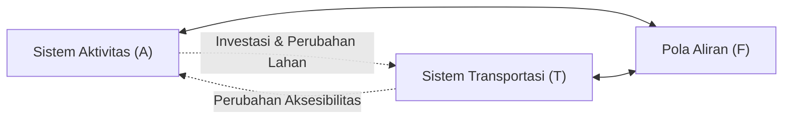

# Telaah Konseptual: Sistem Transportasi Utuh, LUTI, dan Regulasi Perencanaan Transportasi Indonesia
**Tanggal:** 21 Juni 2026 17:35
**Sesi Diskusi:** Sesi Brainstorming Bab 3 (Perencanaan Transportasi)

---

## 1. Konsepsi Sistem Transportasi Utuh (*Total System*)

Perencanaan transportasi yang efektif menuntut pemahaman bahwa transportasi tidak berdiri sendiri sebagai sektor tunggal, melainkan merupakan sebuah sistem makro yang utuh, interaktif, dan multisektoral. Beberapa kerangka teoretis utama yang melandasinya meliputi:

### a. Interaksi T-A-F Manheim (1979)
Marvin L. Manheim merumuskan bahwa fenomena transportasi terjadi akibat interaksi dinamis antara tiga sistem utama:
1.  **Sistem Transportasi (*Transport System* - T):** Ketersediaan sarana, prasarana, fasilitas, dan pola pengoperasiannya.
2.  **Sistem Aktivitas (*Activity System* - A):** Kumpulan aktivitas sosial, ekonomi, budaya, dan politik yang terjadi di atas ruang/lahan.
3.  **Pola Aliran (*Flow Pattern* - F):** Pola perjalanan riil (volume, rute, kecepatan, dan waktu tempuh) yang terbentuk dari interaksi antara sistem transportasi (penyedia jasa/kemampuan gerak) dan sistem aktivitas (kebutuhan gerak).

*Gambar 1: Model Interaksi T-A-F Manheim (1979)*

### b. Subsistem Makro Tamin (2019)
Ofyar Z. Tamin menyusun model konseptual yang lebih rinci bagi konteks Indonesia dengan membagi sistem makro menjadi empat subsistem mikro yang berinteraksi secara melingkar:
1.  **Subsistem Kegiatan (Aspek Guna Lahan):** Menghasilkan bangkitan perjalanan (*trip generation*) akibat perbedaan intensitas dan jenis aktivitas di tata guna lahan yang berbeda.
2.  **Subsistem Jaringan (Aspek Prasarana):** Menyediakan kapasitas fisik dan ruang lalu lintas (jalan, rel, rute penerbangan, alur pelayaran) untuk menampung pergerakan.
3.  **Subsistem Pergerakan (Aspek Aliran/Pelayanan):** Interaksi antara bangkitan kegiatan dengan kapasitas jaringan yang menghasilkan volume arus lalu lintas riil.
4.  **Subsistem Kelembagaan (Aspek Otoritas/Regulator):** Pengambil kebijakan yang mengatur hukum, pendanaan, dan administrasi dari ketiga subsistem lainnya.

### c. Perluasan Kusbiantoro (Dampak Multi-Dimensi)
Kusbiantoro memperluas model makro ini dengan menekankan pentingnya memasukkan **eksternalitas** atau dampak multi-dimensi (sosial, ekonomi, budaya, dan kelestarian lingkungan hidup) ke dalam siklus perencanaan transportasi. Model ini menegaskan bahwa transportasi tidak hanya berorientasi pada penyediaan infrastruktur, tetapi harus memperhatikan daya dukung lingkungan dan kesejahteraan sosial masyarakat.

### d. Interaksi Supply-Demand Cascetta (2009)
Ennio Cascetta merumuskan interaksi ini secara kuantitatif melalui keseimbangan sistem (*system equilibrium*). Permintaan perjalanan (*demand*) bersifat stokastik dan dipengaruhi oleh utilitas lokasi serta biaya perjalanan. Penyediaan transportasi (*supply*) dibatasi oleh kapasitas fisik dan tundaan akibat kemacetan (*congestion delay*). Arus lalu lintas yang stabil adalah titik temu equilibrium di mana utilitas pengguna jasa setara dengan tingkat pelayanan prasarana yang tersedia.

---

## 2. Land-Use Transport Interaction (LUTI) Ortúzar & Willumsen

Menurut Ortúzar dan Willumsen (2011), interaksi guna lahan dan transportasi memiliki hubungan umpan balik dua dimensi (*double dimension loop*):
1.  **Aktivitas Guna Lahan** menentukan intensitas dan distribusi **permintaan perjalanan (*travel demand*)**.
2.  **Ketersediaan Infrastruktur Transportasi** menentukan tingkat **aksesibilitas**, yang pada gilirannya mendikte **nilai lahan** dan menarik **lokasi aktivitas baru** (perumahan, industri, komersial) ke wilayah tersebut.

### Pendekatan Pemodelan LUTI
Dokumen literatur mencatat evolusi model LUTI dari yang bersifat statis ke dinamis:
*   **Model Lowry (Klasik):** Model tertua yang mengaitkan sektor pekerjaan dasar (*basic employment*) dengan sektor hunian (*residential*) dan pelayanan ritel (*retail services*) secara linier.
*   **Model Bid-Choice (seperti MUSSA):** Menggunakan teori ekonomi mikro (pilihan diskrit) untuk mensimulasikan persaingan antar-pengguna lahan dalam memperebutkan lokasi strategis berdasarkan kesediaan membayar (*willingness to pay*).
*   **System Dynamics:** Mensimulasikan interaksi non-linier dan efek umpan balik waktu-tunda (*time-lag*) antara pertumbuhan kota dan kapasitas jalan.
*   **Micro-simulation (seperti UrbanSim):** Menggunakan agen individu (rumah tangga, perusahaan) yang bertindak secara otonom dalam mensimulasikan pilihan lokasi hunian dan tempat kerja secara mikro-spasial.

---

## 3. Lanskap Regulasi Perencanaan Transportasi di Indonesia

Sistem transportasi Indonesia diatur oleh serangkaian undang-undang lintas sektor yang menuntut integrasi yang ketat antara sektor spasial (tata ruang) dan sektoral (perhubungan/pekerjaan umum).

### a. Pemetaan Dokumen Hukum Utama
1.  **UU No. 26/2007 tentang Penataan Ruang (j.o. UU No. 6/2023 tentang Cipta Kerja):** Menetapkan bahwa struktur ruang wilayah nasional terdiri atas sistem pusat permukiman (PKN, PKW, PKL) dan sistem jaringan prasarana (termasuk transportasi).
2.  **PP No. 21/2021 tentang Penyelenggaraan Penataan Ruang:** Mengatur keselarasan rencana tata ruang daerah (RTRW/RDTR) dengan rencana sektoral transportasi nasional.
3.  **UU No. 22/2009 tentang Lalu Lintas dan Angkutan Jalan (LLAJ):** Mengatur penyelenggaraan pergerakan orang dan barang, kelaikan sarana-prasarana jalan, serta instrumen pengendalian lalu lintas seperti Andalalin (Analisis Dampak Lalu Lintas) di Pasal 99-101.
4.  **UU No. 2 Tahun 2022 tentang Jalan:** Mengelompokkan status jalan (Nasional, Provinsi, Kabupaten, Kota, Desa) yang membagi kewenangan pembinaan dan pemeliharaan fisik jalan.
5.  **Permen ATR/BPN No. 6/2026:** Mewajibkan keterlibatan **tenaga ahli transportasi** yang bersertifikasi dalam tim penyusunan dokumen tata ruang (RTRW dan RDTR) untuk menghindari ketidaksinkronan proyeksi bangkitan lahan dengan kapasitas jalan.
6.  **KM No. 49 Tahun 2005 tentang Sistem Transportasi Nasional (Sistranas):** Pedoman sektoral nasional di bidang transportasi yang mengintegrasikan seluruh moda dan membaginya ke dalam 3 tataran perencanaan berjenjang.

### b. Sistranas (KM 49/2005) dan Struktur Spasial RTRW
Sistranas membagi kewenangan perencanaan fungsional transportasi secara hierarkis untuk mendukung sistem pusat permukiman nasional (PKN, PKW, PKL) yang tercantum dalam @tbl-klasifikasi-sistranas.

::: {#tbl-klasifikasi-sistranas .list-table aligns="l,l,l,l,l" tbl-colwidths="[12,13,15,30,30]"}
Klasifikasi Tataran Transportasi Berdasarkan KM 49/2005 (Sistranas)

- - **Tataran**
  - **Penetap Regulasi**
  - **Fokus Spasial**
  - **Simpul Utama**
  - **Ruang Lalu Lintas Utama**
- - **Tatranas** (Nasional)
  - Pemerintah Pusat (Peraturan Menteri)
  - Antar-PKN & Hubungan Internasional
  - Terminal Tipe A, Stasiun Utama Antarkota, Pelabuhan Hub Internasional/Nasional, Bandara Pusat Penyebaran (Primer, Sekunder, Tersier).
  - Jalan Nasional (Arteri & Kolektor Primer 1), Alur Laut Internasional / Kepulauan, Rute Penerbangan Utama.
- - **Tatrawil** (Wilayah)
  - Pemerintah Provinsi (Perda Provinsi setelah konsultasi Menteri)
  - Antar-PKW & Hubungan ke Tatranas
  - Terminal Tipe B, Stasiun/Pelabuhan Pengumpan Wilayah, Pelabuhan Regional, Bandara Bukan Pusat Penyebaran Klas C.
  - Jalan Provinsi (Kolektor Primer 2 & 3), Alur Laut antar-pelabuhan regional, Rute Penerbangan Pengumpan (*feeder*).
- - **Tatralok** (Lokal)
  - Pemerintah Kabupaten/Kota (Perda Kab/Kota setelah konsultasi Gubernur)
  - Antar-PKL, Perkotaan & Perdesaan
  - Terminal Tipe C, Stasiun Pengumpan Perkotaan, Pelabuhan Lokal, Bandara Bukan Pusat Penyebaran Klas A & B (Perintis).
  - Jalan Kabupaten/Kota/Desa, Alur Pelayaran Lokal, Rute Penerbangan Perintis / Lokal.
:::

Sistranas juga menetapkan bahwa Tatranas, Tatrawil, dan Tatralok disusun untuk **jangka waktu 20 tahun** dan wajib dilakukan **kaji ulang (*review*) sekurang-kurangnya sekali dalam 5 tahun**, menyelaraskan diri secara temporal dengan dokumen tata ruang daerah.

### c. Fragmentasi Kelembagaan Perencanaan Transportasi di Indonesia
Tantangan terbesar dalam mewujudkan sistem transportasi utuh di Indonesia adalah fragmentasi wewenang antar-instansi pemerintah, seperti yang digambarkan pada @tbl-fragmentasi-lembaga.

::: {#tbl-fragmentasi-lembaga .list-table aligns="l,l,l,l" tbl-colwidths="[20,25,25,30]"}
Matriks Fragmentasi Kelembagaan Sektor Transportasi Indonesia

- - **Aspek Perencanaan**
  - **Kementerian/Instansi Pembina**
  - **Dokumen Produk Rencana**
  - **Tantangan Sinkronisasi**
- - **Tata Guna Lahan (Guna Lahan/Aktivitas)**
  - Kementerian ATR/BPN & Pemda (Dinas Tata Ruang)
  - RTRW (Nasional/Provinsi/Kab-Kota) dan RDTR
  - Rencana tata ruang sering menetapkan intensitas lahan tinggi tanpa memperkirakan dampak bangkitan perjalanan pada jalan nasional/provinsi.
- - **Prasarana Fisik Jalan (Jaringan/Supply)**
  - Kementerian Pekerjaan Umum (PUPR) & Dinas PU Daerah
  - Rencana Umum Jaringan Jalan (Nasional/Provinsi/Kab-Kota)
  - Pembangunan jalan kadang tidak sinkron dengan penyediaan layanan angkutan umum atau penyediaan terminal di daerah.
- - **Pelayanan & Operasional (Pergerakan/Flow)**
  - Kementerian Perhubungan & Dinas Perhubungan Daerah
  - Tatranas, Tatrawil, Tatralok, serta Rencana Umum LLAJ
  - Perizinan rute angkutan atau tipe terminal (Kemenhub/Dishub) sering tertinggal dibanding pembangunan fisik koridor jalan oleh Kementerian PU.
:::

Tantangan fragmentasi ini menuntut pentingnya pendekatan perencanaan terintegrasi yang melintasi sektoral, yang menjadi ruh utama penulisan bab buku Perencanaan Transportasi ini.
