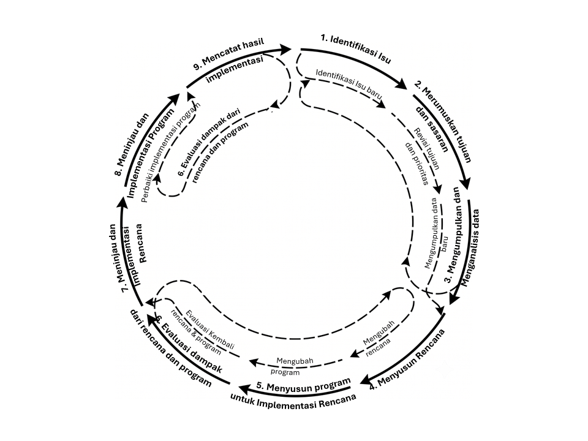

Transportasi merupakan urat nadi utama bagi *pergerakan* manusia dan barang dalam suatu wilayah. Namun, *pergerakan* ini tidak dapat dibiarkan tumbuh secara organik tanpa *kendali*. Tanpa adanya *kendali* yang sistematis, pertumbuhan mobilitas sering kali memicu kemacetan parah, pemborosan energi, dan penurunan kualitas lingkungan wilayah. Oleh karena itu, perencanaan hadir sebagai *kendali* logis untuk mengelola dan mengarahkan masa depan mobilitas wilayah secara teratur. Melalui perencanaan yang matang, penyediaan sarana dan prasarana transportasi dapat diselaraskan dengan perkembangan fisik wilayah. Penyelarasan ini sangat penting untuk menciptakan pergerakan yang aman, lancar, dan menghemat biaya perjalanan bagi masyarakat.

Untuk merancang *kendali* yang efektif, kita terlebih dahulu harus memandang transportasi sebagai suatu sistem yang utuh dan kompleks. Kompleksitas sistem *transportasi utuh* ini terbentuk dari interaksi dinamis antara sarana mobilitas, penyebaran aktivitas manusia, dan pola aliran pergerakan yang melintasi ruang geografis [@manheim1979fundamentals; @hensher2007handbook]. Ruang geografis inilah yang menjadi wadah fisik tempat terjadinya pergerakan tersebut, sehingga perencanaan transportasi tidak pernah bisa dipisahkan dari perencanaan tata ruang [@rodrigue2020geography].

# Sistem Transportasi Utuh

Sistem transportasi utuh merupakan paradigma utama yang seharusnya dipahami oleh seluruh perencana wilayah dan kota. Dalam paradigma ini, kita tidak boleh memandang transportasi secara parsial sebagai sekadar urusan penyediaan jalan atau kendaraan saja. Sebaliknya, kita wajib melihatnya sebagai satu kesatuan dari berbagai sistem yang lebih kecil namun saling berkaitan secara dinamis. Cara pandang sistemik ini diformulasikan secara kokoh oleh @manheim1979fundamentals sebagai hubungan timbal balik tiga variabel utama, yaitu Sistem Transportasi (*Transport system* - T), Sistem Aktivitas (*Activity system* - A), dan Pola Aliran pergerakan (*Flow pattern* - F). Hubungan timbal balik yang membentuk keseimbangan dinamis ini digambarkan dalam diagram T-A-F seperti yang ditunjukkan pada @fig-manheim.

Sistem aktivitas (A) menggambarkan seluruh pola kegiatan sosial-ekonomi masyarakat yang terdistribusi secara spasial di atas ruang, seperti kawasan permukiman, kawasan industri, pusat perbelanjaan, hingga stasiun kereta api. Distribusi kegiatan ini melahirkan kebutuhan perjalanan untuk berpindah tempat dari satu lokasi aktivitas ke lokasi lainnya. Untuk memfasilitasi kebutuhan tersebut, sistem transportasi (T) menyediakan komponen fisik dan operasional, seperti jaringan jalan raya, jalur rel kereta api, armada bus, serta aturan lalu lintas. Ketika masyarakat memanfaatkan sistem transportasi (T) untuk memenuhi kebutuhan sistem aktivitas (A), maka terbentuklah pola aliran pergerakan (F) berupa volume kendaraan dan penumpang di jalan raya atau sarana transit. Hubungan ketiga komponen ini bersifat timbal balik dan saling memengaruhi secara terus-menerus. Sebagai contoh, pembukaan jalur tol baru (perubahan pada T) akan meningkatkan aksesibilitas wilayah, yang kemudian merangsang pengembang membangun kawasan perumahan baru di sekitar gerbang tol (perubahan pada A). Pertumbuhan perumahan baru ini pada gilirannya akan melahirkan bangkitan perjalanan baru yang memadati jalan tol tersebut (perubahan pada F).

Kesamaan ide mengenai interaksi sistemik ini juga dirumuskan secara mendalam oleh @tamin2019perencanaan melalui konsep Sistem Transportasi Makro. Konsep ini memperluas interaksi T-A-F dengan membaginya ke dalam empat subsistem utama yang saling mengunci secara makroskopis, seperti yang ditunjukkan pada @fig-tamin. Empat subsistem tersebut adalah subsistem kegiatan (ekuivalen dengan sistem aktivitas), subsistem jaringan (penyedia ruang fisik jalan dan rel), subsistem pergerakan (pengelola aliran kendaraan dan orang), serta subsistem kelembagaan. Penambahan subsistem kelembagaan ini menjadi pengayaan penting karena berfungsi sebagai regulator yang mengoordinasikan aspek hukum, kebijakan penataan wilayah, dan pendanaan infrastruktur secara lintas sektoral. Tanpa adanya subsistem kelembagaan yang kuat, koordinasi antara penyedia jaringan jalan dan pengelola angkutan umum sering kali berjalan sendiri-sendiri, sehingga memicu inefisiensi sistem transportasi secara keseluruhan.

Pemahaman yang kuat mengenai sistem transportasi utuh ini menjadi sangat krusial dalam memandu perencana untuk menyusun dan mengevaluasi perencanaan transportasi. Dengan menyadari bahwa permasalahan lalu lintas di jalan raya tidak berdiri sendiri, perencana tidak akan terjebak pada solusi reaktif seperti sekadar melebarkan jalan yang macet. Sebaliknya, perencana akan melihat bahwa kemacetan tersebut dapat diselesaikan secara integratif, baik dengan memperbaiki kinerja sistem transportasinya (seperti membangun angkutan umum massal) maupun dengan mengendalikan sistem aktivitasnya (seperti membatasi intensitas pemanfaatan ruang di pusat kota).

{#fig-manheim}

{#fig-tamin}

# Perencanaan dan Transportasi

Sebelum menyatukan kedua konsep ini menjadi sebuah disiplin terpadu yang utuh, kita perlu memahami esensi dari perencanaan dan transportasi secara terpisah terlebih dahulu. Pemisahan istilah ini bertujuan agar kita dapat melihat bagaimana prinsip-prinsip dasar dari proses pengambilan keputusan masa depan (perencanaan) diterapkan secara spesifik pada objek pergerakan fisik (transportasi). Perencanaan sendiri secara teoretis didefinisikan oleh @anderson1995guidelines sebagai aktivitas pemecahan masalah yang diarahkan pada suatu tujuan tertentu di masa depan dengan memanfaatkan sumber daya secara rasional dan efisien. Karakteristik masalah yang dihadapi dalam perencanaan wilayah sering kali bersifat rumit dan tidak memiliki solusi tunggal, yang dalam literatur tata ruang disebut sebagai masalah pelik (*wicked problems*). Masalah pelik ini juga melekat pada sektor transportasi, di mana penyelesaian kemacetan di satu persimpangan sering kali justru memindahkan kemacetan ke persimpangan berikutnya.

Untuk mengelola masalah pelik tersebut, proses perencanaan dirumuskan sebagai sebuah siklus dinamis sembilan tahap yang berjalan secara berkesinambungan. Siklus ini diilustrasikan pada @fig-anderson yang merupakan adaptasi dari kerangka perencanaan tata ruang wilayah milik @anderson1995guidelines. Sembilan tahapan tersebut meliputi: (1) identifikasi isu dan masalah wilayah, (2) perumusan tujuan dan sasaran, (3) pengumpulan dan analisis data, (4) penyusunan alternatif rencana dan program, (5) evaluasi dampak rencana (evaluasi *ex-ante*), (6) pemilihan rencana terbaik, (7) pelaksanaan rencana dan program, (8) pencatatan serta pemantauan hasil pelaksanaan, hingga (9) identifikasi isu baru untuk memulai siklus berikutnya. Karakteristik utama dari siklus ini adalah sifatnya yang interaktif dan adaptif, di mana hasil pemantauan di lapangan dapat menjadi masukan berharga untuk mengevaluasi atau merevisi tujuan perencanaan di masa depan.

{#fig-anderson}

Untuk mengilustrasikan bagaimana kerangka kerja siklus perencanaan tata ruang ini diadaptasikan secara nyata ke dalam perencanaan transportasi, kita dapat mengambil satu kasus konkret, yaitu isu kemacetan parah di jalan utama kota. Setelah isu kemacetan diidentifikasi pada tahap pertama, perencana akan merumuskan tujuan dan sasaran pada tahap kedua. Di sinilah kepaduan konsep sistem transportasi utuh dari subbab sebelumnya diterapkan secara nyata: perencana dapat menetapkan sasaran untuk menyelesaikan masalah dari sisi sistem transportasi (seperti optimalisasi waktu lampu lalu lintas dan penyediaan lajur sepeda) atau dari sisi sistem aktivitasnya (seperti relokasi pusat kegiatan atau pembatasan guna lahan padat). Setelah sasaran disepakati, perencana akan mengumpulkan data primer dan sekunder pada tahap ketiga guna memodelkan arus perjalanan, menyusun alternatif rencana pada tahap keempat, mengevaluasi dampaknya pada tahap kelima, memilih alternatif terbaik pada tahap keenam, hingga melaksanakan pembangunan fisik atau rekayasa lalu lintas pada tahap ketujuh. Hasil pelaksanaan kemudian dicatat secara sistematis pada tahap kedelapan untuk memastikan apakah kemacetan berhasil direduksi atau justru melahirkan isu kemacetan baru di kawasan pinggiran pada tahap kesembilan.

Alasan mendasar mengapa kita menggunakan kerangka kerja siklus perencanaan tata ruang dalam mengelola transportasi adalah fakta tak terbantahkan bahwa transportasi membutuhkan ruang fisik [@rodrigue2020geography]. Transportasi tidak terjadi di ruang hampa, melainkan melekat secara geografis pada permukaan bumi. Setiap pembangunan jalan, rel, atau terminal membutuhkan alokasi lahan nyata yang harus berbagi dengan kebutuhan ruang untuk permukiman, pertanian, dan kawasan lindung. Oleh karena itu, integrasi antara perencanaan dan transportasi ini secara operasional diwujudkan melalui proses pengumpulan data yang sistematis guna memodelkan pergerakan pada berbagai skala wilayah analisis. Merujuk pada pembagian skala geografis oleh @rodrigue2020geography, terdapat tiga skala wilayah analisis yang digunakan oleh perencana:

- **Skala Makro (Strategis):** Menganalisis pergerakan wilayah berskala besar antar-kota atau regional, seperti perencanaan jaringan jalan tol trans-pulau atau sistem transit massal metropolitan.
- **Skala Meso (Taktis):** Menganalisis pergerakan pada koridor jalan arteri tertentu atau kawasan khusus dalam kota, seperti analisis kapasitas koridor utama atau penataan kawasan pusat bisnis.
- **Skala Mikro (Operasional):** Menganalisis manajemen lalu lintas lokal secara mendetail, seperti desain geometris persimpangan jalan atau optimalisasi durasi lampu lalu lintas.

Untuk mengisi parameter pada ketiga skala analisis wilayah tersebut, perencana mengumpulkan data primer langsung dari lapangan serta data sekunder dari dokumen lembaga resmi seperti Badan Pusat Statistik (BPS). Berbagai metode pengumpulan data perencanaan transportasi ini dirangkum pada @tbl-metode-survei.

| Jenis Survei | Metode Pengumpulan Data | Kegunaan Utama dalam Pemodelan |
|:---|:---|:---|
| **Pencacahan Lalu Lintas (*Traffic Count*)** | Penghitungan manual atau sensor otomatis volume kendaraan di jalan | Mengetahui volume lalu lintas aktual (*screening* V/C Ratio) |
| **Survei Asal-Tujuan (*Origin-Destination*)** | Wawancara tepi jalan, pos kordon, pelacakan plat nomor, atau MPD | Menyusun matriks asal-tujuan perjalanan antar-TAZ [@bps2024mpd] |
| **Survei Wawancara Rumah Tangga (*Household Interview*)** | Kuesioner langsung mengenai profil demografi dan perjalanan keluarga | Menganalisis bangkitan dan tarikan perjalanan berbasis individu |
| **Inventarisasi Prasarana** | Pengukuran lebar jalan, kondisi permukaan, dan jenis sinyal | Mengestimasi kapasitas jaringan jalan (*supply* sistem) |
| **Survei Sosio-Ekonomi (Sekunder)** | Pencatatan data BPS (jumlah penduduk, lapangan kerja, pendapatan) | Menjadi variabel penjelas dalam regresi bangkitan perjalanan |

: Metode Pengumpulan Data dan Survei Perencanaan Transportasi {#tbl-metode-survei}

# Model dalam Transportasi: Pengantar

Setelah data-data perencanaan pada @tbl-metode-survei berhasil dikumpulkan, langkah selanjutnya dalam siklus perencanaan adalah melakukan analisis data. Di dalam disiplin transportasi, analisis data ini diwujudkan melalui proses **pemodelan**. Kebutuhan akan model muncul karena realitas pergerakan di suatu wilayah sangatlah rumit untuk dipahami secara langsung. Kompleksitas ini dipicu oleh ribuan pilihan manusia yang acak (stokastik), interaksi kemacetan fisik di jalan raya, tundaan ruang-waktu, dan keterbatasan kapasitas prasarana.

Menurut @ortuzar2011modelling, model secara sederhana didefinisikan sebagai representasi dari kondisi nyata wilayah. Representasi ini sengaja dibuat lebih sederhana dengan hanya mengambil variabel-variabel kunci yang paling berpengaruh terhadap pergerakan, sehingga perencana dapat memahami perilaku sistem transportasi tanpa harus tersesat dalam detail yang tidak perlu. Alasan krusial penggunaan model dalam perencanaan transportasi adalah kemampuannya untuk melakukan eksperimen simulasi kebijakan. Dengan menggunakan model, perencana dapat memprediksi dampak dari suatu kebijakan (seperti pengenaan tarif jalan berbayar atau perubahan rute bus) sebelum kebijakan tersebut benar-benar dijalankan di dunia nyata. Hal ini sangat penting untuk menghemat biaya investasi pembangunan fisik prasarana yang bernilai sangat besar dan meminimalisasi risiko kegagalan proyek di lapangan.

Dalam @ortuzar2011modelling, dibahas berbagai jenis model transportasi yang dikelompokkan berdasarkan tujuan penggunaannya. Beberapa model tersebut di antaranya adalah model matematis permintaan perjalanan (*travel demand models*) untuk memproyeksikan jumlah perjalanan di masa depan, model pilihan diskrit (*discrete choice models*) untuk memprediksi probabilitas pemilihan moda, dan model simulasi jaringan (*network simulation models*) untuk memetakan penyebaran arus lalu lintas di jalan raya. Penggunaan model-model ini membantu perencana menyusun skenario pembangunan wilayah yang lebih terukur dan berbasis data ilmiah.

<!-- Ide Ilustrasi: Diagram Alur Pemodelan Transportasi Umum. Diagram ini menggambarkan alur dari (1) Input Data Primer & Sekunder -> (2) Pembagian Zona Analisis (TAZ) -> (3) Proses Kalibrasi Model -> (4) Validasi Model dengan Data Lapangan -> (5) Simulasi Skenario Kebijakan (ex-ante) -> (6) Output berupa Proyeksi Volume Lalu Lintas, V/C Ratio, dan Tingkat Pelayanan Jalan (LOS) -->

# Model Empat Tahap

## Definisi, Sejarah, dan Fungsi Utama

Model Perencanaan Transportasi Empat Tahap (atau lebih populer disebut *Four-Step Model* [FSM] atau Model Perencanaan Transportasi Empat Tahap [MPTEP]) adalah kerangka kerja analitis klasik yang paling dominan digunakan dalam peramalan permintaan perjalanan transportasi (*transport travel demand forecasting*). Secara konseptual, model ini menyederhanakan interaksi kompleks antara sistem penataan ruang (tata guna lahan) dengan kapasitas jaringan prasarana transportasi ke dalam prosedur pemodelan matematika yang terstruktur dan sekuensial.

Fungsi utama dari model empat tahap adalah memperkirakan volume lalu lintas, pola arus pergerakan barang atau manusia, dan tingkat pelayanan (*level of service*) pada suatu jaringan jalan maupun angkutan umum di masa depan berdasarkan proyeksi kondisi demografi, sosial-ekonomi, dan tata guna lahan tertentu. Informasi ini digunakan oleh perencana wilayah dan kota untuk mengevaluasi kelayakan proyek investasi infrastruktur baru, menyusun rencana induk sektoral transportasi, atau merancang skenario manajemen lalu lintas.

Model ini pertama kali dikembangkan secara empiris pada dekade 1950-an di Amerika Serikat seiring dengan kebutuhan memproyeksikan kapasitas pembangunan jalan bebas hambatan antarpasar (*interstate highway system*). Prosedur formalnya dirintis secara komprehensif dalam *Detroit Metropolitan Area Traffic Study* (1953) dan diterapkan secara institusional berskala regional untuk pertama kalinya dalam *Chicago Area Transportation Study* (CATS) pada tahun 1956 [@hensher2007handbook]. Sejak saat itu, model ini diadopsi secara global dan menjadi prosedur standar perencanaan transportasi makro.

Sesuai dengan namanya, model ini terdiri atas empat tahapan matematis yang saling berurutan:

1.  **Bangkitan Perjalanan (*Trip Generation*)**
2.  **Distribusi Perjalanan (*Trip Distribution*)**
3.  **Pemilihan Moda (*Mode Choice*)**
4.  **Pembebanan Jaringan (*Route Assignment*)**

## Rincian Tahapan, Data, Metode, dan Keluaran

Secara operasional, area studi dibatasi oleh suatu garis kordon lalu lintas luar dan dibagi secara spasial ke dalam Zona Analisis Lalu Lintas (*Traffic Analysis Zones* / TAZ). Penjelasan rincian keempat tahapan FSM dijabarkan sebagai berikut [@ortuzar2011modelling; @tamin2019perencanaan]:

<!-- Ide Ilustrasi: Diagram Alur Model Empat Tahap sekuensial yang menghubungkan Trip Generation, Trip Distribution, Mode Choice, dan Route Assignment -->

### Bangkitan Perjalanan (*Trip Generation*)

Tahap pertama di dalam prosedur FSM adalah **bangkitan perjalanan (*trip generation*)**, yang berfungsi mengukur intensitas pergerakan harian yang keluar dari dan menuju ke setiap Zona Analisis Lalu Lintas (TAZ) [@ortuzar2011modelling]. Perjalanan ini secara matematis dipisahkan menjadi dua kutub utama: kutub produksi perjalanan ($O_i$) yang melambangkan titik keberangkatan, dan kutub tarikan perjalanan ($D_j$) yang menandakan titik tujuan aktivitas [@tamin2019perencanaan].

Untuk memproyeksikan laju pergerakan pada kedua kutub ini, analis memerlukan basis data sosial-ekonomi dan tata guna lahan yang sangat terperinci. Pada ujung produksi, data demografi rumah tangga seperti pendapatan rata-rata, jumlah anggota keluarga, dan tingkat kepemilikan kendaraan pribadi menjadi variabel penentu utama. Sementara itu, pada ujung tarikan, data fisik tata guna lahan seperti luas lantai perkantoran, pusat perbelanjaan, sebaran sekolah, serta jumlah lapangan pekerjaan per sektor ekonomi bertindak sebagai faktor penarik.

Penaksiran laju pergerakan ini diselesaikan menggunakan dua metode komputasional standar. Metode pertama adalah **analisis regresi linier berganda**, di mana total produksi perjalanan ($O_i$) diasumsikan sebagai fungsi linier dari variabel penjelas:

$$O_i = a + b_1X_{1i} + b_2X_{2i} + \dots + b_nX_{ni}$$

dengan $X$ mewakili atribut sosio-ekonomi rumah tangga. Metode kedua adalah **analisis klasifikasi silang (*category analysis*)**, yang mengelompokkan karakteristik rumah tangga ke dalam kategori-kategori diskret guna memperoleh nilai rata-rata perjalanan yang lebih realistis. Keluaran dari tahapan awal ini adalah vektor jumlah total produksi perjalanan ($O_i$) dan tarikan perjalanan ($D_j$) yang siap diumpankan ke tahapan berikutnya.

### Distribusi Perjalanan (*Trip Distribution*)

Setelah jumlah bangkitan pada setiap zona diketahui, tahapan dilanjutkan dengan **distribusi perjalanan (*trip distribution*)**. Fungsi dari tahapan kedua ini adalah menyambungkan kutub produksi ($O_i$) dengan kutub tarikan ($D_j$) dalam ruang geografis, sehingga diperoleh pola sebaran perjalanan yang menghubungkan setiap pasangan zona asal dan tujuan.

Agar sebaran perjalanan ini dapat dihitung, analis memerlukan data luaran dari tahap bangkitan perjalanan serta matriks waktu tempuh atau biaya perjalanan antarzona—yang sering diistilahkan sebagai matriks hambatan (*skim matrix*). Hambatan fisik ini membatasi kemauan seseorang untuk bepergian ke zona yang terlampau jauh.

Secara matematis, sebaran pergerakan ini disimulasikan menggunakan **model gravitasi (*gravity model*)** yang diadaptasi dari hukum gaya tarik fisik Newton. Formulasi model gravitasi ini ditulis sebagai:

$$T_{ij} = O_i \frac{D_j f(C_{ij}) K_{ij}}{\sum_k D_k f(C_{ik}) K_{ik}}$$

Di dalam persamaan ini, sebaran perjalanan ($T_{ij}$) dari zona asal $i$ ke tujuan $j$ berbanding lurus dengan besarnya tarikan zona tujuan ($D_j$) dan berbanding terbalik dengan fungsi hambatan biaya perjalanan $f(C_{ij})$, seperti fungsi eksponensial $e^{-b C_{ij}}$ atau fungsi pangkat $C_{ij}^{-b}$. Faktor penyesuaian sosial-ekonomi khusus ($K_{ij}$) juga dimasukkan untuk merepresentasikan preferensi pergerakan lokal. Keluaran akhir dari tahap distribusi perjalanan ini adalah sebuah **Matriks Asal-Tujuan (MAT)** spasial ($T_{ij}$) yang merangkum peta arus perjalanan antarzona.

### Pemilihan Moda (*Mode Choice* / *Modal Split*)

Arus perjalanan spasial yang tercantum di dalam MAT umum kemudian harus dipilah berdasarkan jenis transportasi yang digunakan melalui tahapan **pemilihan moda (*mode choice* / *modal split*)**. Tujuan utamanya adalah memperkirakan proporsi pembagian pelaku perjalanan ke dalam alternatif moda transportasi yang tersedia, seperti kendaraan roda dua, mobil pribadi, atau angkutan umum massal.

Keputusan pemilihan moda ini dipengaruhi oleh tiga kelompok data utama, yaitu karakteristik pelaku perjalanan (seperti kepemilikan Surat Izin Mengemudi dan tingkat pendapatan), karakteristik perjalanan (seperti jarak tempuh dan tujuan perjalanan), serta karakteristik kinerja moda itu sendiri (mencakup waktu tempuh di jalan, waktu tunggu di halte, biaya tarif, dan tingkat kenyamanan) [@ortuzar2011modelling].

Model komputasional yang digunakan secara universal untuk tahap ini adalah **model pilihan diskret (*discrete choice model*)**, khususnya model **Logit Multinomial (*Multinomial Logit* / MNL)** dengan formulasi:

$$P_{im} = \frac{e^{V_{im}}}{\sum_{k} e^{V_{ik}}}$$

Persamaan ini menghitung probabilitas ($P_{im}$) seorang pelaku perjalanan dari zona asal $i$ memilih moda tertentu $m$ berdasarkan nilai utilitas representatif ($V_{im}$). Nilai utilitas ini dirumuskan sebagai fungsi linier dari atribut biaya dan waktu: $V_{im} = a_0 + a_1(\text{Waktu Tempuh}) + a_2(\text{Biaya Perjalanan}) + \dots$. Hasil akhir dari tahap pemilihan moda ini adalah pemecahan MAT umum menjadi beberapa MAT spesifik per moda transportasi yang terpisah.

### Pembebanan Jaringan (*Route Assignment*)

Langkah pamungkas dalam prosedur FSM adalah **pembebanan jaringan (*route assignment*)**, yang berfungsi memetakan dan mengalokasikan arus perjalanan dari MAT masing-masing moda ke rute-rute fisik di jaringan transportasi jalan atau jalur angkutan umum nyata [@tamin2019perencanaan].

Untuk menyelesaikan perhitungan pembebanan ini, perencana membutuhkan data MAT per moda, geometri fisik jaringan jalan (seperti jumlah lajur, panjang segmen, kapasitas rencana, dan batas kecepatan bebas), serta fungsi hubungan tundaan ruas jalan akibat kemacetan.

Metode perhitungan yang paling sering digunakan adalah **prinsip keseimbangan pengguna (*user equilibrium* / UE) Wardrop**, yang berasumsi bahwa pelaku perjalanan akan selalu memilih rute tercepat secara rasional hingga tercapai kondisi seimbang di mana tidak ada satu pun pengendara yang dapat memotong waktu tempuhnya dengan berpindah rute secara sepihak. Selama proses alokasi ini, waktu tempuh pada setiap ruas jalan ($t_a$) akan melonjak seiring bertambahnya volume lalu lintas ($V_a$) relatif terhadap kapasitas jalurnya ($C_a$), sesuai dengan formula standar dari Biro Jalan Umum AS (BPR):

$$t_a = t_0 \left[ 1 + \alpha \left( \frac{V_a}{C_a} \right)^\beta \right]$$

di mana $t_0$ melambangkan waktu tempuh bebas hambatan, sedangkan $\alpha = 0,15$ dan $\beta = 4$ adalah parameter kalibrasi empiris. Keluaran akhir dari tahapan ini adalah volume arus lalu lintas nyata di setiap ruas jalan, rasio volume terhadap kapasitas (*V/C ratio*), dan waktu perjalanan ekuilibrium regional yang dapat dijadikan bahan evaluasi kinerja jaringan prasarana kota.

## Telaah Kasuistik Penggunaan FSM

Penggunaan FSM di dunia nyata dapat dipelajari secara kasuistik melalui dua contoh kontras perencanaan di Indonesia:

### Kasus Perencanaan Agregat Regional: Studi SITRAMP Jabodetabek (2004)

Dalam perencanaan makro wilayah megapolitan Jakarta pada tahun 2004, proyek **SITRAMP (*Study on Integrated Transportation Master Plan for Jabodetabek*)** yang digarap oleh JICA bersama Bappenas memanfaatkan model FSM untuk mensimulasikan proyeksi kemacetan 20 tahun mendatang (target tahun 2020). 

- *Penerapan:* Pemodelan membagi Jabodetabek menjadi ratusan zona analisis dan menyusun model bangkitan serta distribusi berbasis survei komuter skala besar. Melalui tahap pemilihan moda dan pembebanan rute statis, model mensimulasikan skenario "tanpa intervensi" (*do-nothing scenario*), yang memproyeksikan rasio kejenuhan jalan ($V/C$) di batas kota Jakarta akan melebihi angka 1,5, yang secara spasial meramalkan kelumpuhan total lalu lintas.
- *Implikasi Kebijakan:* Hasil simulasi FSM ini melegitimasi secara ilmiah kebutuhan reformasi prasarana transportasi massal secara radikal. Dari studi ini, dirumuskan cetak biru pembangunan koridor busway (BRT) Transjakarta secara eksklusif, penambahan jalur ganda (*double tracking*) kereta komuter lintas penyangga, inisiasi proyek MRT Jakarta koridor Utara-Selatan, dan opsi pembatasan volume lalu lintas lewat jalan berbayar elektronik (*Electronic Road Pricing* / ERP).

### Kasus Dinamis Tanggap Darurat: Evaluasi Rencana Evakuasi Tsunami Kota Padang

Ketika FSM dihadapkan pada skenario keselamatan publik yang dinamis dan terdesentralisasi, keterbatasan struktural model ini mulai terlihat. Dalam studi simulasi evakuasi tsunami pasca gempa bumi patahan Sumatera di pesisir Kota Padang, FSM konvensional terbukti tidak memadai.

- *Penerapan & Batasan:* FSM tradisional mengasumsikan keputusan perjalanan bersifat statis, agregat, dan independen terhadap dimensi waktu yang sempit. Dalam situasi bencana, pelaku perjalanan tidak melakukan pergerakan searah yang linear. Ada kebutuhan rantai aktivitas (*trip chaining*) multi-destinasi, seperti orang tua yang harus berkendara menjemput anak terlebih dahulu ke sekolah (koordinasi tingkat rumah tangga) sebelum bergerak menuju zona aman di dataran tinggi. 
- *Pembelajaran:* Penggunaan model FSM statis dalam kasus ini akan meremehkan volume kendaraan sesungguhnya di persimpangan kritis karena mengabaikan dinamika temporal. Melalui transisi ke model mikrosimulasi berbasis agen (*Agent-Based Modeling* menggunakan MATSim), ditemukan bahwa ketika seluruh agen bergerak serentak dengan perilaku menjemput anggota keluarga, derajat kejenuhan di rute evakuasi melejit hingga 3,18. Studi kasuistik ini membuktikan bahwa FSM sangat andal untuk infrastruktur makroskopik jangka panjang, namun gagal memitigasi manajemen risiko yang dipengaruhi oleh aspek temporal dan rantai aktivitas individu yang sangat dinamis.

# Berbagai Model dalam Transportasi

Untuk memahami bagaimana model-model transportasi diaplikasikan secara operasional, kita perlu mengkaji perkembangan metodologi pemodelan yang digunakan oleh para perencana. Pendekatan kuantitatif standar yang paling luas digunakan di dunia, termasuk di Indonesia, adalah Model Empat Tahap (*Four-Step Model* - FSM). Prosedur klasik ini membagi analisis pergerakan secara runtut ke dalam empat tahap komputasi yang saling berkaitan. Setiap tahapan diselesaikan menggunakan formulasi matematika esensial seperti dijabarkan pada @tbl-four-step-model.

::: {#tbl-four-step-model .list-table aligns="l,l,l" tbl-colwidths="[25,40,35]"}
Struktur Komponen Model Empat Tahap Klasik (FSM)

- - Tahapan
  - Mekanisme Komputasional & Teori
  - Variabel Utama & Formulasi Esensial 
- - **Bangkitan & Tarikan (*Trip Generation*)**
  - Mengukur jumlah perjalanan harian yang diproduksi oleh perumahan atau ditarik oleh tempat kerja di setiap TAZ.
  - Variabel: Jumlah penduduk, pekerjaan.
    
    Formula: $P_i = a + b X_i$
- - **Distribusi Perjalanan (*Trip Distribution*)**
  - Menghubungkan produksi dan tarikan perjalanan ke dalam matriks asal-tujuan. Tahap ini bertumpu pada analogi hukum Gravitasi Newton.
  - Variabel: Waktu/biaya perjalanan antar-zona.
    
    Formula: $T_{ij} = A_i P_i B_j D_j f(C_{ij})$
- - **Pemilihan Moda (*Mode Choice*)**
  - Menghitung probabilitas komuter memilih kendaraan pribadi atau transportasi umum berdasarkan maksimisasi utilitas acak.
  - Variabel: Selisih biaya dan waktu tempuh.
    
    Formula: $P_m = \frac{e^{U_m}}{\sum e^{U_k}}$
- - **Pembebanan Jaringan (*Traffic Assignment*)**
  - Membebankan perjalanan ke rute jaringan jalan nyata berdasarkan asumsi waktu tempuh terpendek (Ekuilibrium Wardrop).
  - Variabel: Rasio volume/kapasitas jalan.
    
    Formula: $t = t_0 [1 + \alpha (V/C)^\beta]$
:::

Waktu tempuh aktual di jalan raya sangat dipengaruhi oleh volume lalu lintas ($V$) yang menggunakan jalan tersebut dibanding kapasitas fisiknya ($C$). Hubungan ini diukur melalui rasio volume terhadap kapasitas (**V/C Ratio**) yang ditunjukkan pada formula pembebanan rute BPR di @tbl-four-step-model. Peningkatan volume kendaraan akan memperbesar V/C Ratio and menurunkan kecepatan, yang kemudian menurunkan Tingkat Pelayanan Jalan (*Level of Service* - LOS). LOS jalan diklasifikasikan dari huruf A (sangat lancar) hingga F (kemacetan total di mana arus lalu lintas terhenti). Evaluasi LOS ini menjadi dasar bagi perencana untuk menentukan apakah suatu ruas jalan membutuhkan pelebaran fisik atau manajemen rekayasa lalu lintas baru. Sumber utama teori pemodelan ini bersandar pada konsep yang dikembangkan oleh @ortuzar2011modelling and @tamin2019perencanaan.

Meskipun FSM sangat populer, model klasik ini memiliki beberapa keterbatasan mendasar. Asumsi sekuensial FSM dinilai terlalu kaku karena memperlakukan setiap tahapan secara terpisah tanpa umpan balik yang terintegrasi secara dinamis. Selain itu, FSM bersifat berbasis perjalanan (*trip-based*) yang mengabaikan hubungan antar-perjalanan yang dilakukan seseorang dalam sehari. Model ini gagal merekam pola perjalanan komuter yang mampir ke toko atau menjemput anak sekolah dalam perjalanan pulang kantor (*trip chaining*).

Keterbatasan tersebut mendorong evolusi pemodelan menuju pendekatan yang lebih presisi, seperti *Activity-Based Modeling* (ABM) dan *Dynamic Traffic Assignment* (DTA). Cara melaksanakan ABM secara umum adalah dengan menyimulasikan perjalanan sebagai kebutuhan yang diturunkan dari rencana aktivitas harian individu secara berkesinambungan (kronologis 24 jam). Model ini tidak lagi membagi wilayah ke dalam zona-zona kaku (TAZ), melainkan memodelkan setiap individu secara spesifik berdasarkan jadwal kegiatannya.

Evolusi ini memuncak pada pengembangan pemodelan berbasis agen (*Agent-Based Modeling*) menggunakan kerangka kerja simulasi multi-agen berskala besar seperti *Multi-Agent Transport Simulation* (MATSim). Dalam model MATSim, masyarakat disimulasikan secara diskrit sebagai jutaan "agen" sintetik otonom. Setiap agen memiliki profil demografis dan rencana aktivitas harian sendiri. Agen-agen ini bersaing memperebutkan ruang jalan virtual dalam simulator fisik, lalu memperbarui rencana perjalanan mereka di hari berikutnya untuk menghindari kemacetan berdasarkan fungsi utilitas skor perjalanan mereka. Di Indonesia, model MATSim skala besar telah berhasil dikembangkan untuk wilayah megapolitan Jakarta guna menyimulasikan jutaan agen komuter secara bersamaan dan mengevaluasi dampak kebijakan pembatasan kendaraan secara multimodal [@matsim2026jakarta].

Di era terkini, penerapan teknologi pengumpulan data raya (*big data*) dan Kecerdasan Buatan (AI) telah membawa revolusi besar bagi pemodelan transportasi di Indonesia. Sektor swasta memelopori pemanfaatan algoritma AI melalui orkestrasi jutaan perjalanan harian oleh platform *ride-hailing* seperti Gojek dan Grab. Perusahaan ini memanfaatkan model penyesuaian harga dinamis (*dynamic pricing*) berbasis algoritma pembelajaran mesin untuk menyeimbangkan jumlah pengemudi dan permintaan pengguna secara waktu nyata di wilayah perkotaan yang padat. Pada sektor pelayanan publik, Pemerintah Provinsi DKI Jakarta melalui unit *Jakarta Smart City* telah menerapkan lampu lalu lintas pintar (*Intelligent Traffic Control System* - ITCS) berbasis AI dan IoT di puluhan persimpangan jalan arteri vital [@its2025jakarta]. Sistem ini memanfaatkan kamera pemantau berbasis *Computer Vision* untuk menghitung volume kendaraan secara otomatis dan mengadaptasi durasi siklus lampu hijau secara terkoordinasi antar-persimpangan.

Selain itu, survei pergerakan konvensional kini mulai digantikan oleh pemodelan geospasial berbasis data posisi ponsel (*Mobile Positioning Data* - MPD) [@bps2024mpd]. Dengan menganalisis data sinyal seluler pasif secara agregat, otoritas perencana nasional seperti Bappenas dan BPS berhasil memetakan proporsi pergerakan komuter harian secara presisi di sepuluh kawasan metropolitan utama di Indonesia, mulai dari Mebidangro di Sumatera Utara hingga Mamminasata di Sulawesi Selatan. Langkah ini meminimalisasi biaya survei lapangan dan menghasilkan data yang sangat representatif untuk perencanaan pembangunan infrastruktur regional.

<!-- Ide Ilustrasi: Diagram Evolusi Pemodelan Transportasi. Diagram ini memvisualisasikan empat generasi model: Generasi 1 (FSM Tradisional: Sekuensial, Trip-based, Makro-agregat) -> Generasi 2 (Disagregat & Perangkat Lunak Komersial seperti Visum/Vissim) -> Generasi 3 (Agent-Based Simulation & Big Data MPD seperti MATSim) -> Generasi 4 (AI, Machine Learning, dan IoT Real-time seperti ITCS Jakarta Smart City dan Dynamic Pricing Ride-Hailing) -->

# Transportasi dalam Perencanaan di Indonesia

Seluruh proses pemodelan transportasi yang telah kita bahas sebelumnya pada dasarnya bermuara pada implementasi kebijakan pembangunan wilayah nyata. Di Indonesia, implementasi ini memiliki wadah hukum formal yang terbagi ke dalam sistem penataan ruang dan sistem perencanaan pembangunan nasional. Secara hukum, terdapat dua payung hukum besar yang mengatur jalannya pembangunan di Indonesia, yaitu:

1. **Sistem Perencanaan Pembangunan Nasional (SPPN):** Diatur melalui UU No. 25/2004, yang mengoordinasikan rencana pembangunan jangka panjang (RPJP), jangka menengah (RPJM), hingga rencana kerja tahunan (RKP/RKPD) di tingkat nasional dan daerah.
2. **Sistem Penataan Ruang:** Diatur melalui UU No. 26/2007, yang menetapkan struktur ruang dan pola ruang wilayah melalui dokumen Rencana Tata Ruang Wilayah (RTRW) dan Rencana Detail Tata Ruang (RDTR) sebagai acuan tunggal keruangan (*single spatial reference*).

Untuk menyelaraskan rencana-rencana teknis sektoral prasarana seperti rencana permukiman, masterplan drainase, dan rencana induk transportasi agar sejalan dengan kedua payung hukum di atas, kita dapat mengklasifikasikannya berdasarkan tiga dimensi utama:

**A. Dimensi Tata Ruang (UU No. 26/2007)**

Dalam penataan ruang, rencana prasarana sektoral ini diintegrasikan ke dalam komponen **Rencana Struktur Ruang**, khususnya pada sub-komponen **Rencana Jaringan Prasarana** dan **Sistem Pusat Permukiman**. Sistem jaringan transportasi masuk sebagai bagian integral dari rencana jaringan prasarana wilayah yang harus digambar secara spasial dalam peta RTRW/RDTR.

**B. Nomenklatur Resmi UU Sektoral**

Setiap sektor memiliki undang-undang khusus yang menetapkan nomenklatur resmi dokumen rencana induknya:

- *Rencana Permukiman:* Disebut **Rencana Pembangunan dan Pengembangan Perumahan dan Kawasan Permukiman (RP3KP)** berdasarkan UU No. 1/2011 tentang Perumahan dan Kawasan Permukiman.
- *Rencana Drainase:* Disebut **Rencana Induk Sistem Drainase Perkotaan** berdasarkan Permen PUPR No. 12/PRT/M/2014, atau **Rencana Pengelolaan Sumber Daya Air (RPSDA)** berdasarkan UU No. 17/2019 tentang Sumber Daya Air.
- *Rencana Transportasi:* Disebut **Rencana Induk Transportasi (RIT)** atau **Rencana Umum Jaringan Jalan** berdasarkan UU No. 22/2009 tentang Lalu Lintas dan Angkutan Jalan serta UU No. 2/2022 tentang Jalan.

**C. Dimensi Administrasi Pembangunan Daerah (UU No. 23/2014 & UU No. 25/2004)**

Dalam pelaksanaan program dan alokasi anggaran daerah (APBD), rencana prasarana sektoral ini diterjemahkan ke dalam dokumen perencanaan perangkat daerah teknis yang berwenang, yaitu **Rencana Strategis (Renstra)** untuk jangka menengah 5 tahun dan **Rencana Kerja (Renja)** untuk program kerja tahunan.

Matriks integrasi dan klasifikasi dokumen perencanaan prasarana ini diringkas pada @tbl-integrasi-rencana.

| Nama Rencana Teknis | Klasifikasi Spasial (UU 26/2007) | Wadah Perencanaan Pembangunan (UU 25/2004) | Regulasi Sektor Terkait |
|:---|:---|:---|:---|
| **Rencana Induk Transportasi (RIT)** / Rencana Umum Jalan | Rencana Sistem Jaringan Transportasi | Renstra & Renja Dinas Perhubungan / Dinas PU | UU No. 22/2009 (LLAJ) & UU No. 2/2022 (Jalan) |
| **Rencana Induk Sistem Drainase Perkotaan** | Rencana Sistem Jaringan Sumber Daya Air | Renstra & Renja Dinas Pekerjaan Umum (PUPR) | Permen PUPR No. 12/PRT/M/2014 & UU No. 17/2019 (SDA) |
| **RP3KP** | Rencana Sistem Pusat Permukiman & Pola Ruang | Renstra & Renja Dinas Perumahan dan Permukiman | UU No. 1/2011 (Perumahan & Kawasan Permukiman) |

: Matriks Integrasi Dokumen Perencanaan Prasarana Sektoral di Indonesia {#tbl-integrasi-rencana}

Dalam konteks penataan ruang, integrasi pemodelan transportasi diatur secara ketat melalui Peraturan Menteri Agraria dan Tata Ruang/Badan Pertanahan Nasional (ATR/BPN) Nomor 6 Tahun 2026. Regulasi ini mengamanatkan bahwa penyusunan RTRW dan RDTR harus diselaraskan dengan proyeksi kebutuhan transportasi makro. Penyelarasan ini diwujudkan dalam dua dimensi rencana tata ruang:

1. **Rencana Struktur Ruang:** Menentukan hierarki jaringan jalan (arteri, kolektor, lokal) berdasarkan hasil pemodelan V/C ratio dan proyeksi LOS jalan di masa depan. Jika model memproyeksikan LOS suatu jalan akan memburuk (mencapai tingkat E atau F), maka rencana struktur ruang harus memuat rencana peningkatan kapasitas atau pembangunan rute alternatif.
2. **Rencana Pola Ruang:** Mengendalikan intensitas dan zonasi pemanfaatan ruang (koefisien lantai bangunan, kepadatan penduduk) agar bangkitan perjalanan yang ditimbulkannya tidak melampaui kapasitas daya tampung jaringan jalan yang ada. Regulasi ini juga mendorong penerapan konsep *Transit-Oriented Development* (TOD) di sekitar simpul transportasi utama (seperti stasiun LRT atau Commuter Line) untuk mereduksi kebiasaan menggunakan kendaraan pribadi.

Tantangan terbesar dalam mewujudkan integrasi penataan ruang dan transportasi di Indonesia tak lain adalah fragmentasi kelembagaan. Pembangunan infrastruktur fisik jaringan jalan dikelola oleh Kementerian Pekerjaan Umum dan Perumahan Rakyat (PUPR), sedangkan pengelolaan operasional lalu lintas dan sistem angkutan umum berada di bawah wewenang Kementerian Perhubungan. Untuk menjembatani hal ini, Indonesia sebenarnya pernah memiliki payung hukum rencana transportasi nasional terintegrasi, yaitu SISTRANAS (Sistem Transportasi Nasional) yang diatur melalui Keputusan Menteri Perhubungan Nomor KM 49 Tahun 2005 [@2005kmkemenhub049]. Saat buku ini ditulis, pemerintah sedang berupaya memperkuat payung hukum transportasi ini dengan menggodok undang-undang sektoral perhubungan yang baru untuk mengoordinasikan pembangunan infrastruktur dan operasional secara lebih padu secara nasional.

# Penutup/Kesimpulan

Perencanaan transportasi merupakan instrumen strategis yang menjembatani kebutuhan mobilitas fisik masyarakat dengan penataan ruang wilayah yang teratur. Memahami transportasi sebagai suatu kesatuan sistem yang dinamis (T-A-F) memandu perencana dalam melakukan pengumpulan data spasial secara akurat. Dari data tersebut, pemodelan transportasi—mulai dari pendekatan empat tahap klasik hingga simulasi multi-agent berbasis kecerdasan buatan—dapat dijalankan untuk memproyeksikan pergerakan wilayah di masa depan. Pada akhirya, integrasi yang erat antara pemodelan pergerakan dengan pengendalian guna lahan di bawah naungan regulasi tata ruang adalah kunci utama untuk mewujudkan mobilitas perkotaan yang berkelanjutan. Pemahaman terpadu mengenai perencanaan fisik ini sekaligus menjadi fondasi penting sebelum kita melangkah pada pembahasan di bab berikutnya mengenai manajemen operasional sistem transportasi, yang akan mengulas rekayasa lalu lintas dan pengelolaan armada angkutan umum secara lebih teknis.
